---
tags:
  - ranking-history
  - entity
  - historical-tracking
  - performance-analysis
  - ranking-movement
  - tournament-management
---

# Ranking History (Entity)

## Overview

A Ranking History represents a historical record of team ranking changes and movements over time
within specific Ranking Systems and Periods. As an entity with independent identity and lifecycle,
it provides comprehensive tracking of ranking progression, performance trends, and competitive
development for analysis and reporting purposes.

## Purpose

This entity enables comprehensive historical analysis by:

- Tracking ranking movements and position changes over time periods
- Providing performance trend analysis for teams and competitive development
- Supporting historical reporting and statistical analysis for tournaments
- Enabling qualification verification based on historical performance
- Facilitating ranking system validation and methodology assessment

## Structure

This entity includes standard attributes from the [Base Entity](../foundation/base_entity.md)
and adds the following ranking history-specific attributes:

| Attribute | Description | Type | Required | Notes / Example |
|-----------|-------------|------|----------|-----------------|
| **Team** | Reference to the team whose ranking history is tracked | UUID | Yes | Links to [Team](../team/team.md) entity |
| **Ranking System** | Reference to the ranking calculation methodology | UUID | Yes | Links to [Ranking System](system.md) template |
| **History Period** | Time period covered by this history record | String | Yes | `"2024 Annual"`, `"Q1 2024"`, `"Rolling 12 months"` |
| **Start Date** | Beginning date of the historical period | Date | Yes | `"2024-01-01"`, `"2024-04-01"` |
| **End Date** | Ending date of the historical period | Date | Yes | `"2024-12-31"`, `"2024-06-30"` |
| **Starting Position** | Team's ranking position at period start | Integer | Yes | `15`, `3`, `127` |
| **Ending Position** | Team's ranking position at period end | Integer | Yes | `8`, `5`, `98` |
| **Peak Position** | Highest ranking achieved during the period | Integer | Yes | `5`, `1`, `87` |
| **Lowest Position** | Lowest ranking during the period | Integer | Yes | `18`, `7`, `142` |
| **Total Movement** | Net position change from start to end | Integer | Yes | `+7` (improved), `-2` (declined), `0` (unchanged) |
| **Peak Date** | Date when peak position was achieved | Date | Optional | `"2024-06-15"`, `"2024-03-22"` |
| **Performance Summary** | Embedded summary of key performance metrics | String | Optional | `"Consistent improvement, 3 tournament wins, peak #5"` |
| **Position Changes** | Number of ranking position changes during period | Integer | Yes | `12`, `8`, `25` (frequency of movement) |
| **Average Position** | Mean ranking position throughout the period | Decimal | Optional | `12.5`, `6.8`, `89.3` |
| **Ranking Points History** | Embedded historical point progression | String | Optional | `"Started 1200, peaked 1850, ended 1640"` |

## Example

### Example: Professional Annual History

```mermaid
graph TD
  RH[Ranking History: 2024 Professional Season]
  RH --> T[Team: Elena Rybakina Team]
  RH --> RS[Ranking System: WTA Professional Rankings]
  RH --> HP[History Period: 2024 Annual Season]
  RH --> SD[Start Date: 2024-01-01]
  RH --> ED[End Date: 2024-12-31]
  RH --> SP[Starting Position: 15]
  RH --> EP[Ending Position: 8]
  RH --> PK[Peak Position: 3]
  RH --> LP[Lowest Position: 18]
  RH --> TM[Total Movement: +7 improved]
  RH --> PD[Peak Date: 2024-06-15]
  RH --> PS[Performance Summary: Major title, consistent top 10]
  RH --> PC[Position Changes: 23]
  RH --> AP[Average Position: 10.2]
  RH --> RPH[Points History: 1200→2400→1890 points]
```

This example demonstrates a professional tennis player's annual ranking history showing significant
improvement from 15th to 8th position with a peak of 3rd in June. The history tracks 23 position
changes throughout the year with an average position of 10.2, indicating consistent top-level
performance. This covers all Ranking History attributes including movement tracking, peak
performance, and comprehensive statistical analysis for the season.

### Example: Youth Development History

```mermaid
graph TD
  RH[Ranking History: Regional Youth Progress]
  RH --> T[Team: Metro Tennis Academy U18]
  RH --> RS[Ranking System: Regional Youth Rankings]
  RH --> HP[History Period: 2024 Development Year]
  RH --> SD[Start Date: 2024-01-01]
  RH --> ED[End Date: 2024-12-31]
  RH --> SP[Starting Position: 45]
  RH --> EP[Ending Position: 12]
  RH --> PK[Peak Position: 8]
  RH --> LP[Lowest Position: 52]
  RH --> TM[Total Movement: +33 significantly improved]
  RH --> PD[Peak Date: 2024-11-20]
  RH --> PS[Performance Summary: Breakthrough year, regional champion]
  RH --> PC[Position Changes: 15]
  RH --> AP[Average Position: 28.7]
  RH --> RPH[Points History: 180→680→420 points]
```

This second example shows a youth player's remarkable development year, improving from 45th to
12th position with a peak of 8th late in the season. The significant 33-position improvement
demonstrates successful development program outcomes. The regional championship achievement and
breakthrough performance illustrate different tracking for youth competitive development.

## See Also

- [Team Ranking](team.md) - Current team ranking instances
- [Ranking System](system.md) - Ranking calculation methodology templates
- [Ranking Period](period.md) - Time-based ranking cycle configuration
- [Team](../team/team.md) - Team entities with ranking history
- [Tournament](../tournament/tournament.md) - Tournament results affecting rankings
- [Standing](../standing/standing.md) - In-tournament performance contributing to rankings
