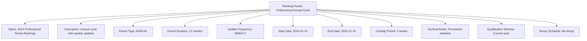
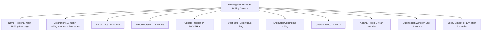

---
tags:
  - ranking-period
  - template-entity
  - time-cycle
  - update-frequency
  - period-management
  - tournament-management
---

# Ranking Period (Template Entity)

## Overview

A Ranking Period defines the time-based cycles and update frequencies for ranking calculations within
a Ranking System. It provides standardized templates for managing when rankings are calculated,
how long they remain valid, and how historical periods are maintained for different competitive
contexts and organizational requirements.

## Purpose

This template entity standardizes ranking period management across tournaments and disciplines by:

- Defining calculation cycles and update frequencies for automated ranking management
- Configuring period duration, overlap, and transition rules for ranking continuity
- Supporting seasonal, annual, and rolling period structures for different competition formats
- Enabling consistent historical tracking and archival of ranking periods
- Providing foundation for ranking decay systems and period-based qualification

## Structure

This template entity includes standard attributes from the [Base Entity](../foundation/base_entity.md)
and adds the following ranking period-specific attributes:

| Attribute | Description | Type | Required | Notes / Example |
|-----------|-------------|------|----------|-----------------|
| **Name** | Descriptive name for the ranking period cycle | String | Yes | `"2024 Annual Ranking Cycle"`, `"Monthly Rolling Rankings"`, `"Seasonal Championships"` |
| **Description** | Detailed explanation of period structure and timing | String | Yes | `"12-month rolling period updated weekly with 6-month decay"` |
| **Period Type** | Classification of ranking period structure | Enum | Yes | `ANNUAL`, `SEASONAL`, `MONTHLY`, `WEEKLY`, `ROLLING`, `TOURNAMENT_BASED`, `CUSTOM` |
| **Period Duration** | Length of each ranking period in specified units | String | Yes | `"12 months"`, `"13 weeks"`, `"4 weeks"`, `"365 days"` |
| **Update Frequency** | How often rankings are recalculated within period | Enum | Yes | `REAL_TIME`, `DAILY`, `WEEKLY`, `MONTHLY`, `TOURNAMENT_END`, `MANUAL` |
| **Start Date** | Beginning date for the ranking period cycle | Date | Optional | `"2024-01-01"`, `"2024-09-01"` (season start) |
| **End Date** | Ending date for the ranking period cycle | Date | Optional | `"2024-12-31"`, `"2025-05-31"` (season end) |
| **Overlap Period** | Duration of period overlap for smooth transitions | String | Optional | `"2 weeks"`, `"1 month"`, `"0 days"` (no overlap) |
| **Archival Rules** | How historical periods are maintained and accessed | String | Optional | `"Archive after 2 years"`, `"Permanent retention"`, `"Rolling 5-year window"` |
| **Qualification Window** | Period considered for ranking-based qualification | String | Optional | `"Last 12 months"`, `"Current season only"`, `"Rolling 18 months"` |
| **Decay Schedule** | Point decay timing and rates within period | String | Optional | `"5% monthly after 6 months"`, `"Linear decay over 12 months"`, `"No decay"` |

## Example

### Example: Professional Annual Rankings

This example demonstrates a professional tennis ranking period with annual cycles updated weekly.
The period runs from January to December with a two-week overlap for smooth transitions between
years. Rankings are permanently archived and qualification considers the current year only.
This covers all Ranking Period attributes including timing, frequency, archival, and qualification.

### Example: Youth Rolling Rankings

This second example shows a rolling ranking period for youth development. The 18-month rolling
window updates monthly with point decay starting after six months of inactivity. Historical
periods are retained for three years, and qualification considers the last 12 months only.
This demonstrates different configuration options for developmental and regional competition.

## See Also

- [Ranking System](system.md) - Ranking calculation methodology configuration
- [Team Ranking](team.md) - Concrete team ranking instances within periods
- [Ranking History](history.md) - Historical tracking across ranking periods
- [Tournament](../tournament/tournament.md) - Tournament-based ranking period triggers
- [Discipline](../discipline/README.md) - Discipline-specific period requirements
