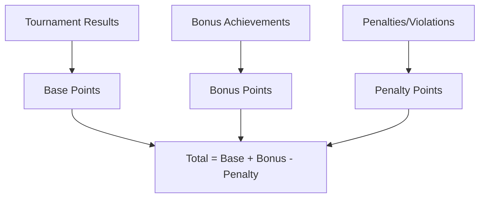
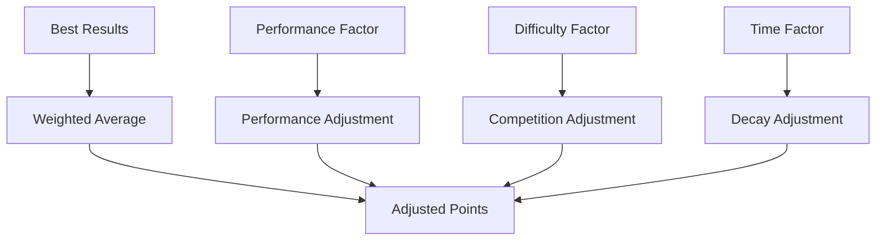

# Ranking Points | Value Object

---

Value Object representing point calculation components and breakdown details embedded within ranking entities.

## Purpose and Context

**Ranking Points** is a value object that encapsulates the detailed point calculation breakdown and scoring
components for team rankings. It provides granular detail about how ranking points are calculated, distributed,
and accumulated within various ranking systems. This value object is embedded within Team Ranking entities to
provide transparency and auditability of point calculations.

The value object supports different point calculation methodologies from simple accumulation to complex weighted
systems with bonus factors, penalty adjustments, and performance multipliers.

## Value Object Properties

| Property | Type | Required | Description |
|----------|------|----------|-------------|
| base_points | Integer | Yes | Core points earned from primary performance |
| bonus_points | Integer | No | Additional points from achievements or bonuses |
| penalty_points | Integer | No | Points deducted due to violations or penalties |
| total_points | Integer | Yes | Calculated total points (base + bonus - penalty) |
| calculation_method | String | Yes | Method used for point calculation |
| performance_factor | Float | No | Multiplier based on performance quality (0.0-2.0) |
| difficulty_factor | Float | No | Multiplier based on competition difficulty (0.5-3.0) |
| time_decay_factor | Float | No | Multiplier for time-based point decay (0.0-1.0) |
| breakdown_details | Object | No | Detailed calculation breakdown and sources |
| validation_status | String | Yes | Status of point calculation validation |
| calculation_timestamp | DateTime | Yes | When points were calculated |

## Integration Points

### Embedded Within

- [Team Ranking](./team.md) - Provides detailed point breakdown for current ranking
- [Ranking History](./history.md) - Historical point calculations for trend analysis

### References To

- [Ranking System](./system.md) - Uses calculation methodology and rules
- [Ranking Criteria](./criteria.md) - Applies weighting factors and requirements

### Integration With Related Domains

- **Tournament Domain**: Points earned from tournament participation and results
- **Standing Domain**: Points calculated from in-tournament performance
- **Team Domain**: Points assigned to specific team entities
- **Discipline Domain**: Points calculated according to discipline-specific rules

## Example: Professional Tennis Ranking Points

```yaml
base_points: 1200
bonus_points: 200
penalty_points: 0
total_points: 1400
calculation_method: "ATP_WEIGHTED_AVERAGE"
performance_factor: 1.15
difficulty_factor: 1.8
time_decay_factor: 0.95
breakdown_details:
  tournament_results:
    - tournament_id: "ATP_2024_WIMBLEDON"
      placement: 3
      points_earned: 720
      multiplier: 1.8
    - tournament_id: "ATP_2024_FRENCH_OPEN"
      placement: 2
      points_earned: 1200
      multiplier: 1.8
  bonus_sources:
    - source: "CONSISTENCY_BONUS"
      points: 150
    - source: "RANKING_MILESTONE"
      points: 50
  calculation_components:
    best_18_tournaments: 1200
    consistency_factor: 200
    recent_form_adjustment: 0
validation_status: "VALIDATED"
calculation_timestamp: "2024-01-15T10:30:00Z"
```

## Example: Youth Regional Ranking Points

```yaml
base_points: 450
bonus_points: 75
penalty_points: 25
total_points: 500
calculation_method: "REGIONAL_CUMULATIVE"
performance_factor: 1.05
difficulty_factor: 1.2
time_decay_factor: 1.0
breakdown_details:
  tournament_results:
    - tournament_id: "REGIONAL_2024_SPRING"
      placement: 1
      points_earned: 200
      multiplier: 1.2
    - tournament_id: "REGIONAL_2024_WINTER"
      placement: 2
      points_earned: 150
      multiplier: 1.2
    - tournament_id: "LOCAL_2024_CHAMPIONSHIP"
      placement: 1
      points_earned: 100
      multiplier: 1.0
  bonus_sources:
    - source: "PARTICIPATION_BONUS"
      points: 50
    - source: "SPORTSMANSHIP_AWARD"
      points: 25
  penalty_sources:
    - source: "LATE_REGISTRATION"
      points: 25
  calculation_components:
    total_tournaments: 450
    participation_bonuses: 75
    conduct_adjustments: -25
validation_status: "VALIDATED"
calculation_timestamp: "2024-01-20T14:45:00Z"
```

## Calculation Methods

### Simple Accumulation



### Weighted Average System



## Validation Rules

### Required Calculations

- Total points must equal base + bonus - penalty points
- Performance factor must be between 0.0 and 2.0
- Difficulty factor must be between 0.5 and 3.0
- Time decay factor must be between 0.0 and 1.0

### Breakdown Consistency

- Breakdown details must sum to calculated totals
- All referenced tournaments must exist and be valid
- Bonus and penalty sources must be documented
- Calculation timestamp must be recent and valid

### Method Compliance

- Calculation method must match Ranking System configuration
- Applied factors must comply with Ranking Criteria requirements
- Point sources must be valid and verifiable
- Validation status must reflect actual validation state

## Business Rules

### Point Calculation

- Base points cannot be negative
- Bonus points are optional but cannot exceed system maximums
- Penalty points reduce total but cannot make total negative
- Total points are always calculated, never manually set

### Factor Application

- Performance factors reward exceptional performance quality
- Difficulty factors adjust for competition strength and level
- Time decay factors implement point aging and relevance
- Multiple factors can be applied in specified order

### Validation Requirements

- All point calculations must be validated before official use
- Validation includes source verification and method compliance
- Invalid calculations must be flagged and corrected
- Calculation timestamps enable audit trails and updates

### Integration Compliance

- Points must align with Tournament Domain result reporting
- Standing Domain performance must contribute to point calculations
- Team Domain assignments must be accurate and current
- Discipline Domain rules must be applied consistently

## Usage in Domain Logic

Ranking Points value objects provide detailed transparency for point calculations while enabling complex ranking
methodologies. They support both simple cumulative systems and sophisticated weighted approaches with multiple
adjustment factors.

The embedded design ensures that ranking calculations are auditable, verifiable, and consistent with system-wide
rules while accommodating the diverse needs of different tournament disciplines and competitive levels.
