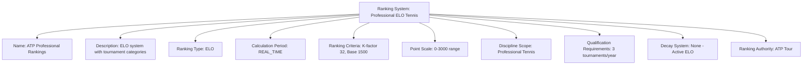
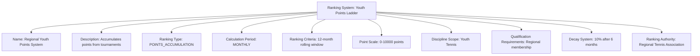

---
tags:
  - ranking-system
  - template-entity
  - calculation
  - methodology
  - seeding
  - tournament-management
---

# Ranking System (Template Entity)

## Overview

A Ranking System defines the methodology and configuration for calculating team rankings within
specific contexts. It provides reusable templates for different ranking approaches including
ELO-based systems, points accumulation systems, and performance-based calculations used for
tournament seeding and competitive analysis.

## Purpose

This template entity standardizes ranking calculation across tournaments and disciplines by:

- Defining calculation methodology and algorithmic approach
- Configuring ranking criteria, weightings, and qualification requirements
- Supporting different ranking types from simple points to complex ELO systems
- Enabling consistent ranking application across multiple tournaments
- Providing foundation for automated ranking updates and historical tracking

## Structure

This template entity includes standard attributes from the [Base Entity](../foundation/base_entity.md)
and adds the following ranking-specific attributes:

| Attribute | Description | Type | Required | Notes / Example |
|-----------|-------------|------|----------|-----------------|
| **Name** | Descriptive name for the ranking system | String | Yes | `"ATP Professional Rankings"`, `"Regional Youth ELO System"`, `"Club Points Ladder"` |
| **Description** | Detailed explanation of ranking methodology and application | String | Yes | `"ELO-based system with 400-point K-factor for professional tennis tournaments"` |
| **Ranking Type** | Primary calculation methodology used for rankings | Enum | Yes | `ELO`, `POINTS_ACCUMULATION`, `PERFORMANCE_BASED`, `HYBRID`, `MANUAL` |
| **Calculation Period** | Time frame for ranking calculations and updates | Enum | Yes | `REAL_TIME`, `WEEKLY`, `MONTHLY`, `QUARTERLY`, `TOURNAMENT_BASED`, `ANNUAL` |
| **Ranking Criteria** | Embedded calculation parameters and requirements | Ranking Criteria | Yes | Configuration object with weights, minimums, decay rates |
| **Point Scale** | Numerical scale and range for ranking points | Ranking Points | Optional | Point distribution, maximum/minimum values, decimal precision |
| **Discipline Scope** | Applicable disciplines for this ranking system | List[UUID] | Optional | References to specific [Discipline](../discipline/README.md) entities |
| **Qualification Requirements** | Minimum requirements for ranking inclusion | String | Optional | `"Minimum 5 tournaments in 12 months"`, `"Active membership required"` |
| **Decay System** | Point decay rules for ranking maintenance | String | Optional | `"5% monthly decay after 6 months inactivity"`, `"No decay system"` |
| **Ranking Authority** | Organization or entity responsible for rankings | String | Optional | `"International Tennis Federation"`, `"Regional Chess Association"` |

## Example

### Example: Professional ELO Tennis System

This example demonstrates a comprehensive professional tennis ranking system using ELO methodology.
The system calculates real-time rankings with a K-factor of 32, base rating of 1500, and requires
minimum tournament participation. It covers all Ranking System attributes including name, calculation
methodology, criteria configuration, discipline scope, and administrative authority.

### Example: Youth Points Accumulation System

This second example shows a points accumulation system for youth players. Rankings are calculated
monthly using a 12-month rolling window with point decay for inactive players. The system demonstrates
different configuration options for qualification requirements and decay systems appropriate for youth
development programs.

## See Also

- [Ranking Period](period.md) - Time-based ranking cycle configuration
- [Team Ranking](team.md) - Concrete team ranking instances
- [Ranking History](history.md) - Historical ranking change tracking
- [Ranking Criteria](criteria.md) - Embedded calculation parameters
- [Ranking Points](points.md) - Embedded point calculation components
- [Seeding System](../discipline/stage/seeding_system.md) - Tournament seeding integration
- [Team](../team/team.md) - Ranked team entities
- [Discipline](../discipline/README.md) - Discipline-specific ranking contexts
