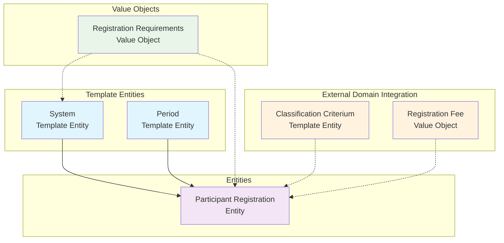

# Registration Domain

## Overview

The Registration Domain handles universal access control and enrollment for all tournament participants
including competitors, officials, staff, committee members, press, coaches, and spectators. This domain
provides comprehensive participant registration workflows, role-based requirements, and status tracking
that ensures proper access control and administrative oversight for tournament participation.

The domain implements sophisticated registration systems supporting different participant roles, time-based
registration periods, status workflow management, and comprehensive compliance tracking while maintaining
clear integration with identity management, financial processing, and tournament organization.

## Purpose

The primary purpose of the Registration Domain is to provide secure and organized tournament access by:

- Implementing universal participant registration covering all tournament roles and responsibilities
- Managing time-based registration periods with automated deadline enforcement and notifications
- Tracking comprehensive participant status workflows from submission to confirmation
- Supporting role-based registration requirements with different compliance standards
- Integrating general registration rules with discipline-specific player criteria
- Maintaining audit trails and administrative accountability for registration decisions
- Providing foundation for tournament access control and participant management

## Domain Models

### Template Entities

Template entities define reusable configurations and processes for registration systems.

#### [System](./system.md) | Template Entity

Defines registration processes, workflows, and requirements for different tournament types. Supports open
enrollment, invitation-only, qualification-based, and hybrid registration approaches with configurable
approval processes and capacity management.

#### [Period](./period.md) | Template Entity

Manages time-based registration windows, deadline structures, and phase management. Supports early/regular/late
registration periods, rolling deadlines, tournament-specific windows, and automated notification schedules.

### Entities

Entities represent concrete registration instances and workflow tracking with unique identities.

#### [Participant Registration](./registration.md) | Entity

Concrete participant registration instances covering all tournament roles with status tracking, compliance
validation, and workflow management. Links to registration systems and periods while embedding role-specific
requirements and fee structures.

### Value Objects

Value objects provide embedded data structures within entities for complex domain concepts.

#### [Requirements](./requirements.md) | Value Object

Embedded general registration requirements and compliance criteria supporting role-based validation,
document verification, and deadline management. Provides flexible configuration for different
participant types and tournament contexts.

## Model Hierarchy

## Role-Based Registration Architecture

### Universal Participant Coverage

The Registration Domain provides enrollment for all tournament participants:

**Competition Participants:**

- **Players/Competitors**: Primary competitive participants requiring ranking and eligibility verification
- **Coaches**: Team coaches and support staff with team affiliation and certification requirements
- **Team Officials**: Team managers, captains, and support personnel with administrative responsibilities

**Tournament Administration:**

- **Committee Members**: Tournament directors, organizers, and governance personnel with full access
- **Staff**: Administrative staff, coordinators, and operational personnel with working credentials  
- **Volunteers**: Support volunteers with specific role assignments and training requirements

**Event Support:**

- **Officials**: Referees, judges, and technical officials with certification and background verification
- **Press/Media**: Journalists, photographers, and broadcasters with media accreditation requirements
- **Spectators**: General public attendees with access control and safety compliance

### Requirements Architecture Separation

The domain implements a two-layer requirements system:

**General Registration Requirements (This Domain):**

- Age verification and eligibility criteria
- Document submission and verification standards
- Payment deadlines and fee structures
- Insurance and liability requirements
- Contact information and communication preferences

**Discipline-Specific Player Criteria (Classification Domain):**

- Sport-specific skill level requirements
- Equipment compliance standards
- Physical requirements and weight classes
- Certification and qualification standards

This separation ensures clean domain boundaries while supporting comprehensive participant validation.

## Integration Points

### Cross-Domain Relationships

**Registration ↔ Identity Domain:**

- Participant identity verification and profile management
- Contact information and emergency contact administration
- Authentication and access control integration

**Registration ↔ Finance Domain:**

- Role-based fee structures and payment processing
- Refund management and financial compliance
- Payment deadline integration with registration periods

**Registration ↔ Tournament Domain:**

- Tournament-specific registration system configuration
- Capacity management and participant allocation
- Access control and tournament participation verification

**Registration ↔ Team Domain:**

- Team affiliation for competitive participants
- Roster management integration for player registration
- Coach and team official assignment coordination

**Registration ↔ Classification Domain:**

- Discipline-specific player eligibility criteria
- Skill level and certification requirements
- Equipment compliance and technical standards

## Status Workflows

### Registration Lifecycle

**Standard Workflow:**

1. **SUBMITTED** → Initial registration submission
2. **UNDER_REVIEW** → Administrative verification in progress
3. **APPROVED** → Registration meets requirements
4. **CONFIRMED** → Final confirmation with payment and compliance
5. **WITHDRAWN** → Participant-initiated withdrawal

**Alternative Flows:**

- **REJECTED** → Registration does not meet requirements
- **WAITLIST** → Approved but capacity-limited
- **EXPIRED** → Registration period expired

### Audit Trail Management

The Base Entity status management provides fundamental tracking capabilities:

- Status transitions with timestamps through Last Updated tracking
- Multiple concurrent status types for comprehensive lifecycle management
- System-managed audit foundation for compliance and troubleshooting
- Integration with domain-specific workflow requirements
- Cross-domain status consistency and reference integrity

## Quality Standards

- All models include comprehensive attribute documentation with role-based examples
- Cross-references are accurate and maintain proper domain boundaries
- Status lifecycles are clearly defined with transition rules and validation
- Role-based requirements are well-documented and consistently applied
- Integration points with external domains are properly managed
- Audit trails provide complete administrative accountability

## Implementation Guidelines

- Use role-based registration requirements for different participant types
- Enforce status transitions and lifecycle rules with proper validation
- Maintain data integrity across participant roles and tournament contexts
- Ensure proper access control based on registration status and role assignment
- Support automated workflow processing with manual override capabilities
- Integrate general registration rules with discipline-specific criteria appropriately
- Maintain comprehensive audit trails for administrative accountability and compliance

## Related Domains

- **[Identity Domain](../identity/README.md)**: Participant identity and profile management
- **[Finance Domain](../finance/README.md)**: Payment processing and fee management  
- **[Tournament Domain](../tournament/README.md)**: Tournament structure and organization
- **[Team Domain](../team/README.md)**: Team composition and roster management
- **[Classification Domain](../classification/README.md)**: Discipline-specific eligibility criteria
- **[Process Domain](../process/README.md)**: Workflow and process management integration

---

**Last Updated**: September 15, 2025 **Version**: 2.0 **Status**: Active **Next Review**: October 15, 2025
