---
tags:
  - registration-period
  - template-entity
  - registration-window
  - deadline-management
  - time-management
  - tournament-management
---

# Registration Period (Template Entity)

## Overview

A Registration Period defines the time-based windows and deadline structures for tournament registration
within a Registration System. It provides standardized templates for managing when registration opens,
how deadlines are enforced, and how different registration phases are structured for various competitive
contexts and organizational requirements.

## Purpose

This template entity standardizes registration timing across tournaments and disciplines by:

- Defining registration windows, deadlines, and phase structures for automated timeline management
- Configuring early, regular, and late registration periods with different rules and pricing
- Supporting seasonal, tournament-specific, and rolling registration structures for different formats
- Enabling consistent deadline enforcement and late registration handling
- Providing foundation for automated notifications and registration workflow management

## Structure

This template entity includes standard attributes from the [Base Entity](../foundation/base_entity.md)
and adds the following registration period-specific attributes:

| Attribute | Description | Type | Required | Notes / Example |
|-----------|-------------|------|----------|-----------------|
| **Name** | Descriptive name for the registration period structure | String | Yes | `"2024 Championship Registration Window"`, `"Monthly Tournament Cycle"`, `"Open Rolling Registration"` |
| **Description** | Detailed explanation of registration timing and phases | String | Yes | `"3-phase registration with early bird, regular, and late periods"` |
| **Period Type** | Classification of registration period structure | Enum | Yes | `TOURNAMENT_SPECIFIC`, `SEASONAL`, `MONTHLY`, `ROLLING`, `EVENT_SERIES`, `CUSTOM` |
| **Registration Opens** | Date and time when registration begins | DateTime | Yes | `"2024-06-01T00:00:00Z"`, `"2024-09-15T09:00:00Z"` |
| **Registration Closes** | Final deadline for all registration submissions | DateTime | Yes | `"2024-08-15T23:59:59Z"`, `"2024-10-30T18:00:00Z"` |
| **Early Registration End** | End of early registration period with reduced fees | DateTime | Optional | `"2024-07-01T23:59:59Z"`, `"2024-09-30T23:59:59Z"` |
| **Late Registration Start** | Beginning of late registration with penalties | DateTime | Optional | `"2024-08-01T00:00:00Z"`, `"2024-10-15T00:00:00Z"` |
| **Grace Period** | Additional time allowed after official deadline | String | Optional | `"24 hours"`, `"3 days"`, `"No grace period"` |
| **Timezone** | Timezone for all registration period times | String | Yes | `"UTC"`, `"America/New_York"`, `"Europe/Paris"` |
| **Notification Schedule** | Automated reminder timing before deadlines | List[String] | Optional | `["30 days", "14 days", "7 days", "24 hours"]` |
| **Withdrawal Deadline** | Latest time teams can withdraw with refund | DateTime | Optional | `"2024-07-15T23:59:59Z"`, `"Same as registration close"` |
| **Modification Deadline** | Latest time for registration changes | DateTime | Optional | `"2024-08-01T23:59:59Z"`, `"7 days before event"` |
| **Extension Rules** | Circumstances allowing deadline extensions | String | Optional | `"Exceptional circumstances only"`, `"Technical issues"`, `"No extensions"` |

## Example

### Example: Championship Tournament Registration Period

```mermaid
graph TD
  RP[Registration Period: Championship Tournament]
  RP --> N[Name: 2024 National Championship Registration]
  RP --> D[Description: 3-phase registration with early bird pricing]
  RP --> PT[Period Type: TOURNAMENT_SPECIFIC]
  RP --> RO[Registration Opens: 2024-06-01 00:00 UTC]
  RP --> RC[Registration Closes: 2024-08-15 23:59 UTC]
  RP --> ERE[Early Registration End: 2024-07-01 23:59 UTC]
  RP --> LRS[Late Registration Start: 2024-08-01 00:00 UTC]
  RP --> GP[Grace Period: 24 hours]
  RP --> TZ[Timezone: UTC]
  RP --> NS[Notification Schedule: 30d, 14d, 7d, 24h]
  RP --> WD[Withdrawal Deadline: 2024-07-15 23:59 UTC]
  RP --> MD[Modification Deadline: 2024-08-01 23:59 UTC]
  RP --> ER[Extension Rules: Exceptional circumstances only]
```

This example demonstrates a championship tournament registration period with three distinct phases:
early registration (June 1-July 1) with discounted fees, regular registration (July 2-August 1),
and late registration (August 1-15) with penalty fees. The system includes automated notifications
at 30, 14, 7, and 1 days before deadlines, with withdrawal allowed until July 15 and modifications
until August 1. A 24-hour grace period provides flexibility for technical issues.

### Example: Monthly Rolling Registration Period

```mermaid
graph TD
  RP[Registration Period: Monthly Rolling Tournaments]
  RP --> N[Name: Monthly Club Tournament Registration]
  RP --> D[Description: Continuous monthly registration cycle]
  RP --> PT[Period Type: ROLLING]
  RP --> RO[Registration Opens: 1st of each month]
  RP --> RC[Registration Closes: 25th of each month]
  RP --> ERE[Early Registration End: 15th of each month]
  RP --> LRS[Late Registration Start: 20th of each month]
  RP --> GP[Grace Period: No grace period]
  RP --> TZ[Timezone: America/New_York]
  RP --> NS[Notification Schedule: 14d, 7d, 3d]
  RP --> WD[Withdrawal Deadline: 20th of each month]
  RP --> MD[Modification Deadline: 22nd of each month]
  RP --> ER[Extension Rules: Technical issues only]
```

This second example shows a rolling monthly registration system for club tournaments with consistent
timing patterns. Registration opens on the 1st and closes on the 25th of each month, with early
registration ending on the 15th and late registration starting on the 20th. The system provides
shorter notification periods suitable for monthly cycles and stricter deadlines with no grace period.

## See Also

- [Registration System](./system.md) - Registration process and workflow templates
- [Team Registration](./team.md) - Concrete team registration instances
- [Registration Status](./status.md) - Status tracking and workflow management
- [Registration Requirements](./requirements.md) - Embedded eligibility criteria
- [Registration Fee](./fee.md) - Embedded payment structure details with period-based pricing
- [Tournament](../tournament/tournament.md) - Tournament entities using registration periods
- [Schedule](../schedule/README.md) - Event scheduling integration with registration timelines
- [Finance](../finance/README.md) - Financial processing integration with period-based fees
