---
tags:
  - participant-registration
  - entity
  - registration-instance
  - tournament-access
  - role-based-registration
  - tournament-management
---

# Participant Registration (Entity)

## Overview

A Participant Registration represents a concrete registration instance for any individual participating in a tournament
within a Registration System and Registration Period. As an entity with independent identity and lifecycle, it provides
access control and enrollment tracking for all tournament participants including competitors, officials, staff,
committee members, press, coaches, and audience members.

## Purpose

This entity provides comprehensive participant registration that enables:

- Universal access control - no tournament access without registration
- Role-based registration with different requirements per participant type
- Complete participant tracking from organizers to spectators
- Status workflow management and approval process automation
- Payment integration and fee tracking based on participant role and access level
- Requirements compliance validation specific to participant roles

## Structure

This entity includes standard attributes from the [Base Entity](../foundation/base_entity.md)
and adds the following participant registration-specific attributes:

| Attribute | Description | Type | Required | Notes / Example |
|-----------|-------------|------|----------|-----------------|
| **Participant** | Reference to the registering participant identity | UUID | Yes | Links to [Identity](../identity/README.md) for person/organization |
| **Registration System** | Reference to the registration process and workflow | UUID | Yes | Links to [Registration System](system.md) template |
| **Registration Period** | Reference to the time-based registration window | UUID | Yes | Links to [Registration Period](period.md) template |
| **Tournament** | Reference to the tournament being registered for | UUID | Yes | Links to [Tournament](../tournament/tournament.md) entity |
| **Primary Role** | Primary role for this tournament participation | Enum | Yes | `PLAYER`, `OFFICIAL`, `COACH`, `COMMITTEE_MEMBER`, `STAFF`, `PRESS`, `SPECTATOR`, `VOLUNTEER` |
| **Secondary Roles** | Additional roles for multi-role participants | List[Enum] | Optional | Multiple roles like `[COACH, COMMITTEE_MEMBER]` |
| **Access Level** | Level of tournament access granted | Enum | Yes | `FULL_ACCESS`, `COMPETITION_AREAS`, `RESTRICTED_AREAS`, `PUBLIC_AREAS`, `VIP_ACCESS` |
| **Current Status** | Participant's current registration workflow status | Enum | Yes | `SUBMITTED`, `UNDER_REVIEW`, `APPROVED`, `CONFIRMED`, `REJECTED`, `WITHDRAWN` |
| **Previous Status** | Participant's registration status before current state | Enum | Optional | Previous status for audit trail and workflow tracking |
| **Submission Date** | Timestamp when registration was initially submitted | DateTime | Yes | `"2024-07-15T09:30:00Z"` |
| **Approval Date** | Timestamp when registration was approved (if applicable) | DateTime | Optional | `"2024-07-18T14:15:00Z"` |
| **Confirmation Date** | Timestamp when registration was confirmed final | DateTime | Optional | `"2024-07-20T10:00:00Z"` |
| **Registration Requirements** | Embedded requirements compliance and validation data | Registration Requirements | Yes | Document verification, background checks, role-specific compliance |
| **Registration Fee** | Embedded payment structure and fee details | Registration Fee | Optional | Payment amounts based on role and access level |
| **Competition Category** | Competition category if participant is a player | String | Optional | `"Men's Open Division"`, `"Youth Under-16"`, `"Professional Elite"` |
| **Team Affiliation** | Team association if participant is player/coach | UUID | Optional | Links to [Team](../team/team.md) for competitive participants |
| **Organization Affiliation** | Organization association for officials/press/staff | UUID | Optional | Links to organizing body, media outlet, official association |
| **Accreditation Type** | Type of tournament credentials issued | Enum | Optional | `COMPETITOR`, `OFFICIAL`, `MEDIA`, `VIP`, `GENERAL`, `WORKING` |
| **Priority Level** | Registration priority for capacity management | Enum | Optional | `STANDARD`, `PRIORITY`, `VIP`, `WAITLIST` |
| **Special Accommodations** | Accessibility or special needs requirements | Text | Optional | Medical accommodations, dietary restrictions, accessibility needs |
| **Contact Information** | Primary contact details for registration communication | String | Optional | Email, phone for registration-specific correspondence |
| **Emergency Contact** | Emergency contact information for tournament participation | String | Optional | Emergency contact details for event safety |
| **Background Check Status** | Status of required background verification | Enum | Optional | `NOT_REQUIRED`, `PENDING`, `CLEARED`, `FAILED`, `EXPIRED` |
| **Insurance Status** | Insurance coverage verification for role | Enum | Optional | `NOT_REQUIRED`, `PENDING`, `VERIFIED`, `INSUFFICIENT` |
| **Withdrawal Reason** | Reason for withdrawal if registration is withdrawn | String | Optional | `"Schedule conflict"`, `"Medical emergency"`, `"Role change"` |
| **Payment Status** | Current payment processing status | Enum | Optional | `PENDING`, `PARTIAL`, `COMPLETED`, `REFUND_REQUESTED`, `REFUNDED`, `WAIVED` |

## Example

### Example: Professional Player Registration

```mermaid
graph TD
  PR[Participant Registration: Professional Player]
  PR --> P[Participant: John Smith ATP Player]
  PR --> RS[Registration System: Professional Tournament]
  PR --> RP[Registration Period: Championship Window]
  PR --> T[Tournament: ATP Masters 1000]
  PR --> PRole[Primary Role: PLAYER]
  PR --> SRoles[Secondary Roles: None]
  PR --> AL[Access Level: COMPETITION_AREAS]
  PR --> CS[Current Status: CONFIRMED]
  PR --> SD[Submission Date: 2024-07-01T10:00:00Z]
  PR --> AD[Approval Date: 2024-07-02T14:30:00Z]
  PR --> CD[Confirmation Date: 2024-07-05T09:15:00Z]
  PR --> CC[Competition Category: Men's Singles]
  PR --> TA[Team Affiliation: None - Individual Sport]
  PR --> AT[Accreditation Type: COMPETITOR]
  PR --> BCS[Background Check Status: NOT_REQUIRED]
  PR --> IS[Insurance Status: VERIFIED]
  PR --> PS[Payment Status: COMPLETED]
```

This example demonstrates a professional tennis player registration with automatic approval based on ATP ranking
qualification. The registration includes competitor-level access to competition areas, verified insurance coverage,
and completed payment processing. Background checks are not required for professional players with established
ranking credentials.

### Example: Media Representative Registration

```mermaid
graph TD
  PR[Participant Registration: Media Representative]
  PR --> P[Participant: Sarah Wilson Sports Journalist]
  PR --> RS[Registration System: Media Accreditation System]
  PR --> RP[Registration Period: Press Registration Window]
  PR --> T[Tournament: National Championship]
  PR --> PRole[Primary Role: PRESS]
  PR --> SRoles[Secondary Roles: None]
  PR --> AL[Access Level: RESTRICTED_AREAS]
  PR --> CS[Current Status: APPROVED]
  PR --> SD[Submission Date: 2024-06-15T14:00:00Z]
  PR --> AD[Approval Date: 2024-06-20T11:30:00Z]
  PR --> OA[Organization Affiliation: Sports Daily Media]
  PR --> AT[Accreditation Type: MEDIA]
  PR --> BCS[Background Check Status: CLEARED]
  PR --> IS[Insurance Status: VERIFIED]
  PR --> PS[Payment Status: WAIVED]
```

This second example shows media representative registration requiring manual approval and background verification.
The journalist receives restricted area access for media coverage, with payment waived for accredited press.
Organization affiliation links to the media outlet for credential verification.

### Example: Tournament Committee Member Registration

```mermaid
graph TD
  PR[Participant Registration: Committee Member]
  PR --> P[Participant: Michael Chen Tournament Director]
  PR --> RS[Registration System: Internal Staff System]
  PR --> RP[Registration Period: Pre-Tournament Setup]
  PR --> T[Tournament: Regional Championships]
  PR --> PRole[Primary Role: COMMITTEE_MEMBER]
  PR --> SRoles[Secondary Roles: STAFF, VOLUNTEER]
  PR --> AL[Access Level: FULL_ACCESS]
  PR --> CS[Current Status: CONFIRMED]
  PR --> SD[Submission Date: 2024-05-01T08:00:00Z]
  PR --> CD[Confirmation Date: 2024-05-01T08:30:00Z]
  PR --> OA[Organization Affiliation: Regional Tennis Association]
  PR --> AT[Accreditation Type: WORKING]
  PR --> BCS[Background Check Status: CLEARED]
  PR --> SA[Special Accommodations: None]
  PR --> PS[Payment Status: WAIVED]
```

This third example demonstrates committee member registration with multiple roles and full tournament access.
The registration includes immediate confirmation for internal staff with comprehensive background verification
and working credentials for administrative responsibilities.

## See Also

- [Registration System](./system.md) - Registration process and workflow templates
- [Registration Period](./period.md) - Time-based registration window configuration
- [Registration Requirements](./requirements.md) - Embedded eligibility and compliance criteria
- [Registration Fee](./fee.md) - Embedded payment structure details with role-based pricing
- [Tournament](../tournament/tournament.md) - Tournament entities requiring participant registration
- [Team](../team/team.md) - Team entities for competitive participant affiliation
- [Identity](../identity/README.md) - Participant identity and profile management
- [Finance](../finance/README.md) - Financial processing integration with role-based fees
