---
tags:
  - registration-requirements
  - value-object
  - eligibility-criteria
  - compliance-rules
  - document-verification
  - tournament-management
---

# Registration Requirements (Value Object)

## Overview

Registration Requirements represents the embedded eligibility criteria, compliance rules, and
document verification standards used within Registration Systems and Participant Registrations.
As a value object without independent identity, it provides detailed configuration for general
registration validation, administrative compliance, and process requirements for different
participant roles and tournament contexts.

## Purpose

This value object enables comprehensive registration configuration by:

- Defining general eligibility requirements for tournament participation access
- Configuring document verification and administrative compliance standards
- Establishing deadline and timing requirements for registration processes
- Supporting role-based requirements for different participant types
- Providing embedded configuration that travels with registration entities

## Structure

This value object includes the following registration requirements-specific attributes:

| Attribute | Description | Type | Required | Notes / Example |
|-----------|-------------|------|----------|-----------------|
| **Age Requirements** | Age-based eligibility criteria for participation | String | Optional | `"18+ years"`, `"13-17 with parental consent"`, `"No age limit"` |
| **Geographic Eligibility** | Geographic restrictions or requirements | String | Optional | `"Regional residents only"`, `"National citizens"`, `"International open"` |
| **Required Documents** | Mandatory documents for registration completion | List[String] | Optional | `["Photo ID", "Medical Certificate", "Insurance Proof"]` |
| **Background Check Required** | Whether background verification is mandatory | Boolean | Optional | `true` (required for officials), `false` (not required) |
| **Insurance Requirements** | Insurance coverage requirements for participation | String | Optional | `"Liability insurance required"`, `"Covered by tournament"`, `"Not required"` |
| **Medical Clearance** | Medical certification requirements | String | Optional | `"Current medical certificate"`, `"Emergency medical form"`, `"Not required"` |
| **Payment Deadlines** | Payment timing requirements and deadlines | String | Optional | `"Full payment at registration"`, `"50% deposit, balance 14 days prior"` |
| **Modification Deadlines** | Latest date for registration changes | String | Optional | `"7 days before event"`, `"Until registration closes"`, `"No modifications"` |
| **Withdrawal Policy** | Rules and deadlines for registration withdrawal | String | Optional | `"Full refund until 14 days prior"`, `"No refunds after confirmation"` |
| **Contact Information Required** | Mandatory contact details for registration | List[String] | Optional | `["Email", "Phone", "Emergency Contact"]` |
| **Waiver Requirements** | Legal waivers required for participation | List[String] | Optional | `["Liability Waiver", "Media Release", "Code of Conduct Agreement"]` |
| **Residency Verification** | Proof of residency requirements | String | Optional | `"Utility bill or lease agreement"`, `"Not required"`, `"Self-declaration sufficient"` |
| **Organizational Affiliation** | Required memberships or organizational ties | String | Optional | `"Federation membership required"`, `"Club affiliation preferred"`, `"Independent entry allowed"` |
| **Technical Requirements** | Equipment or technical compliance needs | String | Optional | `"Own equipment required"`, `"Uniform specifications"`, `"Technology compliance"` |
| **Attendance Requirements** | Mandatory attendance or participation rules | String | Optional | `"Full tournament commitment"`, `"Minimum 2-day participation"`, `"Flexible schedule"` |
| **Communication Preferences** | How participants will receive tournament communications | List[String] | Optional | `["Email notifications", "SMS alerts", "Mobile app"]` |

## Example

### Example: Professional Player Requirements

```mermaid
graph TD
  RR[Registration Requirements: Professional Player]
  RR --> AR[Age Requirements: 16+ years]
  RR --> GE[Geographic Eligibility: International open]
  RR --> RD[Required Documents: Photo ID, Ranking Certificate]
  RR --> BCR[Background Check Required: false]
  RR --> IR[Insurance Requirements: Professional liability required]
  RR --> MC[Medical Clearance: Current medical certificate]
  RR --> PD[Payment Deadlines: Full payment at registration]
  RR --> MD[Modification Deadlines: 7 days before event]
  RR --> WP[Withdrawal Policy: 50% refund until 14 days prior]
  RR --> CIR[Contact Information Required: Email, Phone, Emergency]
  RR --> WR[Waiver Requirements: Liability, Media Release]
  RR --> OA[Organizational Affiliation: Federation membership required]
  RR --> TR[Technical Requirements: Own equipment required]
  RR --> AtR[Attendance Requirements: Full tournament commitment]
```



This example demonstrates professional player registration requirements with federation membership,
medical certification, and professional insurance coverage. The requirements include full tournament
commitment with own equipment and comprehensive waiver documentation.

### Example: Media Representative Requirements

```mermaid
graph TD
  RR[Registration Requirements: Media Representative]
  RR --> AR[Age Requirements: 18+ years]
  RR --> GE[Geographic Eligibility: Accredited media outlets]
  RR --> RD[Required Documents: Press ID, Media Credentials]
  RR --> BCR[Background Check Required: true]
  RR --> IR[Insurance Requirements: Media liability coverage]
  RR --> MC[Medical Clearance: Emergency medical form]
  RR --> PD[Payment Deadlines: No payment required]
  RR --> MD[Modification Deadlines: Until registration closes]
  RR --> WP[Withdrawal Policy: No financial penalty]
  RR --> CIR[Contact Information Required: Email, Phone, Organization]
  RR --> WR[Waiver Requirements: Media Agreement, Code of Conduct]
  RR --> OA[Organizational Affiliation: Verified media outlet]
  RR --> TR[Technical Requirements: Own recording equipment]
  RR --> AtR[Attendance Requirements: Flexible schedule]
```



This second example shows media representative requirements with mandatory background checks,
verified media outlet affiliation, and flexible attendance policies. No payment is required
but comprehensive media agreements and conduct codes must be signed.

### Example: Volunteer Staff Requirements

```mermaid
graph TD
  RR[Registration Requirements: Volunteer Staff]
  RR --> AR[Age Requirements: 16+ years (14+ with supervision)]
  RR --> GE[Geographic Eligibility: Local and regional volunteers]
  RR --> RD[Required Documents: Photo ID, Reference Contact]
  RR --> BCR[Background Check Required: true (working with minors)]
  RR --> IR[Insurance Requirements: Covered by tournament]
  RR --> MC[Medical Clearance: Emergency contact information]
  RR --> PD[Payment Deadlines: No payment required]
  RR --> MD[Modification Deadlines: 3 days before assignment]
  RR --> WP[Withdrawal Policy: 48-hour notice preferred]
  RR --> CIR[Contact Information Required: Email, Phone, Emergency]
  RR --> WR[Waiver Requirements: Volunteer Agreement, Safety Waiver]
  RR --> OA[Organizational Affiliation: None required]
  RR --> TR[Technical Requirements: Training session attendance]
  RR --> AtR[Attendance Requirements: Minimum assigned shifts]
```

This third example demonstrates volunteer staff requirements with youth accommodation provisions,
background checks for working with minors, and training requirements. The registration includes
flexible payment (none required) with tournament-provided insurance coverage.

## See Also

- [Registration System](system.md) - Registration process and workflow templates embedding requirements
- [Participant Registration](registration.md) - Concrete registration instances using requirements
- [Registration Period](period.md) - Time-based deadlines referenced in requirements
- [Finance Domain](../finance/README.md) - Payment structures referenced in payment requirements
- [Classification Criterium](../classification/criterium.md) - Discipline-specific player criteria (separate domain)
- [Identity](../identity/README.md) - Participant identity verification and document management
- [Finance](../finance/README.md) - Payment processing and fee management integration
- [Tournament](../tournament/tournament.md) - Tournament entities requiring participant compliance
