---
tags:
  - registration-system
  - template-entity
  - registration-process
  - workflow
  - requirements
  - tournament-management
---

# Registration System | Template Entity

## Overview

A Registration System defines the registration processes, workflows, and requirements for specific tournament types
or competitive contexts. It provides reusable templates for managing how teams register, what requirements must be
met, and how the registration workflow progresses from submission to confirmation.

## Purpose

This template entity standardizes registration processes across tournaments and disciplines by:

- Defining registration workflows and approval processes for different tournament types
- Configuring eligibility criteria, qualification requirements, and documentation needs
- Supporting different registration types from open enrollment to invitation-only systems
- Enabling consistent registration application across multiple tournaments
- Providing foundation for automated registration validation and processing

## Structure

This template entity includes standard attributes from the [Base Entity](../foundation/base_entity.md)
and adds the following registration system-specific attributes:

| Attribute | Description | Type | Required | Notes / Example |
|-----------|-------------|------|----------|-----------------|
| **Name** | Descriptive name for the registration system | String | Yes | `"Professional Tournament Registration"`, `"Youth Open Enrollment"`, `"Invitation Only System"` |
| **Description** | Detailed explanation of registration process and requirements | String | Yes | `"Multi-phase registration with eligibility verification and payment processing"` |
| **Registration Type** | Classification of registration approach | Enum | Yes | `OPEN_ENROLLMENT`, `INVITATION_ONLY`, `QUALIFICATION_BASED`, `LOTTERY_SYSTEM`, `FIRST_COME_FIRST_SERVED` |
| **Workflow Stages** | Sequential stages in the registration process | List[String] | Yes | `["Submission", "Eligibility Check", "Payment", "Confirmation"]` |
| **Requirements** | Embedded qualification and eligibility criteria | Registration Requirements | Yes | Minimum ranking, age limits, documentation needs |
| **Fee Structure** | Embedded payment structure and fee details | Registration Fee | Optional | Entry fees, payment schedules, refund policies |
| **Approval Process** | Type of approval workflow required | Enum | Yes | `AUTOMATIC`, `MANUAL_REVIEW`, `COMMITTEE_APPROVAL`, `HYBRID` |
| **Capacity Management** | How registration capacity is handled | String | Optional | `"First 64 teams"`, `"Unlimited capacity"`, `"Waitlist after 32"` |
| **Documentation Required** | Required documents for registration | List[String] | Optional | `["Medical Certificate", "Insurance Proof", "Age Verification"]` |
| **Deadline Management** | How registration deadlines are enforced | String | Optional | `"Hard deadline"`, `"Late registration with penalty"`, `"Rolling deadline"` |
| **Eligibility Verification** | Process for verifying team eligibility | String | Optional | `"Automatic ranking check"`, `"Manual document review"`, `"Committee assessment"` |
| **Integration Points** | External systems integrated with registration | List[String] | Optional | `["Payment Gateway", "Ranking System", "Medical Database"]` |

## Example

### Example: Professional Tournament Registration System

```mermaid
graph TD
  RS[Registration System: Professional Tennis]
  RS --> N[Name: ATP Tournament Registration]
  RS --> D[Description: Multi-phase professional registration]
  RS --> RT[Registration Type: QUALIFICATION_BASED]
  RS --> WS[Workflow Stages: Submit→Verify→Pay→Confirm]
  RS --> R[Requirements: ATP Ranking, Medical Clearance]
  RS --> FS[Fee Structure: Entry fee + insurance]
  RS --> AP[Approval Process: HYBRID]
  RS --> CM[Capacity Management: 128 player draw]
  RS --> DR[Documentation Required: Medical, Insurance]
  RS --> DM[Deadline Management: Hard deadline 14 days prior]
  RS --> EV[Eligibility Verification: Automatic ranking check]
  RS --> IP[Integration Points: ATP Rankings, Payment Gateway]
```

This example demonstrates a professional tennis tournament registration system with qualification-based entry
requiring ATP ranking verification. The hybrid approval process combines automatic ranking checks with manual
documentation review. The system manages a fixed capacity of 128 players with hard deadline enforcement and
integration with external ranking and payment systems.

### Example: Youth Open Enrollment System

```mermaid
graph TD
  RS[Registration System: Youth Open Enrollment]
  RS --> N[Name: Regional Youth Tournament Registration]
  RS --> D[Description: Open enrollment for youth development]
  RS --> RT[Registration Type: OPEN_ENROLLMENT]
  RS --> WS[Workflow Stages: Submit→Pay→Confirm]
  RS --> R[Requirements: Age verification, Parental consent]
  RS --> FS[Fee Structure: Sliding scale by family income]
  RS --> AP[Approval Process: AUTOMATIC]
  RS --> CM[Capacity Management: Waitlist after 64]
  RS --> DR[Documentation Required: Birth certificate, Consent form]
  RS --> DM[Deadline Management: Rolling deadline with late fee]
  RS --> EV[Eligibility Verification: Age and residency check]
  RS --> IP[Integration Points: Payment System, Youth Database]
```

This second example shows an open enrollment system for youth tournaments with simplified workflow and automatic
approval. The system supports sliding scale fees, rolling deadlines with late penalties, and basic age/residency
verification suitable for developmental programs.

## See Also

- [Registration Period](./period.md) - Time-based registration window configuration
- [Team Registration](./team.md) - Concrete team registration instances
- [Registration Status](./status.md) - Status tracking and workflow management
- [Registration Requirements](./requirements.md) - Embedded eligibility criteria
- [Registration Fee](./fee.md) - Embedded payment structure details
- [Tournament](../tournament/tournament.md) - Tournament entities using registration systems
- [Team](../team/team.md) - Team entities participating in registration
- [Finance](../finance/README.md) - Financial processing integration
