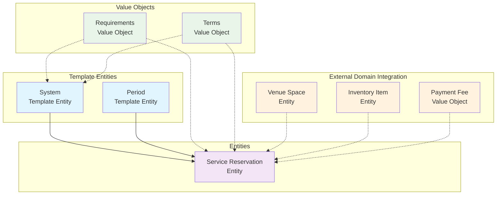

# Reservation Domain

## Overview

The Reservation Domain handles comprehensive service and amenity booking for all tournament participants,
staff, and stakeholders. This domain provides sophisticated booking management for premium facilities,
equipment rental, hospitality services, and specialized tournament amenities, ensuring optimal resource
utilization and enhanced participant experience through systematic availability management and booking control.

The domain implements advanced reservation systems supporting different service types, time-based availability
windows, capacity management, and comprehensive booking lifecycle tracking while maintaining clear separation
from competitive event scheduling and supporting flexible pricing and access control mechanisms.

## Purpose

The primary purpose of the Reservation Domain is to provide organized service and amenity management by:

- Managing comprehensive booking systems for tournament services, facilities, and equipment
- Implementing time-based availability windows with advance booking capabilities and blackout periods
- Supporting diverse reservation types from VIP hospitality to equipment rental and meeting spaces
- Providing flexible access control with role-based eligibility and requirements validation
- Integrating booking management with financial processing and usage tracking
- Maintaining service quality through capacity management and booking workflow oversight
- Establishing foundation for enhanced tournament experience through premium service access

## Domain Models

### Template Entities

Template entities define reusable configurations and processes for reservation systems.

#### [System](./system.md) | Template Entity

Defines booking processes, service configurations, and capacity management for different tournament contexts.
Supports priority-based booking, approval workflows, role-based access, and flexible service allocation
approaches with configurable booking rules and capacity constraints.

#### [Period](./period.md) | Template Entity

Manages time-based availability windows, booking schedules, and advance reservation timeframes. Supports
dynamic availability patterns, blackout windows, advance booking periods, and automated capacity management
with timezone coordination and booking deadline enforcement.

### Entities

Entities represent concrete booking instances and service utilization tracking with unique identities.

#### [Service Reservation](./reservation.md) | Entity

Concrete service booking instances covering all tournament amenities with comprehensive tracking, billing
integration, and usage monitoring. Links to reservation systems and periods while embedding service-specific
requirements and terms for complete booking lifecycle management.

### Value Objects

Value objects provide embedded data structures within entities for complex domain concepts.

#### [Requirements](./requirements.md) | Value Object

Embedded booking criteria and eligibility rules supporting role-based access control, safety requirements,
and documentation validation. Provides flexible configuration for different service types and participant
access levels with comprehensive compliance standards.

#### [Terms](./terms.md) | Value Object

Embedded booking conditions, policies, and pricing structures supporting diverse service models with
cancellation policies, usage restrictions, and payment terms. Enables flexible service delivery with
comprehensive policy management and billing integration.

## Model Hierarchy

## Service Types and Booking Architecture

### Comprehensive Service Coverage

The Reservation Domain provides booking management for diverse tournament services:

**Premium Hospitality Services:**

- **VIP Lounges**: Exclusive hospitality areas with catering, networking, and premium viewing access
- **Business Centers**: Professional meeting spaces with presentation equipment and catering services
- **Executive Suites**: Private viewing areas with dedicated service and exclusive amenities

**Equipment and Facility Rental:**

- **Practice Courts**: Tournament-standard practice facilities with equipment and timing availability
- **Equipment Rental**: Professional gear, specialized equipment, and tournament-specific apparatus
- **Storage Facilities**: Secure storage for team equipment, personal items, and tournament materials

**Support and Administrative Services:**

- **Interview Rooms**: Media interview spaces with technical equipment and scheduling coordination
- **Meeting Spaces**: Committee meeting rooms, planning spaces, and administrative facilities
- **Training Facilities**: Specialized training areas, conditioning facilities, and preparation spaces

### Booking Workflow Architecture

The domain implements sophisticated booking workflows:

**Advance Booking Management:**

- Configurable advance booking periods for different service types and participant roles
- Priority-based allocation supporting VIP access and role-based preferential booking
- Automated capacity management with waitlist functionality and notification systems

**Access Control and Eligibility:**

- Role-based access restrictions ensuring appropriate service allocation
- Comprehensive requirements validation including documentation and compliance verification
- Dynamic eligibility assessment supporting tournament-specific access criteria

**Usage Tracking and Billing:**

- Real-time usage monitoring with automated billing calculation and fee processing
- Flexible pricing models supporting hourly rates, flat fees, and package pricing
- Comprehensive billing integration with financial processing and payment management

## Integration Points

### Cross-Domain Relationships

**Reservation ↔ Venue Domain:**

- Integration with venue spaces for facility-based bookings and capacity coordination
- Availability synchronization and scheduling conflict resolution
- Physical space allocation and maintenance coordination

**Reservation ↔ Inventory Domain:**

- Equipment reservation and availability tracking with inventory management
- Asset allocation and return processing with condition monitoring
- Maintenance scheduling and equipment lifecycle coordination

**Reservation ↔ Finance Domain:**

- Service-specific pricing models and payment processing integration
- Billing calculation and financial transaction management
- Refund processing and cancellation fee administration

**Reservation ↔ Registration Domain:**

- Participant role verification for access control and eligibility validation
- Registration status integration affecting booking capabilities
- Preferential access management based on registration categories

**Reservation ↔ Identity Domain:**

- Participant identity verification for booking authorization and access control
- Contact management for booking communications and notification delivery
- Profile integration for service preferences and historical booking analysis

**Reservation ↔ Tournament Domain:**

- Tournament-specific service configuration and availability coordination
- Event schedule integration for booking conflict resolution
- Tournament phase-based access control and service availability management

## Booking Lifecycle Management

### Reservation Status Workflows

**Standard Booking Workflow:**

1. **REQUESTED** → Initial booking request submission
2. **PENDING** → Availability verification and approval processing
3. **CONFIRMED** → Booking approved with payment processing
4. **ACTIVE** → Service period commenced with usage tracking
5. **COMPLETED** → Service concluded with final billing
6. **CANCELLED** → Booking cancelled with appropriate fee processing

**Alternative Flows:**

- **REJECTED** → Booking does not meet requirements or availability constraints
- **WAITLIST** → Approved but capacity-limited with notification queue
- **EXPIRED** → Booking period expired without confirmation
- **NO_SHOW** → Confirmed booking without participant utilization

### Service Quality and Compliance

The domain ensures service delivery quality through:

- Comprehensive booking validation with requirements verification and eligibility confirmation
- Automated capacity management preventing overbooking and ensuring service availability
- Usage monitoring supporting service quality assessment and billing accuracy
- Cancellation policy enforcement with appropriate fee calculation and refund processing
- Integration with venue and inventory management for comprehensive resource coordination

## Advanced Booking Features

### Dynamic Availability Management

**Time-Based Availability:**

- Flexible availability windows supporting different booking patterns and service types
- Blackout period management for maintenance, exclusive events, and tournament operations
- Seasonal and tournament-specific availability adjustments with automated scheduling

**Capacity Optimization:**

- Dynamic capacity allocation supporting optimal resource utilization
- Priority-based booking ensuring VIP access while maximizing overall service delivery
- Automated waitlist management with intelligent notification and allocation systems

### Pricing and Policy Management

**Flexible Pricing Models:**

- Hourly rates for time-based services with premium period adjustments
- Flat fees for exclusive access and package services
- Usage-based pricing supporting equipment rental and consumption-based services

**Comprehensive Policy Framework:**

- Cancellation policies with timeframe-based fee structures and refund calculations
- Usage restrictions ensuring appropriate service utilization and participant behavior
- Access control policies supporting role-based service allocation and security requirements

## Quality Standards

- All models include comprehensive attribute documentation with service-specific examples
- Cross-references maintain proper domain boundaries with clear integration patterns
- Booking lifecycles are clearly defined with transition rules and policy enforcement
- Service-specific requirements are well-documented and consistently applied
- Integration points with external domains support comprehensive resource management
- Billing and financial integration provides accurate cost tracking and payment processing

## Implementation Guidelines

- Use service-specific booking requirements for different amenity types and access levels
- Enforce booking lifecycle transitions with proper validation and policy compliance
- Maintain data integrity across service types and tournament contexts
- Ensure proper access control based on participant roles and registration status
- Support automated booking processing with manual override capabilities for administrative flexibility
- Integrate service booking with venue management and inventory systems appropriately
- Maintain comprehensive usage tracking for service quality assessment and billing accuracy

## Related Domains

- **[Venue Domain](../venue/README.md)**: Physical space management and facility coordination
- **[Inventory Domain](../inventory/README.md)**: Equipment and asset management integration
- **[Finance Domain](../finance/README.md)**: Payment processing and billing management
- **[Registration Domain](../registration/README.md)**: Participant access control and role verification
- **[Identity Domain](../identity/README.md)**: Participant identity and profile management
- **[Tournament Domain](../tournament/README.md)**: Tournament structure and event coordination
- **[Schedule Domain](../schedule/README.md)**: Competitive event timing (distinct from service booking)

---

**Last Updated**: December 23, 2024 **Version**: 2.0 **Status**: Active **Next Review**: January 23, 2025
