---
tags:
  - reservation-period
  - template-entity
  - availability-window
  - booking-schedule
  - time-management
  - tournament-management
---

# Reservation Period (Template Entity)

## Overview

A Reservation Period defines the time-based availability windows and booking schedules for services and amenities
within a Reservation System. It provides standardized templates for managing when bookings can be made, how
availability windows are structured, and how different booking phases are configured for various service types
and operational requirements.

## Purpose

This template entity standardizes reservation timing across tournaments and service types by:

- Defining availability windows, booking deadlines, and service-specific schedules for automated timeline management
- Configuring advance booking periods, real-time availability, and blackout windows for different service categories
- Supporting tournament-specific, seasonal, and continuous availability structures for different operational contexts
- Enabling consistent availability enforcement and booking window management across services
- Providing foundation for automated notifications and reservation timeline coordination

## Structure

This template entity includes standard attributes from the [Base Entity](../foundation/base_entity.md)
and adds the following reservation period-specific attributes:

| Attribute | Description | Type | Required | Notes / Example |
|-----------|-------------|------|----------|-----------------|
| **Name** | Descriptive name for the reservation period structure | String | Yes | `"Tournament VIP Booking Window"`, `"Daily Equipment Rental"`, `"Seasonal Facility Access"` |
| **Description** | Detailed explanation of availability timing and booking phases | String | Yes | `"VIP amenity booking with early access and priority windows"` |
| **Period Type** | Classification of reservation period structure | Enum | Yes | `TOURNAMENT_SPECIFIC`, `SEASONAL`, `DAILY`, `CONTINUOUS`, `EVENT_BASED`, `CUSTOM` |
| **Booking Opens** | Date and time when reservations begin | DateTime | Yes | `"2024-06-01T00:00:00Z"`, `"2024-09-15T09:00:00Z"` |
| **Booking Closes** | Final deadline for reservation submissions | DateTime | Yes | `"2024-08-15T23:59:59Z"`, `"2024-10-30T18:00:00Z"` |
| **Advance Booking Start** | Beginning of early booking period with benefits | DateTime | Optional | `"2024-05-01T00:00:00Z"`, `"2024-08-01T00:00:00Z"` |
| **Same Day Booking Cutoff** | Latest time for same-day reservations | DateTime | Optional | `"Tournament day 14:00"`, `"Service day 10:00"` |
| **Service Hours** | Operational hours when services are available | List[String] | Yes | `["Monday-Friday 08:00-20:00", "Weekend 10:00-18:00"]` |
| **Blackout Periods** | Times when booking is not available | List[String] | Optional | `["Competition hours", "Maintenance windows", "Private events"]` |
| **Timezone** | Timezone for all reservation period times | String | Yes | `"UTC"`, `"America/New_York"`, `"Europe/Paris"` |
| **Notification Schedule** | Automated reminder timing for bookings | List[String] | Optional | `["7 days before", "24 hours before", "1 hour before service"]` |
| **Cancellation Deadline** | Latest time for reservation cancellations | String | Optional | `"24 hours before service"`, `"Same day until 10:00"` |
| **Modification Deadline** | Latest time for booking changes | String | Optional | `"4 hours before service"`, `"Until service start time"` |
| **Rollover Rules** | How unused bookings are handled | String | Optional | `"Auto-forfeit"`, `"Credit to next period"`, `"Refund available"` |
| **Capacity Release** | How capacity is released during the period | String | Optional | `"Fixed allocation"`, `"Rolling availability"`, `"Dynamic release"` |

## Example

### Example: VIP Tournament Amenity Period

```mermaid
graph TD
  RP[Reservation Period: VIP Tournament Amenities]
  RP --> N[Name: VIP Championship Booking Window]
  RP --> D[Description: Priority booking for VIP services during tournament]
  RP --> PT[Period Type: TOURNAMENT_SPECIFIC]
  RP --> BO[Booking Opens: 2024-06-01 00:00 UTC]
  RP --> BC[Booking Closes: 2024-08-30 23:59 UTC]
  RP --> ABS[Advance Booking Start: 2024-05-15 00:00 UTC]
  RP --> SDBC[Same Day Booking Cutoff: Service day 12:00]
  RP --> SH[Service Hours: Daily 07:00-22:00]
  RP --> BP[Blackout Periods: Competition hours, VIP events]
  RP --> TZ[Timezone: Tournament location timezone]
  RP --> NS[Notification Schedule: 7d, 24h, 2h before service]
  RP --> CD[Cancellation Deadline: 4 hours before service]
  RP --> MD[Modification Deadline: 2 hours before service]
  RP --> RR[Rollover Rules: Credit to next tournament]
  RP --> CR[Capacity Release: VIP tier-based priority release]
```

This example demonstrates a VIP tournament amenity period with early access for premium tier holders.
The system provides advance booking starting 15 days before general availability, with flexible
same-day booking until noon. Comprehensive notification schedules ensure VIP guests are well-informed,
while tier-based capacity release maximizes VIP satisfaction and service utilization.

### Example: Daily Equipment Rental Period

```mermaid
graph TD
  RP[Reservation Period: Daily Equipment Rental]
  RP --> N[Name: Tournament Equipment Daily Rental]
  RP --> D[Description: Daily equipment booking for tournament participants]
  RP --> PT[Period Type: DAILY]
  RP --> BO[Booking Opens: Daily 06:00 local time]
  RP --> BC[Booking Closes: Daily 20:00 local time]
  RP --> ABS[Advance Booking Start: 3 days in advance]
  RP --> SDBC[Same Day Booking Cutoff: 16:00 same day]
  RP --> SH[Service Hours: Daily 08:00-18:00]
  RP --> BP[Blackout Periods: Equipment maintenance 12:00-13:00]
  RP --> TZ[Timezone: Venue local timezone]
  RP --> NS[Notification Schedule: 24h, 2h before pickup]
  RP --> CD[Cancellation Deadline: 2 hours before pickup]
  RP --> MD[Modification Deadline: 1 hour before pickup]
  RP --> RR[Rollover Rules: Auto-forfeit unused bookings]
  RP --> CR[Capacity Release: Real-time availability]
```

This second example shows a daily equipment rental system with rolling availability and real-time
capacity management. The system opens daily booking windows with advance reservation options,
maintenance blackout periods, and automatic forfeiture of unused bookings to maximize equipment
availability and operational efficiency.

## See Also

- [Reservation System](./system.md) - Booking process and service configuration templates
- [Service Reservation](./reservation.md) - Concrete service booking instances
- [Reservation Requirements](./requirements.md) - Embedded booking criteria and eligibility rules
- [Reservation Terms](./terms.md) - Embedded booking conditions and policies
- [Schedule](../schedule/README.md) - Competition scheduling coordination
- [Venue](../venue/README.md) - Facility availability integration
- [Tournament](../tournament/tournament.md) - Tournament-specific booking windows
