---
tags:
  - reservation-requirements
  - value-object
  - booking-criteria
  - eligibility-rules
  - access-control
  - tournament-management
---

# Reservation Requirements (Value Object)

## Overview

Reservation Requirements represents the embedded eligibility criteria, access control rules, and booking
prerequisites used within Reservation Systems and Service Reservations. As a value object without independent
identity, it provides detailed configuration for service booking validation, access requirements, and
operational prerequisites for different service types and participant categories.

## Purpose

This value object enables comprehensive booking validation by:

- Defining eligibility requirements for tournament service and amenity access
- Configuring access control and security prerequisites for different service categories
- Establishing operational requirements and safety standards for service utilization
- Supporting role-based and tier-based access controls for premium services
- Providing embedded configuration that travels with reservation entities

## Structure

This value object includes the following reservation requirements-specific attributes:

| Attribute | Description | Type | Required | Notes / Example |
|-----------|-------------|------|----------|-----------------|
| **Eligibility Criteria** | Participant qualification requirements for booking | String | Optional | `"Tournament participants only"`, `"VIP tier Bronze+"`, `"Staff and officials"` |
| **Role Requirements** | Specific roles or positions required for access | List[String] | Optional | `["Player", "Coach", "Official"]`, `["VIP Guest", "Sponsor"]` |
| **Documentation Required** | Mandatory documents for reservation approval | List[String] | Optional | `["Tournament badge", "Photo ID", "Medical clearance"]` |
| **Age Restrictions** | Age-based limitations for service access | String | Optional | `"18+ for VIP lounge"`, `"Adult supervision required under 16"`, `"No age restrictions"` |
| **Advance Notice** | Minimum time required before service booking | String | Optional | `"24 hours advance booking"`, `"Same day booking allowed"`, `"1 week notice required"` |
| **Group Size Limits** | Restrictions on number of participants | String | Optional | `"Maximum 4 people per booking"`, `"Individual use only"`, `"Groups up to 20"` |
| **Safety Requirements** | Safety training or clearance needed | List[String] | Optional | `["Equipment training completed", "Safety briefing attended"]` |
| **Insurance Coverage** | Insurance requirements for service access | String | Optional | `"Tournament coverage sufficient"`, `"Additional liability required"`, `"Waiver signed"` |
| **Payment Guarantee** | Financial prerequisites for booking | String | Optional | `"Credit card on file"`, `"Prepayment required"`, `"Deposit held"` |
| **Equipment Prerequisites** | Required personal equipment or gear | List[String] | Optional | `["Proper athletic attire", "Safety equipment", "Personal racquet"]` |
| **Health Requirements** | Medical or fitness prerequisites | String | Optional | `"Medical clearance for spa services"`, `"No health restrictions"`, `"Emergency contact required"` |
| **Access Level** | Security clearance level needed | Enum | Optional | `PUBLIC`, `RESTRICTED`, `VIP_ONLY`, `STAFF_ONLY`, `CONFIDENTIAL` |
| **Technical Requirements** | Technical skills or certifications needed | List[String] | Optional | `["AV equipment training", "Certified operator required"]` |
| **Booking Limits** | Restrictions on frequency or duration | String | Optional | `"Max 2 hours per day"`, `"Once per tournament"`, `"Unlimited access"` |
| **Companion Policy** | Rules for additional guests or attendees | String | Optional | `"Plus one guest allowed"`, `"No companions"`, `"Family members welcome"` |
| **Cancellation Requirements** | Prerequisites for booking modifications | String | Optional | `"24h notice required"`, `"Manager approval needed"`, `"No restrictions"` |

## Example

### Example: VIP Lounge Access Requirements

```mermaid
graph TD
  RR[Reservation Requirements: VIP Lounge Access]
  RR --> EC[Eligibility Criteria: VIP tier Silver+ or Sponsor status]
  RR --> RoleReq[Role Requirements: VIP Guest, Sponsor, Tournament Director]
  RR --> DocReq[Documentation Required: VIP credentials, Photo ID]
  RR --> AR[Age Restrictions: 18+ for alcohol service areas]
  RR --> AN[Advance Notice: 4 hours advance booking preferred]
  RR --> GSL[Group Size Limits: Maximum 8 guests per booking]
  RR --> SR[Safety Requirements: None]
  RR --> IC[Insurance Coverage: VIP coverage included]
  RR --> PG[Payment Guarantee: Credit card authorization required]
  RR --> EP[Equipment Prerequisites: Business casual dress code]
  RR --> HR[Health Requirements: None]
  RR --> AL[Access Level: VIP_ONLY]
  RR --> TR[Technical Requirements: None]
  RR --> BL[Booking Limits: Maximum 4 hours per day]
  RR --> CP[Companion Policy: Plus 3 business guests allowed]
  RR --> CR[Cancellation Requirements: 2 hour notice for courtesy]
```

This example demonstrates VIP lounge access requirements with tier-based eligibility and premium
service standards. The requirements include dress code enforcement, guest limits, and payment
authorization while maintaining flexible access for high-value tournament stakeholders.

### Example: Equipment Rental Requirements

```mermaid
graph TD
  RR[Reservation Requirements: Tournament Equipment Rental]
  RR --> EC[Eligibility Criteria: Valid tournament registration]
  RR --> RoleReq[Role Requirements: Player, Coach, Practice Partner]
  RR --> DocReq[Documentation Required: Tournament badge, Equipment waiver]
  RR --> AR[Age Restrictions: Under 16 requires adult supervision]
  RR --> AN[Advance Notice: Same day booking allowed]
  RR --> GSL[Group Size Limits: Individual equipment assignments]
  RR --> SR[Safety Requirements: Equipment safety briefing completed]
  RR --> IC[Insurance Coverage: Tournament liability coverage]
  RR --> PG[Payment Guarantee: Damage deposit for premium equipment]
  RR --> EP[Equipment Prerequisites: Proper sports attire required]
  RR --> HR[Health Requirements: No restrictions]
  RR --> AL[Access Level: RESTRICTED]
  RR --> TR[Technical Requirements: Equipment handling demonstration]
  RR --> BL[Booking Limits: Maximum 4 hours per booking]
  RR --> CP[Companion Policy: Coach supervision allowed]
  RR --> CR[Cancellation Requirements: 1 hour notice to avoid penalty]
```

This second example shows equipment rental requirements with safety emphasis and damage protection.
The requirements include equipment training, damage deposits, and supervision protocols while
ensuring fair access for all tournament participants.

### Example: Meeting Room Business Services

```mermaid
graph TD
  RR[Reservation Requirements: Meeting Room Business Services]
  RR --> EC[Eligibility Criteria: Tournament stakeholders and sponsors]
  RR --> RoleReq[Role Requirements: Official, Sponsor, Media, Staff]
  RR --> DocReq[Documentation Required: Business credentials, Purpose statement]
  RR --> AR[Age Restrictions: Professional business use only]
  RR --> AN[Advance Notice: 24 hours advance booking required]
  RR --> GSL[Group Size Limits: 2-20 people depending on room]
  RR --> SR[Safety Requirements: Building security briefing]
  RR --> IC[Insurance Coverage: Business liability recommended]
  RR --> PG[Payment Guarantee: Corporate account or credit card]
  RR --> EP[Equipment Prerequisites: Business professional attire]
  RR --> HR[Health Requirements: None]
  RR --> AL[Access Level: RESTRICTED]
  RR --> TR[Technical Requirements: AV equipment orientation available]
  RR --> BL[Booking Limits: Maximum 8 hours per day]
  RR --> CP[Companion Policy: Business associates welcome]
  RR --> CR[Cancellation Requirements: 4 hours notice for AV setup]
```

This third example demonstrates meeting room requirements with business focus and professional
standards. The requirements include corporate verification, purpose documentation, and AV
coordination while supporting tournament business operations and stakeholder needs.

## See Also

- [Reservation System](system.md) - Booking process templates embedding requirements
- [Service Reservation](reservation.md) - Concrete booking instances using requirements
- [Reservation Period](period.md) - Time-based booking windows referenced in requirements
- [Reservation Terms](terms.md) - Booking conditions and policies working with requirements
- [Identity](../identity/README.md) - Participant verification and role management
- [Finance](../finance/README.md) - Payment processing referenced in payment requirements
