---
tags:
  - reservation-system
  - template-entity
  - booking-process
  - service-management
  - amenity-allocation
  - tournament-management
---

# Reservation System (Template Entity)

## Overview

A Reservation System defines the booking processes, allocation rules, and service management configurations for
specific tournament contexts or service types. It provides reusable templates for managing how services and
amenities are reserved, what booking requirements must be met, and how the reservation workflow progresses from
request to confirmation.

## Purpose

This template entity standardizes reservation processes across tournaments and service types by:

- Defining booking workflows and approval processes for different service categories
- Configuring availability rules, capacity management, and allocation priorities
- Supporting different reservation types from first-come-first-served to priority-based systems
- Enabling consistent booking processes across multiple tournaments and venues
- Providing foundation for automated reservation validation and conflict prevention

## Structure

This template entity includes standard attributes from the [Base Entity](../foundation/base_entity.md)
and adds the following reservation system-specific attributes:

| Attribute | Description | Type | Required | Notes / Example |
|-----------|-------------|------|----------|-----------------|
| **Name** | Descriptive name for the reservation system | String | Yes | `"VIP Amenity Booking"`, `"Equipment Rental System"`, `"Practice Court Allocation"` |
| **Description** | Detailed explanation of reservation process and scope | String | Yes | `"Priority-based booking for VIP amenities and hospitality services"` |
| **Service Categories** | Types of services covered by this system | List[String] | Yes | `["Facilities", "Equipment", "Hospitality", "Support Services"]` |
| **Booking Type** | Classification of reservation approach | Enum | Yes | `FIRST_COME_FIRST_SERVED`, `PRIORITY_BASED`, `APPROVAL_REQUIRED`, `AUCTION_BASED`, `ASSIGNED` |
| **Allocation Rules** | Rules governing how resources are distributed | List[String] | Yes | `["VIP status priority", "Early booking discount", "Tournament role preference"]` |
| **Availability Window** | How far in advance bookings can be made | String | Yes | `"30 days before tournament"`, `"Real-time availability"`, `"Season-long booking"` |
| **Requirements** | Embedded booking criteria and eligibility rules | Reservation Requirements | Yes | Eligibility criteria, documentation needs, approval requirements |
| **Terms** | Embedded booking conditions and policies | Reservation Terms | Yes | Cancellation policies, payment terms, usage conditions |
| **Capacity Management** | How service capacity and conflicts are handled | String | Optional | `"Overbooking allowed with waitlist"`, `"Strict capacity limits"`, `"Dynamic pricing"` |
| **Approval Process** | Type of approval workflow required | Enum | Yes | `AUTOMATIC`, `MANUAL_REVIEW`, `ROLE_BASED_APPROVAL`, `COMMITTEE_DECISION` |
| **Conflict Resolution** | How booking conflicts are resolved | String | Optional | `"Priority ranking system"`, `"First booking wins"`, `"Administrative review"` |
| **Integration Points** | External systems integrated with reservations | List[String] | Optional | `["Payment Gateway", "Access Control", "Venue Management", "Calendar Systems"]` |
| **Notification Rules** | Automated communication preferences | List[String] | Optional | `["Booking confirmation", "Cancellation alerts", "Availability updates"]` |
| **Pricing Model** | How booking costs are calculated | String | Optional | `"Fixed rate per hour"`, `"Dynamic pricing"`, `"Role-based rates"`, `"Complimentary"` |

## Example

### Example: VIP Amenity Booking System

```mermaid
graph TD
  RS[Reservation System: VIP Amenity Booking]
  RS --> N[Name: VIP Hospitality Services]
  RS --> D[Description: Priority booking for VIP amenities]
  RS --> SC[Service Categories: Hospitality, Facilities, Catering]
  RS --> BT[Booking Type: PRIORITY_BASED]
  RS --> AR[Allocation Rules: VIP tier priority, Early booking bonus]
  RS --> AW[Availability Window: 60 days before tournament]
  RS --> REQ[Requirements: VIP status verification, Payment guarantee]
  RS --> TERMS[Terms: 48-hour cancellation, Premium pricing]
  RS --> CM[Capacity Management: Limited capacity with waitlist]
  RS --> AP[Approval Process: ROLE_BASED_APPROVAL]
  RS --> CR[Conflict Resolution: VIP tier priority ranking]
  RS --> IP[Integration Points: Payment Gateway, Access Control]
  RS --> NR[Notification Rules: Instant confirmation, Status updates]
  RS --> PM[Pricing Model: VIP tier-based rates]
```

This example demonstrates a VIP amenity booking system with priority-based allocation favoring higher VIP tiers.
The system requires VIP status verification and payment guarantees, with role-based approval for high-value bookings.
Integration with payment and access control systems ensures seamless VIP experience management.

### Example: Practice Court Allocation System

```mermaid
graph TD
  RS[Reservation System: Practice Court Allocation]
  RS --> N[Name: Tournament Practice Courts]
  RS --> D[Description: Fair allocation of practice facilities]
  RS --> SC[Service Categories: Facilities, Equipment]
  RS --> BT[Booking Type: FIRST_COME_FIRST_SERVED]
  RS --> AR[Allocation Rules: Max 2 hours per player, No double booking]
  RS --> AW[Availability Window: 7 days before tournament]
  RS --> REQ[Requirements: Valid tournament registration, Equipment waiver]
  RS --> TERMS[Terms: 1-hour cancellation notice, No-show penalties]
  RS --> CM[Capacity Management: Strict capacity limits]
  RS --> AP[Approval Process: AUTOMATIC]
  RS --> CR[Conflict Resolution: First booking wins]
  RS --> IP[Integration Points: Tournament Registration, Court Booking]
  RS --> NR[Notification Rules: Booking confirmation, Reminder alerts]
  RS --> PM[Pricing Model: Complimentary for participants]
```

This second example shows a practice court allocation system with fair first-come-first-served booking.
The system requires valid tournament registration and enforces time limits to ensure equitable access.
Automatic approval with strict capacity management prevents overbooking and maintains fair access.

## See Also

- [Reservation Period](./period.md) - Time-based availability window configuration
- [Service Reservation](./reservation.md) - Concrete service booking instances
- [Reservation Requirements](./requirements.md) - Embedded booking criteria and eligibility rules
- [Reservation Terms](./terms.md) - Embedded booking conditions and policies
- [Venue](../venue/README.md) - Facility and area management integration
- [Finance](../finance/README.md) - Payment processing and pricing integration
- [Tournament](../tournament/tournament.md) - Tournament context for reservation systems
