---
tags:
  - reservation-terms
  - value-object
  - booking-conditions
  - service-policies
  - pricing-structure
  - tournament-management
---

# Reservation Terms (Value Object)

## Overview

Reservation Terms represents the embedded booking conditions, usage policies, and pricing structures used within
Reservation Systems and Service Reservations. As a value object without independent identity, it provides detailed
configuration for service booking policies, financial terms, operational conditions, and service delivery
standards for different service types and participant categories.

## Purpose

This value object enables comprehensive booking policy management by:

- Defining booking conditions, cancellation policies, and usage terms for different service categories
- Configuring pricing structures, payment terms, and financial conditions for service access
- Establishing operational policies and service delivery standards for consistent service management
- Supporting flexible terms for different participant types, service tiers, and tournament contexts
- Providing embedded policy configuration that travels with reservation entities

## Structure

This value object includes the following reservation terms-specific attributes:

| Attribute | Description | Type | Required | Notes / Example |
|-----------|-------------|------|----------|-----------------|
| **Pricing Model** | How service costs are calculated and charged | Enum | Yes | `FIXED_RATE`, `HOURLY_RATE`, `TIERED_PRICING`, `DYNAMIC_PRICING`, `COMPLIMENTARY` |
| **Base Rate** | Standard pricing for the service | String | Optional | `"$50/hour"`, `"$200/day"`, `"Complimentary"`, `"VIP tier discount"` |
| **Payment Terms** | When and how payment is processed | String | Yes | `"Payment at booking"`, `"Invoice net 30"`, `"Credit card hold"` |
| **Deposit Requirements** | Upfront payment or security deposit needed | String | Optional | `"50% deposit required"`, `"$100 damage deposit"`, `"No deposit"` |
| **Cancellation Policy** | Rules for booking cancellations and refunds | String | Yes | `"Full refund 24h notice"`, `"50% refund same day"`, `"No refunds"` |
| **Modification Policy** | Rules for changing booking details | String | Yes | `"Free changes until 4h before"`, `"$25 modification fee"`, `"No changes allowed"` |
| **No Show Policy** | Consequences for missing reserved service | String | Yes | `"Forfeit booking fee"`, `"Warning first time"`, `"Full charge applies"` |
| **Usage Restrictions** | Limitations on how service can be used | List[String] | Optional | `["No food in equipment areas", "Professional use only", "Quiet zone enforced"]` |
| **Service Inclusions** | What is included in the standard booking | List[String] | Optional | `["Basic setup", "Standard equipment", "Cleanup service"]` |
| **Additional Charges** | Extra fees for optional services | List[String] | Optional | `["Setup fee: $25", "Extended hours: +$20/hr", "Premium equipment: +$15"]` |
| **Liability Terms** | Responsibility and insurance requirements | String | Yes | `"Standard tournament liability"`, `"Additional insurance required"`, `"Participant assumes risk"` |
| **Damage Policy** | Rules for equipment or facility damage | String | Optional | `"Repair costs charged to booker"`, `"Damage deposit covers minor issues"` |
| **Access Conditions** | Rules for service access and security | String | Optional | `"Badge required at all times"`, `"Escort required"`, `"Self-service access"` |
| **Service Standards** | Expected quality and delivery standards | String | Optional | `"Professional service level"`, `"Basic service provision"`, `"Premium concierge service"` |
| **Refund Processing** | How refunds are handled when applicable | String | Optional | `"Refund within 5 business days"`, `"Credit for future tournaments"`, `"No refunds available"` |
| **Extension Policy** | Rules for extending service beyond booking | String | Optional | `"Subject to availability"`, `"Premium rate for extensions"`, `"No extensions allowed"` |
| **Transfer Policy** | Rules for transferring bookings to others | String | Optional | `"Transferable with 24h notice"`, `"Non-transferable"`, `"Transfer fee applies"` |

## Example

### Example: VIP Lounge Service Terms

```mermaid
graph TD
  RT[Reservation Terms: VIP Lounge Service]
  RT --> PM[Pricing Model: TIERED_PRICING]
  RT --> BR[Base Rate: Platinum $150/day, Gold $100/day, Silver $75/day]
  RT --> PT[Payment Terms: Credit card authorization at booking]
  RT --> DR[Deposit Requirements: No deposit required]
  RT --> CP[Cancellation Policy: Full refund 2h notice, 50% same day]
  RT --> MP[Modification Policy: Free changes until service start]
  RT --> NSP[No Show Policy: Forfeit full day rate]
  RT --> UR[Usage Restrictions: Business attire required, No outside catering]
  RT --> SI[Service Inclusions: Premium refreshments, WiFi, Business center]
  RT --> AC[Additional Charges: Guest fee $25/person, Catering upgrade available]
  RT --> LT[Liability Terms: VIP coverage included in tournament insurance]
  RT --> DP[Damage Policy: VIP area damage assessed and charged]
  RT --> AccC[Access Conditions: VIP badge and escort for non-VIP guests]
  RT --> SS[Service Standards: Premium concierge service level]
  RT --> RP[Refund Processing: Credit card refund within 3 business days]
  RT --> EP[Extension Policy: Subject to availability at hourly rate]
  RT --> TP[Transfer Policy: Transferable to same VIP tier with approval]
```

This example demonstrates comprehensive VIP lounge terms with tier-based pricing and premium service
standards. The terms include flexible cancellation policies, strict usage guidelines, and concierge
service delivery that maintains the exclusive VIP experience while protecting facility standards.

### Example: Equipment Rental Terms

```mermaid
graph TD
  RT[Reservation Terms: Tournament Equipment Rental]
  RT --> PM[Pricing Model: COMPLIMENTARY]
  RT --> BR[Base Rate: Complimentary for tournament participants]
  RT --> PT[Payment Terms: No payment required]
  RT --> DR[Deposit Requirements: $50 damage deposit for premium equipment]
  RT --> CP[Cancellation Policy: No penalty for cancellation]
  RT --> MP[Modification Policy: Free changes until 1h before pickup]
  RT --> NSP[No Show Policy: Forfeit equipment access for 24h]
  RT --> UR[Usage Restrictions: Tournament use only, Proper handling required]
  RT --> SI[Service Inclusions: Standard equipment, Basic maintenance]
  RT --> AC[Additional Charges: Damage repair at cost, Replacement if lost]
  RT --> LT[Liability Terms: Tournament insurance covers normal use]
  RT --> DP[Damage Policy: Repair costs above $50 charged to participant]
  RT --> AccC[Access Conditions: Tournament badge required for pickup]
  RT --> SS[Service Standards: Professional equipment maintained to standards]
  RT --> RP[Refund Processing: Damage deposit returned within 48h]
  RT --> EP[Extension Policy: Subject to availability, no additional charge]
  RT --> TP[Transfer Policy: Non-transferable, personal assignment only]
```

This second example shows equipment rental terms with participant-friendly policies and damage
protection. The terms provide complimentary access with reasonable damage deposits and flexible
usage while ensuring equipment protection and fair allocation among tournament participants.

### Example: Meeting Room Business Terms

```mermaid
graph TD
  RT[Reservation Terms: Meeting Room Business Services]
  RT --> PM[Pricing Model: HOURLY_RATE]
  RT --> BR[Base Rate: Standard $75/hr, Premium $125/hr with AV]
  RT --> PT[Payment Terms: Corporate account billing or credit card]
  RT --> DR[Deposit Requirements: No deposit for verified accounts]
  RT --> CP[Cancellation Policy: Full refund 4h notice, 50% within 4h]
  RT --> MP[Modification Policy: $25 fee for major changes within 24h]
  RT --> NSP[No Show Policy: Charge minimum 2-hour booking]
  RT --> UR[Usage Restrictions: Business use only, No food in AV rooms]
  RT --> SI[Service Inclusions: Basic room setup, WiFi, Flipchart]
  RT --> AC[Additional Charges: AV setup $50, Catering coordination $25]
  RT --> LT[Liability Terms: Standard business liability coverage]
  RT --> DP[Damage Policy: Equipment damage charged at replacement cost]
  RT --> AccC[Access Conditions: Business credentials and purpose verification]
  RT --> SS[Service Standards: Professional business environment]
  RT --> RP[Refund Processing: Corporate billing credit within 7 days]
  RT --> EP[Extension Policy: Available at standard rate if room free]
  RT --> TP[Transfer Policy: Transferable within same organization]
```

This third example demonstrates meeting room terms with business-focused policies and professional
service delivery. The terms include corporate billing options, AV service coordination, and
professional standards that support tournament business operations and stakeholder meetings.

## See Also

- [Reservation System](system.md) - Booking process templates embedding terms
- [Service Reservation](reservation.md) - Concrete booking instances using terms
- [Reservation Period](period.md) - Time-based booking windows affecting terms
- [Reservation Requirements](requirements.md) - Booking criteria working with terms
- [Finance](../finance/README.md) - Payment processing and billing integration
- [Venue](../venue/README.md) - Facility management and usage policies
