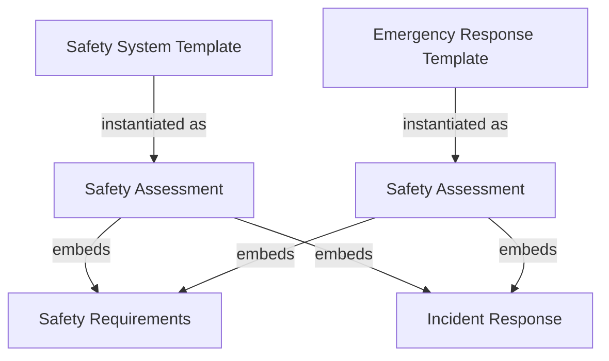
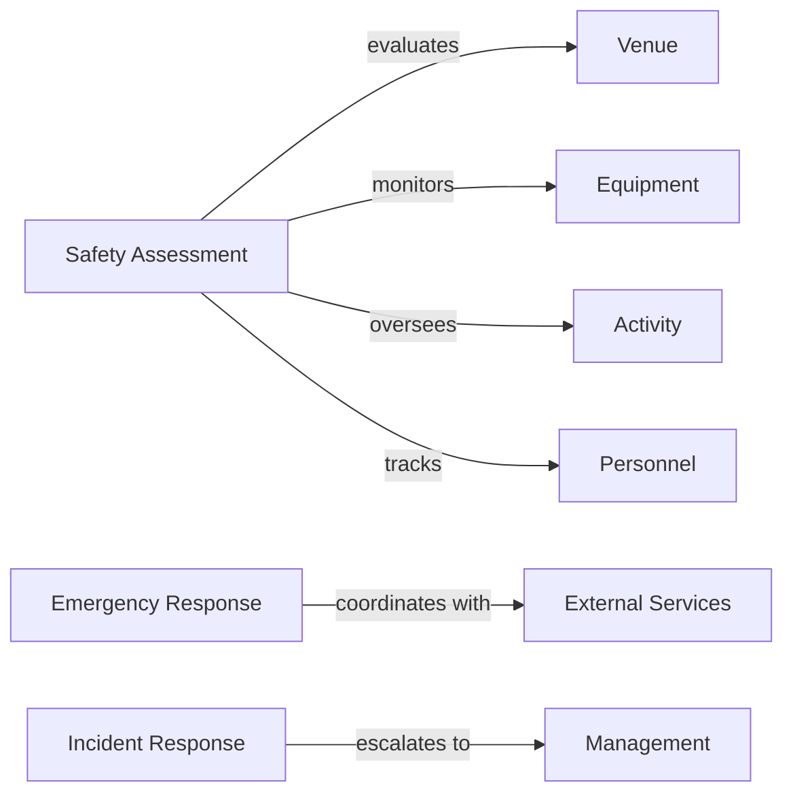

# Safety Domain

## Overview

The Safety domain provides comprehensive tournament safety management through risk assessment, emergency response  
coordination, and incident tracking. It establishes standardized safety protocols, monitors compliance, and ensures  
effective emergency preparedness across all tournament activities and venues.

## Domain Architecture

The Safety domain follows a balanced 5-model architecture:

### Template Entities (2)

- **[Safety System](system.md)**: Comprehensive safety management processes and protocols
- **[Emergency Response](response.md)**: Emergency procedures and crisis management coordination

### Entities (1)

- **[Safety Assessment](safety.md)**: Concrete safety evaluations and monitoring instances

### Value Objects (2)

- **[Safety Requirements](requirements.md)**: Embedded safety criteria and compliance standards
- **[Incident Response](incident.md)**: Embedded incident handling procedures and escalation protocols

## Model Relationships

### Template Entity Usage



### Domain Integration



## Core Capabilities

### Safety Management

- **Risk Assessment**: Comprehensive venue, equipment, and activity risk evaluation
- **Compliance Monitoring**: Tracking safety requirements and regulatory compliance
- **Protocol Standardization**: Consistent safety procedures across tournament contexts
- **Continuous Monitoring**: Ongoing safety oversight and improvement

### Emergency Response

- **Medical Emergency Coordination**: First aid response and medical service coordination
- **Evacuation Management**: Systematic evacuation procedures and crowd control
- **Crisis Communication**: Emergency notification and stakeholder coordination
- **External Service Integration**: Professional emergency service coordination

### Incident Management

- **Incident Tracking**: Comprehensive incident documentation and analysis
- **Response Coordination**: Systematic incident response and escalation
- **Follow-up Management**: Post-incident review and improvement planning
- **Prevention Analytics**: Incident pattern analysis for proactive prevention

## Usage Examples

### Basic Safety Assessment

```yaml
# Safety Assessment for Indoor Venue
assessment_type: "venue"
subject_identifier: "venue-indoor-arena-001"
safety_system: "comprehensive-venue-safety-system"
emergency_response: "indoor-venue-emergency-response"
risk_level: "low"
compliance_status: "compliant"
safety_requirements:
  - requirement_type: "venue"
    category: "fire"
    priority_level: "critical"
incident_response:
  - incident_type: "medical"
    severity_level: "major"
```

### Emergency Response Coordination

```yaml
# Emergency Response for Medical Incident
response_type: "medical_emergency"
severity_level: "major"
activation_criteria: "Serious injury requiring emergency services"
response_procedures:
  immediate_response:
    - "Assess scene safety and victim condition"
    - "Call emergency medical services"
    - "Provide first aid within scope"
coordination_requirements:
  - "Establish communication with tournament control"
  - "Clear emergency access routes"
  - "Coordinate with venue management"
```

## Integration Guidelines

### Cross-Domain Relationships

- **Venue Domain**: Safety assessments for venue compliance and emergency preparedness
- **Equipment Domain**: Safety evaluations for tournament equipment and infrastructure
- **Personnel Domain**: Safety training requirements and emergency role assignments
- **Tournament Domain**: Overall event safety coordination and risk management

### Implementation Patterns

1. **Assessment Planning**: Use Safety System templates to plan comprehensive assessments
2. **Emergency Preparedness**: Use Emergency Response templates for coordinated response planning
3. **Compliance Monitoring**: Embed Safety Requirements for consistent evaluation criteria
4. **Incident Management**: Embed Incident Response procedures for systematic handling

## Quality Standards

### Documentation Requirements

- All safety assessments must include risk evaluation and compliance status
- Emergency response procedures must specify clear escalation criteria
- Incident response protocols must define timeline requirements and responsible roles
- Safety requirements must reference recognized compliance standards

### Validation Rules

- Risk levels must align with assessment evidence and compliance status
- Emergency response procedures must be tested and validated regularly
- Incident escalation criteria must be realistic and achievable
- Safety requirements must include measurable validation criteria

## Implementation Notes

### Best Practices

- Regular review and update of safety templates based on regulatory changes
- Integration with external emergency services and regulatory authorities
- Comprehensive training for personnel responsible for safety management
- Documentation of all safety decisions and incident responses for audit purposes

### Performance Considerations

- Safety assessments should be conducted regularly and systematically
- Emergency response procedures should be practiced and validated
- Incident response protocols should be optimized for rapid deployment
- Integration with safety management systems should maintain data integrity

## Related Domains

- **[Venue](../venue/README.md)**: Venue safety assessment and emergency preparedness
- **[Equipment](../equipment/README.md)**: Equipment safety evaluation and maintenance protocols  
- **[Personnel](../personnel/README.md)**: Safety training and emergency role assignments
- **[Tournament](../tournament/README.md)**: Overall event safety coordination and risk management

---

**Last Updated**: November 28, 2024  
**Version**: 2.0  
**Status**: Active  
**Next Review**: February 28, 2025

