---
tags:
  - emergency-response
  - template-entity
  - emergency-procedures
  - escalation-protocol
  - crisis-management
  - tournament-management
---

# Emergency Response (Template Entity)

## Overview

An Emergency Response defines the emergency procedures, escalation protocols, and crisis management coordination for
specific emergency types or venue contexts. It provides standardized templates for managing how emergencies are
detected, reported, and resolved, what response procedures must be followed, and how the emergency response workflow
progresses from initial alert to resolution and recovery.

## Purpose

This template entity standardizes emergency response across tournaments and emergency types by:

- Defining emergency detection protocols and response procedures for different emergency categories
- Configuring escalation rules, notification procedures, and coordination frameworks
- Supporting different response approaches from basic emergency procedures to comprehensive crisis management
- Enabling consistent emergency response across multiple tournaments and venues
- Providing foundation for automated emergency detection and response coordination

## Structure

This template entity includes standard attributes from the [Base Entity](../foundation/base_entity.md)
and adds the following emergency response-specific attributes:

| Attribute | Description | Type | Required | Notes / Example |
|-----------|-------------|------|----------|-----------------|
| **Name** | Descriptive name for the emergency response protocol | String | Yes | `"Medical Emergency Response"`, `"Evacuation Protocol"`, `"Security Incident Response"` |
| **Description** | Detailed explanation of emergency response scope and procedures | String | Yes | `"Comprehensive medical emergency response for tournament venues"` |
| **Emergency Categories** | Types of emergencies covered by this response protocol | List[String] | Yes | `["Medical Emergency", "Fire/Evacuation", "Security Threat", "Severe Weather", "Equipment Failure"]` |
| **Response Type** | Classification of emergency response approach | Enum | Yes | `IMMEDIATE_RESPONSE`, `COORDINATED_RESPONSE`, `EVACUATION_PROTOCOL`, `MEDICAL_RESPONSE`, `SECURITY_RESPONSE` |
| **Severity Levels** | Emergency severity classification and corresponding responses | List[String] | Yes | `["Level 1: Minor incident", "Level 2: Moderate emergency", "Level 3: Major emergency", "Level 4: Crisis"]` |
| **Response Procedures** | Step-by-step emergency response procedures | List[String] | Yes | `["Assess situation", "Secure area", "Contact emergency services", "Coordinate response", "Document incident"]` |
| **Escalation Chain** | Chain of command for emergency escalation | List[String] | Yes | `["First Responder", "Safety Officer", "Tournament Director", "Emergency Services", "Senior Management"]` |
| **Notification Protocol** | Who to notify and how during emergencies | List[String] | Yes | `["Emergency services: 911", "Safety Officer: immediate", "Tournament Control: within 5 min", "Media: as directed"]` |
| **Resource Requirements** | Required resources for effective emergency response | List[String] | Optional | `["First aid supplies", "Emergency communication", "Evacuation routes", "Assembly areas", "Emergency vehicles"]` |
| **Response Timeline** | Expected timeframes for emergency response actions | String | Optional | `"Initial response: 2 minutes, Assessment: 5 minutes, Full response: 15 minutes"` |
| **Coordination Points** | Key coordination points during emergency response | List[String] | Optional | `["Emergency Command Center", "Medical Station", "Security Desk", "Tournament Control", "Main Entrance"]` |
| **Communication Channels** | Communication methods used during emergencies | List[String] | Optional | `["Emergency radio", "PA system", "Mobile alerts", "Social media", "Website updates"]` |
| **Recovery Procedures** | Post-emergency recovery and restoration procedures | List[String] | Optional | `["Area clearance", "Damage assessment", "Service restoration", "Incident documentation", "Lessons learned"]` |
| **Training Requirements** | Required training for emergency response personnel | List[String] | Optional | `["First aid certification", "Emergency procedures", "Communication protocols", "Evacuation procedures"]` |
| **Review and Testing** | How often emergency procedures are tested and reviewed | String | Optional | `"Monthly drills, quarterly review, annual comprehensive test"` |

## Example

### Example: Medical Emergency Response

```mermaid
graph TD
  ER[Emergency Response: Medical Emergency Protocol]
  ER --> N[Name: Tournament Medical Emergency Response]
  ER --> D[Description: Comprehensive medical emergency response protocol]
  ER --> EC[Emergency Categories: Medical Emergency, Injury, Illness]
  ER --> RT[Response Type: MEDICAL_RESPONSE]
  ER --> SL[Severity Levels: Minor, Moderate, Serious, Critical]
  ER --> RP[Response Procedures: Assess, Stabilize, Treat, Transport]
  ER --> ESC[Escalation Chain: First Responder → Medical Officer → EMS]
  ER --> NP[Notification Protocol: Medical team immediate, EMS if serious]
  ER --> RR[Resource Requirements: First aid, AED, Medical supplies]
  ER --> RTL[Response Timeline: 1 min initial, 3 min medical, 8 min EMS]
  ER --> CP[Coordination Points: Medical Station, Tournament Control]
  ER --> CC[Communication Channels: Medical radio, PA system]
  ER --> REC[Recovery Procedures: Area clearance, Documentation]
  ER --> TR[Training Requirements: First aid, CPR, Emergency protocols]
  ER --> RT2[Review and Testing: Monthly medical drills, quarterly review]
```

This example demonstrates a comprehensive medical emergency response protocol with immediate medical
assessment and rapid escalation to emergency medical services. The system includes first responder
protocols, medical team coordination, and seamless integration with external emergency services.

### Example: Evacuation Emergency Protocol

```mermaid
graph TD
  ER[Emergency Response: Emergency Evacuation Protocol]
  ER --> N[Name: Venue Emergency Evacuation]
  ER --> D[Description: Complete venue evacuation for fire or security threats]
  ER --> EC[Emergency Categories: Fire, Security Threat, Structural Emergency]
  ER --> RT[Response Type: EVACUATION_PROTOCOL]
  ER --> SL[Severity Levels: Precautionary, Urgent, Immediate, Emergency]
  ER --> RP[Response Procedures: Alert, Direct, Evacuate, Account, Secure]
  ER --> ESC[Escalation Chain: Floor Warden → Safety Officer → Emergency Services]
  ER --> NP[Notification Protocol: Fire alarm, PA announcements, Emergency services]
  ER --> RR[Resource Requirements: Evacuation routes, Assembly areas, Emergency exits]
  ER --> RTL[Response Timeline: 30 sec alert, 2 min evacuation start, 10 min complete]
  ER --> CP[Coordination Points: Main exits, Assembly areas, Emergency Command]
  ER --> CC[Communication Channels: Fire alarm, PA system, Emergency radio]
  ER --> REC[Recovery Procedures: All-clear signal, Re-entry procedures, Incident review]
  ER --> TR[Training Requirements: Evacuation procedures, Floor warden training]
  ER --> RT2[Review and Testing: Quarterly evacuation drills, annual review]
```

This second example shows a comprehensive evacuation protocol with systematic personnel movement and
coordination. The system emphasizes rapid notification, orderly evacuation procedures, and complete
accounting of all personnel with coordination between internal staff and emergency services.

## See Also

- [Safety System](./system.md) - Safety management processes and protocol templates
- [Safety Assessment](./safety.md) - Concrete safety evaluations and emergency preparedness
- [Safety Requirements](./requirements.md) - Embedded safety criteria and emergency preparedness standards
- [Incident Response](./response.md) - Embedded incident handling and response procedures
- [First Aid](../first_aid/README.md) - Medical response and emergency care coordination
- [Communication](../communication/README.md) - Emergency notification and alert systems
- [Venue](../venue/README.md) - Facility emergency procedures and evacuation coordination
