---
tags:
  - safety-assessment
  - entity
  - risk-evaluation
  - incident-tracking
  - compliance-monitoring
  - tournament-management
---

# Safety Assessment (Entity)

## Overview

A Safety Assessment represents a concrete safety evaluation and monitoring instance for a specific venue, activity,
or tournament context. As an entity with independent identity and lifecycle, it provides comprehensive tracking of
safety status, risk assessments, incident records, and compliance monitoring for all aspects of tournament safety
management and emergency preparedness.

## Purpose

This entity enables comprehensive safety management by:

- Managing concrete safety evaluations for venues, activities, and tournament operations
- Tracking comprehensive safety status including risk levels, compliance status, and incident history
- Supporting diverse safety contexts from facility assessments to activity-specific safety monitoring
- Enabling detailed incident tracking, response coordination, and safety improvement initiatives
- Facilitating compliance monitoring, audit trails, and safety performance analysis

## Structure

This entity includes standard attributes from the [Base Entity](../foundation/base_entity.md)
and adds the following safety assessment-specific attributes:

| Attribute | Description | Type | Required | Notes / Example |
|-----------|-------------|------|----------|-----------------|
| **Safety System** | Reference to the safety management methodology | UUID | Yes | Links to [Safety System](system.md) template |
| **Emergency Response** | Reference to the emergency response protocol | UUID | Yes | Links to [Emergency Response](response.md) template |
| **Assessment Context** | What is being assessed for safety | Enum | Yes | `VENUE`, `ACTIVITY`, `EQUIPMENT`, `PERSONNEL`, `EVENT` |
| **Context Reference** | Reference to the specific venue, activity, or item being assessed | UUID | Yes | Links to Venue, Activity, Equipment, or Event |
| **Assessment Date** | When the safety assessment was conducted | DateTime | Yes | `"2024-09-15T09:00:00Z"`, `"2024-10-20T14:30:00Z"` |
| **Risk Level** | Current overall risk assessment level | Enum | Yes | `LOW`, `MODERATE`, `HIGH`, `CRITICAL`, `UNASSESSED` |
| **Compliance Status** | Current compliance with safety standards | Enum | Yes | `COMPLIANT`, `MINOR_ISSUES`, `MAJOR_ISSUES`, `NON_COMPLIANT`, `PENDING_REVIEW` |
| **Safety Requirements** | Embedded safety criteria and assessment parameters | Safety Requirements | Yes | Risk assessment criteria, safety standards, compliance requirements |
| **Incident Response** | Embedded incident handling and response capabilities | Incident Response | Yes | Response protocols, escalation procedures, contact information |
| **Safety Officer** | Reference to the safety officer responsible for this assessment | UUID | Yes | Links to [Identity](../identity/README.md) safety personnel |
| **Assessment Findings** | Key findings from the safety assessment | List[String] | Optional | `["Exit routes clear", "Emergency equipment functional", "Minor lighting issues"]` |
| **Risk Factors** | Identified risk factors and their severity | List[String] | Optional | `["Wet floor areas", "Equipment age", "High participant volume"]` |
| **Corrective Actions** | Required actions to address safety issues | List[String] | Optional | `["Install additional lighting", "Schedule equipment maintenance", "Update signage"]` |
| **Incident History** | Record of previous incidents in this context | List[UUID] | Optional | Links to incident records in this assessment context |
| **Monitoring Schedule** | Ongoing monitoring requirements and schedule | String | Optional | `"Daily visual inspection, weekly detailed check, monthly comprehensive audit"` |
| **Next Review Date** | When the next safety review is scheduled | DateTime | Optional | `"2024-10-15T09:00:00Z"`, `"2024-11-01T14:00:00Z"` |
| **Emergency Contacts** | Key emergency contacts for this assessment context | List[String] | Optional | `["Safety Officer: +1-555-0123", "Facility Manager: +1-555-0124", "Emergency Services: 911"]` |
| **Documentation Links** | Links to related safety documentation | List[String] | Optional | `["Safety inspection report", "Equipment certification", "Emergency procedures"]` |

## Example

### Example: Venue Safety Assessment

```mermaid
graph TD
  SA[Safety Assessment: Main Tournament Venue]
  SA --> SS[Safety System: Comprehensive Venue Safety]
  SA --> ER[Emergency Response: Medical + Evacuation Protocol]
  SA --> AC[Assessment Context: VENUE]
  SA --> CR[Context Reference: Main Tournament Arena]
  SA --> AD[Assessment Date: 2024-09-15 09:00 UTC]
  SA --> RL[Risk Level: LOW]
  SA --> CS[Compliance Status: COMPLIANT]
  SA --> SR[Safety Requirements: Multi-level facility assessment]
  SA --> IR[Incident Response: Medical + emergency coordination]
  SA --> SO[Safety Officer: John Smith - Certified Safety Professional]
  SA --> AF[Assessment Findings: All systems operational, Exit routes clear]
  SA --> RF[Risk Factors: High capacity event, Weather considerations]
  SA --> CA[Corrective Actions: Enhanced weather monitoring]
  SA --> IH[Incident History: No major incidents in past 12 months]
  SA --> MS[Monitoring Schedule: Daily checks + weekly comprehensive]
  SA --> NRD[Next Review Date: 2024-10-15 09:00 UTC]
  SA --> EC[Emergency Contacts: Safety Officer, Facility Manager, EMS]
  SA --> DL[Documentation Links: Inspection reports, Emergency procedures]
```

This example demonstrates a comprehensive venue safety assessment with full compliance status and low risk
level. The assessment includes daily monitoring schedules, emergency response coordination, and proactive
weather monitoring to maintain optimal safety conditions for tournament operations.

### Example: Equipment Safety Assessment

```mermaid
graph TD
  SA[Safety Assessment: Tournament Equipment Safety]
  SA --> SS[Safety System: Competition Safety Protocol]
  SA --> ER[Emergency Response: Equipment Emergency Response]
  SA --> AC[Assessment Context: EQUIPMENT]
  SA --> CR[Context Reference: Professional Tournament Equipment Set]
  SA --> AD[Assessment Date: 2024-09-16 07:30 UTC]
  SA --> RL[Risk Level: MODERATE]
  SA --> CS[Compliance Status: MINOR_ISSUES]
  SA --> SR[Safety Requirements: Equipment safety + maintenance standards]
  SA --> IR[Incident Response: Equipment failure + replacement protocols]
  SA --> SO[Safety Officer: Maria Garcia - Equipment Safety Specialist]
  SA --> AF[Assessment Findings: Most equipment excellent, Minor wear on nets]
  SA --> RF[Risk Factors: High usage frequency, Age of some equipment]
  SA --> CA[Corrective Actions: Replace nets, Schedule preventive maintenance]
  SA --> IH[Incident History: 2 minor equipment failures resolved quickly]
  SA --> MS[Monitoring Schedule: Pre-event inspection + post-event check]
  SA --> NRD[Next Review Date: 2024-09-20 07:30 UTC]
  SA --> EC[Emergency Contacts: Equipment Manager, Maintenance Team]
  SA --> DL[Documentation Links: Equipment logs, Maintenance schedules]
```

This second example shows an equipment safety assessment with moderate risk due to equipment age and
usage frequency. The assessment includes preventive maintenance scheduling, replacement planning, and
detailed equipment monitoring to ensure continued safe operation throughout the tournament.

## See Also

- [Safety System](./system.md) - Safety management processes and protocol templates
- [Emergency Response](./response.md) - Emergency procedures and escalation protocol templates  
- [Safety Requirements](./requirements.md) - Embedded safety criteria and compliance standards
- [Incident Response](./incident.md) - Embedded incident handling and response procedures
- [Venue](../venue/README.md) - Facility management and safety coordination
- [Identity](../identity/README.md) - Safety personnel and emergency contact management
- [First Aid](../first_aid/README.md) - Medical response and emergency care integration
- [Tournament](../tournament/tournament.md) - Tournament context for safety assessments

