---
tags:
  - safety-system
  - template-entity
  - safety-management
  - risk-assessment
  - compliance-framework
  - tournament-management
---

# Safety System (Template Entity)

## Overview

A Safety System defines the comprehensive safety management processes, risk assessment frameworks, and compliance
protocols for specific tournament contexts or venue types. It provides reusable templates for managing how safety
assessments are conducted, what safety requirements must be met, and how the safety oversight workflow progresses
from initial assessment to ongoing monitoring.

## Purpose

This template entity standardizes safety management across tournaments and venues by:

- Defining safety assessment protocols and risk evaluation processes for different tournament contexts
- Configuring compliance requirements, safety standards, and regulatory frameworks
- Supporting different safety approaches from basic oversight to comprehensive risk management systems
- Enabling consistent safety processes across multiple tournaments and venues
- Providing foundation for automated safety monitoring and incident prevention

## Structure

This template entity includes standard attributes from the [Base Entity](../foundation/base_entity.md)
and adds the following safety system-specific attributes:

| Attribute | Description | Type | Required | Notes / Example |
|-----------|-------------|------|----------|-----------------|
| **Name** | Descriptive name for the safety management system | String | Yes | `"Venue Safety Oversight"`, `"Competition Safety Management"`, `"Event Safety Protocol"` |
| **Description** | Detailed explanation of safety processes and scope | String | Yes | `"Comprehensive safety management for indoor tournament venues"` |
| **Safety Categories** | Types of safety areas covered by this system | List[String] | Yes | `["Facility Safety", "Participant Safety", "Equipment Safety", "Emergency Preparedness"]` |
| **Assessment Type** | Classification of safety assessment approach | Enum | Yes | `CONTINUOUS_MONITORING`, `PERIODIC_REVIEW`, `INCIDENT_BASED`, `COMPLIANCE_AUDIT`, `COMPREHENSIVE` |
| **Risk Framework** | Framework used for risk assessment and management | String | Yes | `"ISO 31000 Risk Management"`, `"Tournament Safety Standards"`, `"Venue-specific protocols"` |
| **Compliance Standards** | Regulatory and safety standards that must be met | List[String] | Yes | `["ISO 45001", "Local fire codes", "Sports safety regulations", "Accessibility standards"]` |
| **Safety Requirements** | Embedded safety criteria and assessment parameters | Safety Requirements | Yes | Risk assessment criteria, safety standards, compliance requirements |
| **Incident Response** | Embedded incident handling and escalation procedures | Incident Response | Yes | Response protocols, escalation rules, notification procedures |
| **Assessment Frequency** | How often safety assessments are conducted | String | Optional | `"Daily pre-event checks"`, `"Weekly comprehensive review"`, `"Continuous monitoring"` |
| **Safety Personnel** | Required safety staff roles and qualifications | List[String] | Optional | `["Safety Officer", "First Aid Certified", "Emergency Coordinator", "Venue Security"]` |
| **Monitoring Tools** | Tools and systems used for safety monitoring | List[String] | Optional | `["CCTV systems", "Environmental sensors", "Incident reporting app", "Safety checklists"]` |
| **Documentation Requirements** | Required safety documentation and records | List[String] | Optional | `["Daily safety logs", "Incident reports", "Equipment inspections", "Training records"]` |
| **Integration Points** | External systems integrated with safety management | List[String] | Optional | `["Emergency Services", "Medical Response", "Venue Management", "Communication Systems"]` |
| **Review Cycle** | How often the safety system is reviewed and updated | String | Optional | `"Monthly system review"`, `"Post-tournament evaluation"`, `"Annual compliance audit"` |

## Example

### Example: Comprehensive Venue Safety System

```mermaid
graph TD
  SS[Safety System: Comprehensive Venue Safety]
  SS --> N[Name: Tournament Venue Safety Management]
  SS --> D[Description: Comprehensive safety oversight for tournament venues]
  SS --> SC[Safety Categories: Facility, Participant, Equipment, Emergency]
  SS --> AT[Assessment Type: COMPREHENSIVE]
  SS --> RF[Risk Framework: ISO 31000 + Tournament Safety Standards]
  SS --> CS[Compliance Standards: ISO 45001, Fire codes, Sports regulations]
  SS --> SR[Safety Requirements: Multi-level risk assessment criteria]
  SS --> IR[Incident Response: Tiered escalation with medical coordination]
  SS --> AF[Assessment Frequency: Daily checks + weekly comprehensive]
  SS --> SP[Safety Personnel: Safety Officer, First Aid, Emergency Coordinator]
  SS --> MT[Monitoring Tools: CCTV, Environmental sensors, Mobile app]
  SS --> DR[Documentation Requirements: Logs, reports, inspections, training]
  SS --> IP[Integration Points: Emergency Services, Medical, Communication]
  SS --> RC[Review Cycle: Monthly review + post-tournament evaluation]
```

This example demonstrates a comprehensive venue safety system with multi-layered risk assessment and continuous
monitoring. The system includes daily safety checks, weekly comprehensive reviews, and real-time environmental
monitoring with integration to emergency services and medical response teams for complete safety coverage.

### Example: Competition Safety Protocol

```mermaid
graph TD
  SS[Safety System: Competition Safety Protocol]
  SS --> N[Name: Athletic Competition Safety Management]
  SS --> D[Description: Safety management focused on competitive events]
  SS --> SC[Safety Categories: Participant, Equipment, Competition, Medical]
  SS --> AT[Assessment Type: CONTINUOUS_MONITORING]
  SS --> RF[Risk Framework: Sports-specific safety standards]
  SS --> CS[Compliance Standards: Sport federation rules, Medical protocols]
  SS --> SR[Safety Requirements: Athletic safety + equipment standards]
  SS --> IR[Incident Response: Immediate medical + competition protocols]
  SS --> AF[Assessment Frequency: Real-time during competition]
  SS --> SP[Safety Personnel: Sports Medicine, Competition Officials]
  SS --> MT[Monitoring Tools: Medical monitoring, Equipment checks]
  SS --> DR[Documentation Requirements: Medical clearances, Equipment logs]
  SS --> IP[Integration Points: Medical Team, Competition Control]
  SS --> RC[Review Cycle: Post-competition analysis + continuous improvement]
```

This second example shows a competition-focused safety system with real-time monitoring during athletic events.
The system emphasizes sports medicine integration, equipment safety validation, and immediate medical response
capabilities with continuous monitoring throughout competitive events.

## See Also

- [Emergency Response](./response.md) - Emergency procedures and escalation protocol templates
- [Safety Assessment](./safety.md) - Concrete safety evaluations and monitoring instances
- [Safety Requirements](./requirements.md) - Embedded safety criteria and compliance standards
- [Incident Response](./incident.md) - Embedded incident handling and escalation procedures
- [Venue](../venue/README.md) - Facility management and safety coordination
- [First Aid](../first_aid/README.md) - Medical response and emergency care integration
- [Tournament](../tournament/tournament.md) - Tournament context for safety systems
