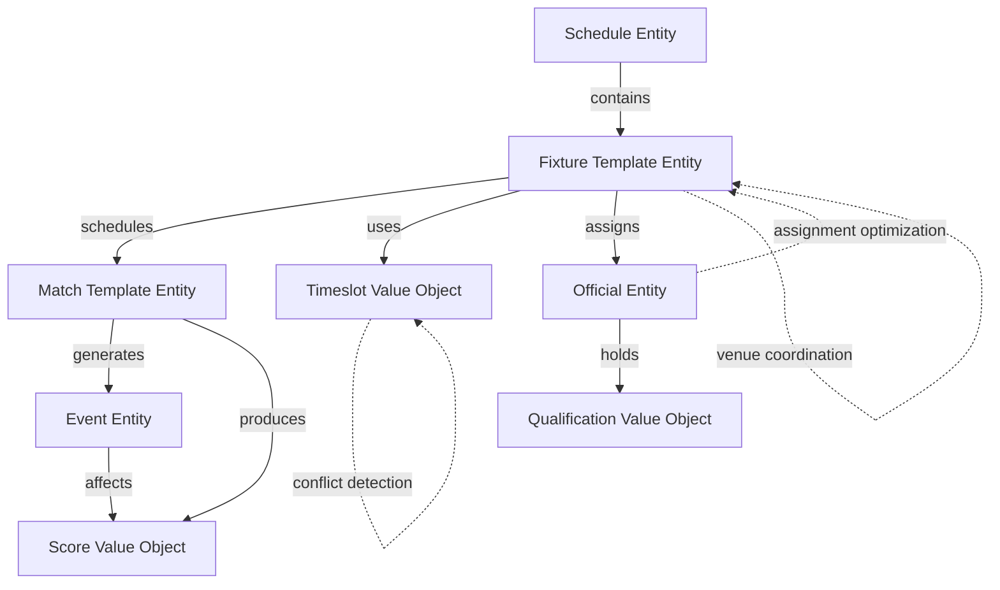

# Schedule Domain

## Overview

The Schedule domain provides comprehensive tournament scheduling, competitive coordination, and event management  
capabilities for tournament organizer systems. This domain manages the temporal organization of tournaments,  
competitive encounters, official assignments, and real-time event tracking across diverse tournament formats  
and competitive requirements.

## Domain Purpose

The Schedule domain enables tournament organizers to:

- **Comprehensive Scheduling:** Coordinate complex tournament schedules with multiple venues, teams, and timeframes
- **Competitive Management:** Manage matches, fixtures, and competitive encounters with detailed tracking
- **Official Coordination:** Assign qualified officials to appropriate competitive contexts
- **Real-time Tracking:** Monitor events, scores, and competitive progression throughout tournaments
- **Resource Optimization:** Optimize venue, official, and time allocation across tournament activities

## Models Overview

### Core Scheduling Models

#### [Schedule](schedule.md) - Entity

Tournament scheduling container that organizes and coordinates all tournament events and activities within  
specific timeframes. Provides structural foundation for tournament timing and resource allocation.

**Key Capabilities:**

- Tournament-wide event coordination and timing structure
- Complex tournament format support from single-elimination to multi-stage championships
- Resource allocation coordination including venues, officials, and participants
- Schedule optimization and real-time adjustment capabilities

#### [Fixture](fixture.md) - Template Entity

Specific scheduled competition instances that connect competitive activities with precise timing, venue  
allocation, and operational resources. Serves as fundamental scheduling unit for tournament execution.

**Key Capabilities:**

- Operational coordination with officials, equipment, and special requirements
- Real-time status tracking throughout tournament progression
- Resource optimization and conflict resolution across tournament schedules
- Detailed tournament logistics and coordination management

#### [Match](match.md) - Template Entity

Competitive encounters between teams or participants with comprehensive match management including team  
participation, competition rules, and outcome determination.

**Key Capabilities:**

- Team participation and competitive arrangement management
- Multiple match format support from individual to team-based encounters
- Score tracking, result determination, and competition progression
- Competition analysis and performance evaluation

### Temporal and Event Models

#### [Timeslot](timeslot.md) - Value Object

Precise temporal intervals with defined boundaries that enable scheduling coordination, conflict detection,  
and resource optimization across tournament activities.

**Key Capabilities:**

- Timezone-aware scheduling for international tournaments
- Complex scheduling coordination with conflict detection
- Resource allocation optimization across temporal constraints
- Immutable temporal records for audit trails

#### [Event](event.md) - Entity

Significant occurrences during competitive activities with detailed incident tracking, temporal documentation,  
and comprehensive analysis capabilities for tournament management.

**Key Capabilities:**

- Real-time event tracking and post-competition analysis
- Disciplinary action tracking and official decision documentation
- Performance analysis and statistical reporting
- Audit trails for competitive integrity and dispute resolution

#### [Score](score.md) - Value Object

Quantified performance achievements that capture performance metrics, temporal progression, and contextual  
details for tournament analysis and record-keeping.

**Key Capabilities:**

- Diverse scoring system support from simple numeric to complex structured formats
- Temporal score progression tracking and match chronology
- Performance analysis and statistical reporting
- Immutable performance records for tournament integrity

### Official Management

#### [Official](official/official.md) - Entity

Tournament officials with certification management, assignment coordination, and professional qualification  
tracking for ensuring qualified competitive oversight.

**Key Capabilities:**

- Professional certification and qualification management
- Tournament assignment coordination and availability tracking
- Performance evaluation and professional development
- Specialized expertise management for diverse competitive requirements

#### [Qualification](official/qualification.md) - Value Object

Professional certifications documenting competency, authority, and expertise for official validation  
and assignment eligibility.

**Key Capabilities:**

- Professional certification documentation and validation
- Renewal tracking and compliance management
- Specialized endorsement and expertise certification
- Performance history and professional development tracking

## Domain Architecture



## Business Rules and Constraints

### Scheduling Constraints

- Fixtures cannot overlap in the same venue area without explicit multi-use configuration
- Officials cannot be assigned to concurrent fixtures requiring their exclusive attention
- Teams cannot participate in overlapping competitive activities
- Equipment and resource availability must be verified before fixture confirmation

### Status Transitions

**Schedule Lifecycle:**
`DRAFT` → `PUBLISHED` → `ACTIVE` → `COMPLETED`

**Fixture Lifecycle:**
`SCHEDULED` → `READY` → `IN_PROGRESS` → `COMPLETED` | `POSTPONED` | `CANCELLED`

**Match Lifecycle:**
`SCHEDULED` → `READY` → `IN_PROGRESS` → `COMPLETED` | `FORFEIT` | `NO_CONTEST`

**Official Lifecycle:**
`PENDING` → `ACTIVE` ↔ `UNAVAILABLE` → `RETIRED`

### Quality Standards

- All temporal boundaries must be chronologically valid and timezone-consistent
- Official qualifications must be current and appropriate for assigned competition levels
- Score records must be verified by authorized personnel before final recording
- Event documentation requires sufficient detail for audit and dispute resolution

## Integration Points

### External Domain Dependencies

- **Tournament Domain:** Tournament structure and competitive framework
- **Team Domain:** Team participation and competitive eligibility
- **Venue Domain:** Physical location availability and resource constraints
- **Identity Domain:** Individual identity management for officials and participants
- **Organization Domain:** Certification bodies and tournament organizing entities

### Data Flow Patterns

- **Schedule Creation:** Tournament requirements → Schedule planning → Fixture allocation → Resource coordination
- **Match Execution:** Fixture activation → Match progression → Event recording → Score tracking → Result finalization
- **Official Assignment:** Qualification verification → Availability checking → Assignment matching → Performance tracking

## Usage Examples

### Tournament Championship Schedule

```text
National Championship 2024
├── Qualifying Round Schedule (Oct 28-29)
│   ├── 32 qualifying fixtures across 8 courts
│   ├── 8 regional officials assigned
│   └── Standard scoring with advancement criteria
├── Main Tournament Schedule (Nov 15-17)
│   ├── 48 championship fixtures across 3 days
│   ├── 12 international officials assigned
│   └── Complex scoring with video review
└── Finals Schedule (Nov 17)
    ├── Championship final with ceremonial arrangements
    ├── Elite official assignments
    └── Comprehensive event tracking
```

### Multi-Sport Tournament Coordination

```text
Regional Multi-Sport Tournament
├── Basketball Schedule
│   ├── Team-based matches with period scoring
│   ├── Referee and scorekeeper assignments
│   └── Real-time event tracking
├── Tennis Schedule
│   ├── Individual and doubles matches
│   ├── Umpire and line judge assignments
│   └── Set-based structured scoring
└── Volleyball Schedule
    ├── Team competitions with rally scoring
    ├── Officials with specialized certifications
    └── Video review capabilities
```

## See Also

- [Tournament Domain](../tournament/README.md) - Tournament structure and competitive framework
- [Team Domain](../team/README.md) - Team management and competitive participation
- [Venue Domain](../venue/README.md) - Physical location and resource management
- [Identity Domain](../identity/README.md) - Individual identity and profile management
- [Organization Domain](../organization/README.md) - Organizational structure and certification bodies
