---
tags:
  - event
  - entity
  - match-tracking
  - competition-incidents
  - tournament-logging
  - real-time-events
---

# Event (Entity)

## Overview

An Event represents a specific significant occurrence during a competitive match or scheduled activity within a  
tournament context. As an entity with independent identity and lifecycle, it provides detailed incident tracking,  
temporal documentation, and comprehensive competition analysis capabilities for tournament management.

## Purpose

This entity enables comprehensive competition monitoring by:

- Recording specific incidents, actions, and significant moments during competitive activities
- Supporting real-time event tracking and post-competition analysis
- Facilitating disciplinary action tracking and official decision documentation
- Enabling detailed performance analysis and statistical reporting
- Providing audit trails for competitive integrity and dispute resolution

## Structure

This entity includes standard attributes from the [Base Entity](../foundation/base_entity.md)  
and adds the following event-specific attributes:

| Attribute | Description | Type | Required | Notes / Example |
|-----------|-------------|------|----------|-----------------|
| **Match** | Reference to the match where this event occurred | UUID | Yes | Links to [Match](match.md) entity |
| **Event Type** | Classification of the recorded occurrence | Enum | Yes | `GOAL`, `PENALTY`, `WARNING`, `TIMEOUT`, `SUBSTITUTION`, `INJURY`, `MISCONDUCT` |
| **Event Timestamp** | Precise time when the event occurred | DateTime | Yes | `"2024-11-15T14:32:45Z"` |
| **Match Time** | Event timing within match context | String | Yes | `"23:45"`, `"Set 2 - 18:30"`, `"Overtime 5:12"` |
| **Player Involved** | Player directly involved in the event | UUID | Optional | Links to Player entity |
| **Team Involved** | Team associated with the event | UUID | Optional | Links to Team entity |
| **Official Recording** | Official who recorded or observed the event | UUID | Optional | Links to [Official](official/official.md) entity |
| **Event Severity** | Classification of event importance or impact | Enum | Yes | `MINOR`, `MODERATE`, `MAJOR`, `CRITICAL` |
| **Event Category** | Broader classification of event type | Enum | Yes | `SCORING`, `DISCIPLINARY`, `PROCEDURAL`, `MEDICAL`, `TECHNICAL` |
| **Event Description** | Detailed description of the occurrence | Text | Yes | `"Player received yellow card for unsportsmanlike conduct"` |
| **Location on Field** | Specific location where event occurred | String | Optional | `"Center court"`, `"18-yard box"`, `"Service line"` |
| **Event Outcome** | Result or consequence of the event | String | Optional | `"Free kick awarded"`, `"Player substituted"`, `"Match suspended"` |
| **Points Awarded** | Points or score changes resulting from event | Integer | Optional | `1`, `2`, `3` |
| **Penalty Applied** | Specific penalty or sanction imposed | String | Optional | `"2-minute penalty"`, `"Game misconduct"`, `"Warning issued"` |
| **Video Reference** | Link to video recording of the event | String | Optional | `"Camera 3 - 14:32:45"`, `"Replay system timestamp"` |
| **Witness Officials** | Additional officials who witnessed the event | List[UUID] | Optional | References to Official entities |
| **Review Status** | Whether event has been reviewed or appealed | Enum | Optional | `RECORDED`, `UNDER_REVIEW`, `CONFIRMED`, `OVERTURNED` |
| **Appeal Deadline** | Deadline for appealing this event | DateTime | Optional | `"2024-11-16T17:00:00Z"` |
| **Event Sequence** | Order of this event within the match | Integer | Optional | `1`, `15`, `47` |
| **Related Events** | Links to other events connected to this occurrence | List[UUID] | Optional | References to other Event entities |
| **Administrative Notes** | Additional administrative information | Text | Optional | `"Reviewed by head official"`, `"Appeal period expired"` |

## Examples

### Example: Goal Scoring Event

```mermaid
graph TD
  E[Event: Championship Goal]
  E --> M[Match: Eagles vs Hawks Championship Final]
  E --> ET[Event Type: GOAL]
  E --> ETS[Timestamp: 2024-11-15T15:23:45Z]
  E --> MT[Match Time: 42:15]
  E --> PI[Player: Sarah Johnson #10]
  E --> TI[Team: Eagles]
  E --> OR[Official: Head Referee Mike Chen]
  E --> ES[Severity: MAJOR]
  E --> EC[Category: SCORING]
  E --> ED[Description: Header goal from corner kick]
  E --> LOF[Location: 6-yard box, center]
  E --> EO[Outcome: Goal awarded, Eagles lead 2-1]
  E --> PA[Points: 1 point awarded to Eagles]
  E --> VR[Video: Camera 2 - 15:23:45]
  E --> WO[Witnesses: Line judge, assistant referee]
  E --> RS[Review: CONFIRMED]
  E --> ESQ[Sequence: 23rd event of match]
  E --> RE[Related: Corner kick event #22]
  E --> AN[Notes: Clean header, no disputed calls]
```

This example demonstrates a significant scoring event with comprehensive documentation including video  
reference, official verification, and related event tracking typical of high-level competitive matches.

### Example: Disciplinary Event

```mermaid
graph TD
  E[Event: Yellow Card Warning]
  E --> M[Match: Storm vs Thunder Qualifying]
  E --> ET[Event Type: WARNING]
  E --> ETS[Timestamp: 2024-10-28T11:15:30Z]
  E --> MT[Match Time: 18:42]
  E --> PI[Player: Alex Rodriguez #7]
  E --> TI[Team: Thunder]
  E --> OR[Official: Referee Lisa Wong]
  E --> ES[Severity: MODERATE]
  E --> EC[Category: DISCIPLINARY]
  E --> ED[Description: Unsportsmanlike conduct - arguing with official]
  E --> LOF[Location: Midfield, near official]
  E --> EO[Outcome: Yellow card issued, player cautioned]
  E --> PA[Penalty: Formal caution recorded]
  E --> VR[Video: Court camera timestamp 11:15:30]
  E --> WO[Witnesses: Assistant referee, timekeeper]
  E --> RS[Review: RECORDED]
  E --> AD[Appeal: 2024-10-29T18:00:00Z]
  E --> ESQ[Sequence: 12th event of match]
  E --> AN[Notes: Player accepted caution, no further incident]
```

This second example shows a disciplinary event with formal penalty procedures, appeal deadlines,  
and comprehensive incident documentation required for tournament disciplinary tracking.

## Business Rules

### Event Recording Requirements

- All significant match occurrences must be recorded by authorized officials
- Event timestamps must be synchronized with official match timing systems
- Critical events require verification by multiple officials when possible
- Video evidence should be preserved for events subject to appeal or review

### Event Classification

- Event types must align with tournament-specific rule sets and regulations
- Severity levels determine appeal procedures and review requirements
- Disciplinary events trigger automatic notifications to tournament committees
- Scoring events must be verified before official match records are finalized

### Appeal and Review Process

- Events marked as appealable have defined deadline periods for formal challenges
- Review status changes require authorized tournament official approval
- Overturned events must include detailed justification and documentation
- Related events may be affected by successful appeals or review outcomes

## See Also

- [Match](./match.md) - Competitive encounters where events occur
- [Fixture](./fixture.md) - Scheduled competition instances containing events
- [Official](./official/official.md) - Tournament officials who record and verify events
- [Score](./score.md) - Team scores affected by scoring events
- [Schedule](./schedule.md) - Tournament scheduling context for events
- [Base Entity](../foundation/base_entity.md) - Common entity structure and lifecycle
