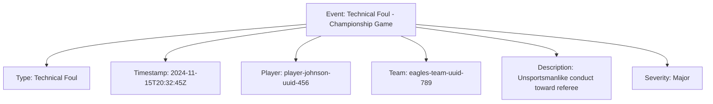

---
tags:
  - event
  - entity
  - match-tracking
  - competition-incidents
---

# Event (Entity)

## Overview

An Event Entity records a specific occurrence during a Match, such as penalties, warnings, timeouts, or other  
significant moments that need to be tracked for the match record.

As an Entity, it maintains its own identity and lifecycle, managed according to the [Base Entity](../foundation/base_entity.md).

## Purpose

This entity enables comprehensive event tracking by:

- Recording significant occurrences and incidents during competitive matches for detailed match history
- Supporting disciplinary action tracking and official decision documentation through precise incident recording
- Facilitating performance analysis and statistical reporting for tournament management and evaluation
- Providing audit trails for competitive integrity, dispute resolution, and post-match review processes
- Enabling real-time event monitoring and automated alert systems for tournament oversight

## Structure

This entity includes standard attributes from the [Base Entity](../foundation/base_entity.md)  
and adds the following event-specific attributes:

| Attribute | Description | Type | Required | Notes / Example |
|-----------|-------------|------|----------|-----------------|
| **Type** | The type of event that occurred | String | Yes | `"Penalty"`, `"Warning"`, `"Timeout"`, `"Goal"`, `"Foul"` |
| **Timestamp** | When the event occurred during the match | DateTime | Yes | `2024-11-02T14:30:15Z` |
| **Player** | Reference to the Player involved in the event (if applicable) | UUID | Optional | `player-uuid-456` |
| **Team** | Reference to the Team involved in the event (if applicable) | UUID | Optional | `team-uuid-789` |
| **Description** | Additional details about the event | Text | Optional | `"Yellow card for unsportsmanlike conduct"` |
| **Severity** | The severity level of the event (if applicable) | String | Optional | `"Minor"`, `"Major"`, `"Critical"` |

## Example

### Basketball Championship Penalty Event

This example demonstrates a technical foul event during a championship game showing all event attributes: event  
type classification, precise timestamp for chronological tracking, involved player and team identification,  
detailed description for review purposes, and severity assessment for disciplinary action. The match context  
is provided through the fixture that embeds this event. This structure enables tournament officials to maintain  
comprehensive incident records for competitive integrity and post-match analysis.  
and post-match analysis.

## Considerations

- **Event Tracking:** Match events provide a detailed record of significant occurrences during a match
- **Timing:** Events should be recorded with precise timestamps for accurate match history
- **Classification:** Event types should be standardized for consistent reporting and analysis
- **Severity:** Severity levels help prioritize events for review and action

## See Also

- [Match](./match.md) - Competitive encounters where events occur
- [Fixture](./fixture.md) - Scheduled competition instances containing events
- [Score](./score.md) - Team scores affected by scoring events
- [Schedule](./schedule.md) - Tournament scheduling context for events
- [Base Entity](../foundation/base_entity.md) - Common entity structure and lifecycle
