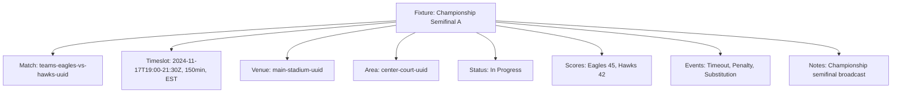

---
tags:
  - fixture
  - template-entity
  - tournament-scheduling
  - competition-coordination
---

# Fixture (Template Entity)

## Overview

A Fixture Entity represents a specific scheduled competition instance (a game, match, heat, etc.) within a  
tournament. It acts as the central point connecting the scheduled competition time and location with operational  
details and links to the specific competition data (like a Match).

As an Entity, it possesses a unique identity and lifecycle, managed according to the [Base Entity](../foundation/base_entity.md).

## Structure

This template entity includes standard attributes from the [Base Entity](../foundation/base_entity.md)  
and adds the following fixture-specific attributes:

| Attribute | Description | Type | Required | Notes / Example |
|-----------|-------------|------|----------|-----------------|
| **Match** | Reference to the specific Match entity that this fixture schedules | UUID | Yes | `match-uuid-123` |
| **Timeslot** | The scheduled time for this fixture, embedded as a Value Object | Timeslot | Yes | Start: 14:00, End: 15:30, Duration: 90 minutes |
| **Venue** | Reference to the Venue where this fixture takes place | UUID | Yes | `venue-uuid-main-stadium` |
| **Area** | Reference to the specific Area within the venue where this fixture occurs | UUID | Yes | `area-uuid-court-1` |
| **Status** | Current status of the fixture | String | Yes | `"Scheduled"`, `"In Progress"`, `"Completed"`, `"Cancelled"` |
| **Scores** | List of team scores for this fixture, embedded as Value Objects | List[Score] | Optional | List of embedded [Score](score.md) Value Objects |
| **Events** | List of events that occurred during this fixture | List[Event] | Optional | List of embedded [Event](event.md) entities |
| **Notes** | Additional operational notes about this specific fixture | Text | Optional | `"Delayed due to weather"`, `"Special equipment required"` |

## Purpose

This template entity enables comprehensive fixture management by:

- Coordinating scheduled competition instances with precise timing and location details
- Centralizing operational data including scores, events, and status tracking for tournament oversight
- Supporting diverse tournament formats through flexible template-based fixture configurations
- Enabling real-time status updates and progress monitoring throughout tournament execution
- Facilitating resource allocation and venue coordination across complex tournament schedules

## Example

### Championship Semifinal Fixture

This example demonstrates a championship semifinal fixture showing all operational attributes: match reference linking  
participating teams, embedded timeslot with precise scheduling, venue and area allocation, current progress status,  
embedded score tracking for both teams, event recording for match incidents, and administrative notes. This structure  
enables tournament organizers to coordinate all aspects of fixture execution from scheduling through completion while  
maintaining centralized data for real-time monitoring and historical records.

## Considerations

- **Scheduling:** Fixtures are the primary unit for tournament scheduling and time management
- **Status Tracking:** Fixture status should be updated as the tournament progresses
- **Venue Allocation:** Each fixture must be assigned to a specific venue and area
- **Data Centralization:** Scores and events are embedded within fixtures for complete operational context

## See Also

- [Schedule](./schedule.md) - Tournament scheduling container and coordination
- [Match](./match.md) - Competitive encounters between teams or participants
- [Timeslot](./timeslot.md) - Specific time intervals for scheduling
- [Official](./official/official.md) - Tournament officials and their assignments
- [Base Entity](../foundation/base_entity.md) - Common entity structure and lifecycle
