---
tags:
  - fixture
  - template-entity
  - tournament-scheduling
  - competition-coordination
  - venue-allocation
  - match-scheduling
---

# Fixture (Template Entity)

## Overview

A Fixture represents a specific scheduled competition instance within a tournament context, serving as the fundamental  
scheduling unit that connects competitive activities with time, location, and operational resources. As a template  
entity with contextual identity, it provides the operational framework for tournament execution and coordination.

## Purpose

This template entity enables comprehensive tournament scheduling by:

- Coordinating specific competition instances with precise timing and venue allocation
- Managing operational details including officials, equipment, and special requirements
- Facilitating real-time status tracking throughout tournament progression
- Supporting resource optimization and conflict resolution across tournament schedules
- Enabling detailed tournament logistics and coordination management

## Structure

This template entity includes standard attributes from the [Base Entity](../foundation/base_entity.md)  
and adds the following fixture-specific attributes:

| Attribute | Description | Type | Required | Notes / Example |
|-----------|-------------|------|----------|-----------------|
| **Schedule** | Reference to the schedule containing this fixture | UUID | Yes | Links to [Schedule](schedule.md) entity |
| **Match** | Reference to the specific match this fixture coordinates | UUID | Yes | Links to [Match](match.md) entity |
| **Timeslot** | Scheduled time allocation for this fixture | Object | Yes | Embedded [Timeslot](timeslot.md) value object |
| **Venue** | Reference to the venue where fixture takes place | UUID | Yes | Links to Venue entity |
| **Area** | Specific area within venue for this fixture | UUID | Yes | Links to Area entity |
| **Fixture Number** | Sequential identifier within tournament schedule | String | Yes | `"F001"`, `"QF-2"`, `"FINAL-A"` |
| **Competition Type** | Classification of competition level | Enum | Yes | `QUALIFYING`, `PRELIMINARY`, `SEMIFINAL`, `FINAL`, `PLAYOFF` |
| **Officials Assigned** | Officials allocated to this specific fixture | List[UUID] | Optional | References to [Official](official/official.md) entities |
| **Equipment Required** | Specialized equipment needed for this fixture | List[String] | Optional | `"Video replay system"`, `"Additional scoring equipment"` |
| **Special Requirements** | Additional operational requirements | List[String] | Optional | `"Media coverage"`, `"VIP seating arrangement"`, `"Medical standby"` |
| **Fixture Status** | Current operational status of the fixture | Enum | Yes | `SCHEDULED`, `READY`, `IN_PROGRESS`, `COMPLETED`, `POSTPONED`, `CANCELLED` |
| **Check-in Time** | When teams/participants should arrive | DateTime | Optional | `"2024-11-15T13:30:00Z"` |
| **Warm-up Period** | Allocated warm-up time before competition | Duration | Optional | `"15 minutes"`, `"30 minutes"` |
| **Estimated Duration** | Expected fixture completion time | Duration | Optional | `"90 minutes"`, `"120 minutes"` |
| **Actual Start Time** | When the fixture actually commenced | DateTime | Optional | `"2024-11-15T14:05:00Z"` |
| **Actual End Time** | When the fixture actually concluded | DateTime | Optional | `"2024-11-15T15:45:00Z"` |
| **Result Summary** | Brief fixture outcome summary | String | Optional | `"Home team victory 3-1"`, `"Visitor team advancement"` |
| **Operational Notes** | Additional fixture-specific information | Text | Optional | `"Delayed 15 minutes due to previous fixture overtime"` |

## Examples

### Example: Championship Final Fixture

```mermaid
graph TD
  F[Fixture: Championship Final]
  F --> S[Schedule: Championship Main Schedule]
  F --> M[Match: Final Championship Match]
  F --> T[Timeslot: 2024-11-17 19:00-21:00]
  F --> V[Venue: Main Stadium Arena]
  F --> A[Area: Center Court]
  F --> FN[Fixture Number: FINAL-A]
  F --> CT[Competition Type: FINAL]
  F --> OA[Officials: Head referee, 2 line judges, scorer]
  F --> ER[Equipment: HD replay system, ceremonial podium]
  F --> SR[Special Req: Live broadcast, medal ceremony setup]
  F --> FS[Status: SCHEDULED]
  F --> CI[Check-in: 18:00]
  F --> WP[Warm-up: 30 minutes]
  F --> ED[Duration: 120 minutes estimated]
  F --> ON[Notes: Championship ceremony follows immediately]
```

This example demonstrates a high-profile championship final with comprehensive operational coordination.  
The fixture includes specialized equipment, media requirements, and ceremonial arrangements typical  
of tournament finals with significant organizational complexity.

### Example: Qualifying Round Fixture

```mermaid
graph TD
  F[Fixture: Qualifying Round Match]
  F --> S[Schedule: Qualifying Round Schedule]
  F --> M[Match: Qualifying Match QR-24]
  F --> T[Timeslot: 2024-10-28 10:30-11:30]
  F --> V[Venue: Regional Sports Complex]
  F --> A[Area: Court 3]
  F --> FN[Fixture Number: Q024]
  F --> CT[Competition Type: QUALIFYING]
  F --> OA[Officials: Certified referee, scorekeeper]
  F --> ER[Equipment: Standard scoring system]
  F --> SR[Special Req: None]
  F --> FS[Status: COMPLETED]
  F --> CI[Check-in: 10:00]
  F --> WP[Warm-up: 15 minutes]
  F --> ED[Duration: 60 minutes]
  F --> AS[Start: 10:32]
  F --> AE[End: 11:28]
  F --> RS[Result: Team A advances to next round]
  F --> ON[Notes: Match completed on schedule]
```

This second example shows a streamlined qualifying fixture with minimal operational complexity.  
The fixture demonstrates efficient tournament processing with standard equipment and  
straightforward advancement criteria for qualifying tournaments.

## Business Rules

### Scheduling Constraints

- Fixtures must not overlap in the same venue area
- Minimum transition time required between consecutive fixtures
- Officials cannot be assigned to concurrent fixtures
- Equipment availability must be verified before fixture scheduling

### Status Progression

- Fixtures progress through defined status sequence: `SCHEDULED` → `READY` → `IN_PROGRESS` → `COMPLETED`
- Status changes trigger automatic notifications to relevant stakeholders
- Postponed or cancelled fixtures require coordinator approval and rescheduling
- Completed fixtures cannot be modified without administrative override

### Operational Requirements

- Check-in time must precede scheduled start time by minimum buffer period
- Warm-up periods cannot exceed venue availability windows
- Special requirements must be coordinated with venue management
- Equipment requests require advance notice for procurement and setup

## See Also

- [Schedule](./schedule.md) - Tournament scheduling container and coordination
- [Match](./match.md) - Competitive encounters between teams or participants
- [Timeslot](./timeslot.md) - Specific time intervals for scheduling
- [Official](./official/official.md) - Tournament officials and their assignments
- [Event](./event.md) - Specific occurrences during scheduled activities
- [Base Entity](../foundation/base_entity.md) - Common entity structure and lifecycle
