---
tags:
  - match
  - template-entity
  - competition
  - team-encounter
  - tournament-competition
  - competitive-event
---

# Match (Template Entity)

## Overview

A Match represents a competitive encounter between teams or participants within a tournament context. As a template  
entity with contextual identity, it serves as the core competitive unit that defines team participation, competition  
rules, and outcome determination for scheduled tournament activities.

## Purpose

This template entity enables comprehensive competition management by:

- Defining competitive encounters between teams or individual participants
- Managing team participation, roles, and competitive arrangements
- Supporting various match formats from individual competitions to team-based encounters
- Facilitating score tracking, result determination, and competition progression
- Enabling detailed competition analysis and performance evaluation

## Structure

This template entity includes standard attributes from the [Base Entity](../foundation/base_entity.md)  
and adds the following match-specific attributes:

| Attribute | Description | Type | Required | Notes / Example |
|-----------|-------------|------|----------|-----------------|
| **Teams** | Teams or participants in this competitive encounter | List[UUID] | Yes | References to Team entities; minimum 2 teams |
| **Match Type** | Classification of competition format | Enum | Yes | `SINGLES`, `DOUBLES`, `TEAM_VS_TEAM`, `MULTI_TEAM`, `INDIVIDUAL` |
| **Competition Level** | Competitive level within tournament structure | Enum | Yes | `QUALIFYING`, `PRELIMINARY`, `QUARTERFINAL`, `SEMIFINAL`, `FINAL` |
| **Match Format** | Specific competitive format and rules | String | Yes | `"Best of 3 sets"`, `"Single elimination"`, `"Round robin"` |
| **Home Team** | Designated home team if applicable | UUID | Optional | Reference to Team entity |
| **Away Team** | Designated away team if applicable | UUID | Optional | Reference to Team entity |
| **Match Number** | Sequential identifier within tournament | String | Yes | `"M001"`, `"QF-2"`, `"FINAL-A"` |
| **Round** | Tournament round or stage identifier | String | Optional | `"Round 1"`, `"Quarterfinals"`, `"Championship Final"` |
| **Winner Advances To** | Next competition stage for winner | String | Optional | `"Semifinal A"`, `"Championship Final"`, `"Next tournament level"` |
| **Loser Advances To** | Alternative progression for losing team | String | Optional | `"Consolation bracket"`, `"Lower division"` |
| **Match Rules** | Specific rules governing this competition | Text | Optional | `"Standard tournament rules apply with 30-second shot clock"` |
| **Scoring System** | Method for determining match outcome | String | Optional | `"Points-based with overtime"`, `"Best of 5 games"` |
| **Minimum Duration** | Minimum expected match duration | Duration | Optional | `"45 minutes"`, `"60 minutes"` |
| **Maximum Duration** | Maximum allowed match duration | Duration | Optional | `"120 minutes"`, `"180 minutes with overtime"` |
| **Tiebreaker Rules** | Procedures for resolving tied outcomes | Text | Optional | `"Sudden death overtime"`, `"Penalty competition"` |
| **Technical Requirements** | Special equipment or setup needed | List[String] | Optional | `"Video replay system"`, `"Electronic scoring"` |
| **Match Status** | Current competitive status | Enum | Yes | `SCHEDULED`, `READY`, `IN_PROGRESS`, `COMPLETED`, `POSTPONED`, `CANCELLED` |
| **Final Score** | Completed match outcome summary | String | Optional | `"Team A: 3, Team B: 1"`, `"Home: 21, Away: 18"` |
| **Match Result** | Official match outcome determination | Enum | Optional | `HOME_WIN`, `AWAY_WIN`, `DRAW`, `NO_CONTEST`, `FORFEIT` |
| **Match Notes** | Additional match-specific information | Text | Optional | `"Overtime required"`, `"Weather-related delays"` |

## Examples

### Example: Championship Final Match

```mermaid
graph TD
  M[Match: Championship Final]
  M --> T[Teams: Eagles vs Hawks]
  M --> MT[Match Type: TEAM_VS_TEAM]
  M --> CL[Competition Level: FINAL]
  M --> MF[Format: Best of 3 sets, 25 points per set]
  M --> HT[Home Team: Eagles]
  M --> AT[Away Team: Hawks]
  M --> MN[Match Number: FINAL-A]
  M --> R[Round: Championship Final]
  M --> WA[Winner: Tournament Champion]
  M --> LA[Loser: Tournament Runner-up]
  M --> MR[Rules: Championship rules with extended timeouts]
  M --> SS[Scoring: Best of 3 sets with rally scoring]
  M --> MIN[Min Duration: 90 minutes]
  M --> MAX[Max Duration: 180 minutes]
  M --> TR[Tiebreaker: 15-point deciding set if needed]
  M --> TRQ[Tech Req: HD replay, electronic scoring]
  M --> MS[Status: COMPLETED]
  M --> FS[Final Score: Eagles 3, Hawks 1]
  M --> MRE[Result: HOME_WIN]
  M --> MN2[Notes: Eagles win championship in 4 sets]
```

This example demonstrates a high-stakes championship final with comprehensive competitive structure.  
The match includes detailed scoring systems, technical requirements, and championship-level procedures  
typical of tournament finals with significant competitive importance.

### Example: Qualifying Round Match

```mermaid
graph TD
  M[Match: Qualifying Round Competition]
  M --> T[Teams: Storm vs Thunder]
  M --> MT[Match Type: TEAM_VS_TEAM]
  M --> CL[Competition Level: QUALIFYING]
  M --> MF[Format: Single set to 21 points]
  M --> HT[Home Team: Storm]
  M --> AT[Away Team: Thunder]
  M --> MN[Match Number: Q024]
  M --> R[Round: Qualifying Round 2]
  M --> WA[Winner: Advances to main tournament]
  M --> LA[Loser: Eliminated from tournament]
  M --> MR[Rules: Standard qualifying rules]
  M --> SS[Scoring: Single set rally scoring to 21]
  M --> MIN[Min Duration: 30 minutes]
  M --> MAX[Max Duration: 60 minutes]
  M --> TR[Tiebreaker: First to 21 with 2-point margin]
  M --> TRQ[Tech Req: Standard scoring system]
  M --> MS[Status: COMPLETED]
  M --> FS[Final Score: Storm 21, Thunder 18]
  M --> MRE[Result: HOME_WIN]
  M --> MN2[Notes: Storm advances to main tournament bracket]
```

This second example shows a streamlined qualifying match with simplified competitive structure.  
The match demonstrates efficient tournament processing with standard scoring and clear advancement  
criteria for qualifying competitions.

## Business Rules

### Team Participation

- Matches must include minimum of 2 teams or participants
- Teams cannot compete against themselves in the same match
- Team availability must be verified before match scheduling
- Substitutions governed by tournament-specific rules and regulations

### Competition Progression

- Match outcomes determine advancement through tournament brackets
- Winner and loser advancement paths must be clearly defined
- Tournament seeding affects match scheduling and progression opportunities
- Forfeit or disqualification handled according to tournament disciplinary procedures

### Scoring and Results

- Scoring systems must be clearly defined before match commencement
- Tiebreaker procedures required for competitions allowing tied outcomes
- Official results require authorized personnel verification
- Score corrections possible only through formal appeal processes

## See Also

- [Fixture](./fixture.md) - Scheduled competition instances with timing and venue details
- [Schedule](./schedule.md) - Tournament scheduling and coordination framework
- [Event](./event.md) - Specific occurrences during competitive activities
- [Score](./score.md) - Team scores and progression tracking
- [Team](../team/team.md) - Team structure and competitive participation
- [Base Entity](../foundation/base_entity.md) - Common entity structure and lifecycle
