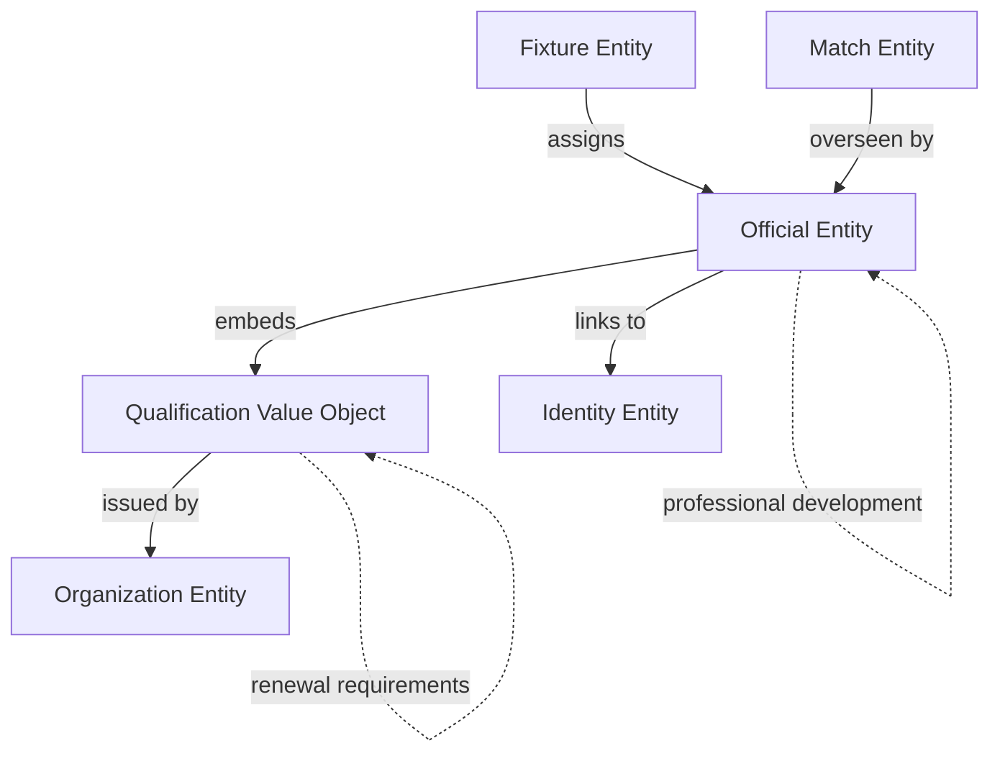

# Schedule Domain - Official Management

This subdirectory contains models for managing tournament officials, their qualifications, and assignment  
coordination within the schedule domain context. These models enable comprehensive oversight personnel  
management for competitive tournament environments.

## Models Overview

### [Official](official.md) - Entity

Represents tournament officials and competitive oversight personnel with certification management,  
assignment coordination, and professional qualification tracking. Manages referee, judge, umpire,  
and other official roles across tournament contexts.

**Key Capabilities:**

- Professional certification and qualification management
- Tournament assignment coordination and availability tracking
- Performance evaluation and professional development support
- Specialized expertise management for diverse competitive requirements

### [Qualification](qualification.md) - Value Object

Documents professional certifications and credentials held by tournament officials, supporting  
competency validation, renewal management, and assignment eligibility verification.

**Key Capabilities:**

- Professional certification documentation and validation
- Renewal tracking and compliance management
- Specialized endorsement and expertise certification
- Performance history and professional development tracking

## Domain Architecture

## Business Context

The Official Management subdomain addresses critical tournament administration needs:

- **Qualified Personnel:** Ensures appropriately certified officials oversee competitive activities
- **Assignment Coordination:** Matches official qualifications with tournament requirements
- **Professional Standards:** Maintains certification standards and continuing education requirements
- **Performance Management:** Tracks official performance and professional development

## Integration Points

### Schedule Domain Integration

- **Fixture Assignment:** Officials assigned to specific tournament fixtures
- **Match Oversight:** Officials provide competitive oversight and rule enforcement
- **Event Recording:** Officials document significant competitive incidents and outcomes

### Identity Domain Integration

- **Individual Profiles:** Officials linked to personal identity and contact information
- **Role Management:** Official responsibilities and permissions within tournament contexts

### Organization Domain Integration

- **Certification Bodies:** Organizations issuing professional qualifications and certifications
- **Tournament Organizations:** Entities coordinating official assignments and requirements

## Usage Patterns

### Official Assignment Workflow

1. Tournament fixture requires certified official oversight
2. System identifies officials with appropriate qualifications and availability
3. Assignment coordination matches official expertise with tournament requirements
4. Performance tracking records official effectiveness and professional development needs

### Qualification Management Workflow

1. Official achieves professional certification from authorized organization
2. Qualification documented with renewal requirements and continuing education needs
3. System tracks renewal deadlines and compliance status
4. Professional development supports advancement and specialization opportunities

## See Also

- [Schedule Domain README](../README.md) - Parent domain containing official management
- [Fixture](../fixture.md) - Scheduled competitions requiring official oversight
- [Match](../match.md) - Competitive encounters overseen by qualified officials
- [Identity Domain](../../identity/README.md) - Individual identity management for officials
- [Organization Domain](../../organization/README.md) - Entities issuing professional qualifications
