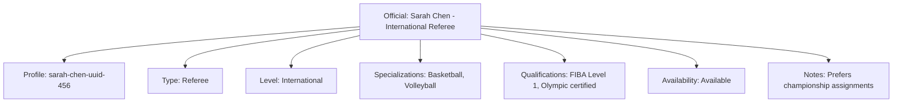

---
tags:
  - official
  - entity
  - tournament-officials
  - match-officiating
---

# Official (Entity)

## Overview

An Official Entity represents an individual acting in an official capacity (e.g., referee, judge, umpire,  
scorekeeper) for tournaments or specific events. It links a Profile to their officiating roles,  
qualifications, and assignments.

As an Entity, it possesses a unique identity and lifecycle, managed according to the [Base Entity](../../foundation/base_entity.md).

## Purpose

This entity enables comprehensive official management by:

- Managing certified personnel responsible for competitive oversight and rule enforcement
- Coordinating official assignments across tournaments, matches, and competitive events
- Tracking professional qualifications, certifications, and specialized expertise areas
- Supporting fair competition through qualified and available official allocation
- Facilitating assignment scheduling based on certification levels and availability status

## Structure

This entity includes standard attributes from the [Base Entity](../../foundation/base_entity.md)  
and adds the following official-specific attributes:

| Attribute | Description | Type | Required | Notes / Example |
|-----------|-------------|------|----------|-----------------|
| **Profile** | Reference to the Profile of the individual serving as the official | UUID | Yes | `550e8400-e29b-41d4-a716-446655440000` |
| **Type** | The category of official role | String | Yes | Example: "Referee", "Judge", "Umpire", "Scorekeeper", "Timekeeper" |
| **Level** | The official's certification or experience level | String | Yes | Example: "International", "National", "Regional", "Local", "Trainee" |
| **Specializations** | List of specific areas of expertise or focus | List[String] | No | Example: ["Basketball", "Volleyball", "Tennis"], ["Track", "Field"] |
| **Qualifications** | List of certifications and their details | List[Qualification] | No | List of embedded [Qualification](qualification.md) Value Objects |
| **Availability** | The official's general availability status | String | Yes | Example: "Available", "Unavailable", "Part-time", "On-call" |
| **Notes** | Additional administrative notes about the official | Text | No | `"Prefers morning assignments", "Requires transport"` |

## Example

### International Basketball Referee

This example demonstrates an international-level basketball referee showing all official attributes: profile reference  
linking to identity information, referee type classification, international certification level, specializations,  
embedded qualification credentials, current availability status, and administrative notes. This structure enables  
tournament organizers to identify qualified officials, verify certifications, and coordinate assignments based on  
expertise levels and scheduling availability.

## Relationships

- An Official is linked to one Profile
- An Official may be assigned to multiple Fixtures
- An Official may be associated with multiple Tournaments
- An Official may hold multiple Roles

### Parent Relationships

- **Profile** - The individual serving as the official
- **Tournament** - Where the official is assigned

### Related Entities

- **Fixture** - Where officials are assigned
- **Role** - Defines official's permissions and responsibilities

## Considerations

- **Qualification Management:** Track certification expiry dates, handle qualification renewals, validate qualification requirements
- **Assignment Management:** Handle match assignments, manage availability, track assignment history
- **Role Management:** Assign appropriate roles, handle role changes, track role history
- **Performance Tracking:** Monitor assignment completion, track feedback and ratings, handle performance issues
- **Security:** Control access to official records, protect sensitive information, audit official activities

## See Also

- [Qualification](./qualification.md) - Certification credentials for officials
- [Profile](../../identity/profile.md) - Individual identity information
- [Fixture](../fixture.md) - Match assignments for officials
- [Tournament](../../tournament/tournament.md) - Tournament context for official assignments
- [Base Entity](../../foundation/base_entity.md) - Common entity structure and lifecycle
