---
tags:
  - official
  - entity
  - tournament-officials
  - match-officiating
  - referee-management
  - competition-oversight
---

# Official (Entity)

## Overview

An Official represents an individual serving in an authorized competitive oversight capacity within tournament  
contexts. As an entity with independent identity and lifecycle, it manages certification credentials, assignment  
coordination, and professional qualifications for ensuring fair and competent tournament administration.

## Purpose

This entity enables comprehensive official management by:

- Managing certified personnel responsible for competitive oversight and rule enforcement
- Coordinating official assignments across tournaments, matches, and competitive events
- Tracking professional qualifications, certifications, and specialized expertise
- Supporting fair competition through qualified and available official allocation
- Facilitating professional development and certification management for tournament personnel

## Structure

This entity includes standard attributes from the [Base Entity](../../foundation/base_entity.md)  
and adds the following official-specific attributes:

| Attribute | Description | Type | Required | Notes / Example |
|-----------|-------------|------|----------|-----------------|
| **Identity Profile** | Reference to the individual's identity information | UUID | Yes | Links to Identity entity |
| **Official Type** | Primary classification of officiating role | Enum | Yes | `REFEREE`, `JUDGE`, `UMPIRE`, `SCOREKEEPER`, `TIMEKEEPER`, `LINE_JUDGE` |
| **Certification Level** | Professional certification and experience tier | Enum | Yes | `INTERNATIONAL`, `NATIONAL`, `REGIONAL`, `LOCAL`, `TRAINEE` |
| **License Number** | Unique professional license identifier | String | Yes | `"REF-2024-001234"`, `"JUDGE-NAT-5678"` |
| **Specializations** | Areas of expertise and competitive focus | List[String] | Optional | `"Basketball"`, `"Volleyball"`, `"Tennis doubles"` |
| **Qualifications** | Professional certifications and credentials | List[Object] | Optional | Embedded [Qualification](qualification.md) objects |
| **Availability Status** | Current availability for tournament assignments | Enum | Yes | `AVAILABLE`, `UNAVAILABLE`, `LIMITED`, `SEASONAL`, `RETIRED` |
| **Assignment Preferences** | Preferred tournament types and conditions | Object | Optional | Schedule preferences, travel limitations |
| **Experience Level** | Years of professional officiating experience | Integer | Optional | `5`, `15`, `25` |
| **Performance Rating** | Average performance evaluation score | Float | Optional | `4.8`, `3.9`, `5.0` |
| **Total Assignments** | Career total of completed official assignments | Integer | Optional | `156`, `1247`, `45` |
| **Current Season Assignments** | Assignments completed in current season | Integer | Optional | `12`, `35`, `8` |
| **Language Proficiencies** | Languages for international tournament communication | List[String] | Optional | `"English"`, `"Spanish"`, `"French"` |
| **Geographic Coverage** | Regions available for tournament assignments | List[String] | Optional | `"Northeast Region"`, `"International"`, `"Local only"` |
| **Equipment Requirements** | Specialized equipment needed for assignments | List[String] | Optional | `"Electronic whistle"`, `"Video review system access"` |
| **Contact Information** | Professional contact details for assignments | Object | Optional | Phone, email, emergency contacts |
| **Emergency Contact** | Emergency contact information | Object | Optional | Name, relationship, phone number |
| **Medical Restrictions** | Health considerations affecting assignments | List[String] | Optional | `"Indoor venues only"`, `"No travel restrictions"` |
| **Insurance Status** | Professional liability insurance status | Enum | Optional | `ACTIVE`, `EXPIRED`, `PENDING`, `NOT_REQUIRED` |
| **Background Check** | Security clearance status for official duties | Enum | Optional | `CLEARED`, `PENDING`, `EXPIRED`, `NOT_REQUIRED` |
| **Mentor Status** | Whether official can mentor trainee officials | Boolean | Optional | `true`, `false` |
| **Training History** | Record of professional development activities | List[Object] | Optional | Training courses, workshops, certifications |
| **Administrative Notes** | Additional management information | Text | Optional | `"Prefers morning assignments"`, `"Requires advance travel booking"` |

## Examples

### Example: International Championship Official

```mermaid
graph TD
  O[Official: Sarah Chen - International Referee]
  O --> IP[Identity: Sarah Chen Profile]
  O --> OT[Type: REFEREE]
  O --> CL[Level: INTERNATIONAL]
  O --> LN[License: REF-INT-2024-0892]
  O --> S[Specializations: Basketball, Volleyball]
  O --> Q[Qualifications: FIBA Level 1, Olympic certified]
  O --> AS[Status: AVAILABLE]
  O --> AP[Preferences: International tournaments preferred]
  O --> EL[Experience: 12 years]
  O --> PR[Rating: 4.9/5.0]
  O --> TA[Total Assignments: 287]
  O --> CSA[Season Assignments: 18]
  O --> LP[Languages: English, Mandarin, French]
  O --> GC[Coverage: International, Asia-Pacific region]
  O --> ER[Equipment: Electronic systems certified]
  O --> CI[Contact: +1-555-REFEREE]
  O --> EC[Emergency: Brother - +1-555-FAMILY]
  O --> MR[Medical: No restrictions]
  O --> IS[Insurance: ACTIVE - Professional liability]
  O --> BC[Background: CLEARED - Updated 2024]
  O --> MS[Mentor: true - Authorized trainer]
  O --> TH[Training: Advanced positioning course 2024]
  O --> AN[Notes: Available for championship assignments]
```

This example demonstrates a highly qualified international official with comprehensive credentials,  
multilingual capabilities, and extensive experience suitable for championship-level tournaments.

### Example: Regional Tournament Official

```mermaid
graph TD
  O[Official: Mike Rodriguez - Regional Judge]
  O --> IP[Identity: Mike Rodriguez Profile]
  O --> OT[Type: JUDGE]
  O --> CL[Level: REGIONAL]
  O --> LN[License: JUDGE-REG-2024-4567]
  O --> S[Specializations: Tennis, Badminton]
  O --> Q[Qualifications: Regional certification, First Aid]
  O --> AS[Status: AVAILABLE]
  O --> AP[Preferences: Weekend tournaments, local travel]
  O --> EL[Experience: 6 years]
  O --> PR[Rating: 4.5/5.0]
  O --> TA[Total Assignments: 89]
  O --> CSA[Season Assignments: 7]
  O --> LP[Languages: English, Spanish]
  O --> GC[Coverage: Southwest region only]
  O --> ER[Equipment: Standard judging equipment]
  O --> CI[Contact: +1-555-JUDGE]
  O --> EC[Emergency: Spouse - +1-555-HOME]
  O --> MR[Medical: No night driving]
  O --> IS[Insurance: ACTIVE - Basic coverage]
  O --> BC[Background: CLEARED - Updated 2023]
  O --> MS[Mentor: false - Not yet qualified]
  O --> TH[Training: Rules update seminar 2024]
  O --> AN[Notes: Prefers daytime assignments]
```

This second example shows a regional-level official with specialized focus and geographical limitations  
suitable for local tournament coordination and regional competitive events.

## Business Rules

### Qualification Management

- Officials must maintain current certifications appropriate to their assignment level
- Qualification renewals required before expiration to maintain active status
- Specialized certifications needed for specific tournament types or competitive levels
- Training requirements must be completed within specified timeframes

### Assignment Coordination

- Official availability must be verified before tournament assignment
- Certification level must match or exceed tournament requirements
- Conflict of interest policies prevent officials from assigned matches involving affiliations
- Geographic coverage determines eligible tournament assignments

### Performance Standards

- Minimum performance ratings required to maintain certification levels
- Performance evaluations collected after each significant assignment
- Poor performance triggers professional development requirements
- Outstanding performance qualifies officials for advanced assignments

## See Also

- [Qualification](./qualification.md) - Professional certification and credential management
- [Fixture](../fixture.md) - Scheduled competitions requiring official assignments
- [Match](../match.md) - Competitive encounters overseen by officials
- [Event](../event.md) - Specific incidents recorded by officials
- [Identity](../../identity/identity.md) - Individual identity information for officials
- [Base Entity](../../foundation/base_entity.md) - Common entity structure and lifecycle
