---
tags:
  - qualification
  - value-object
  - certification
  - professional-credentials
  - official-competency
  - tournament-standards
---

# Qualification (Value Object)

## Overview

A Qualification represents a professional certification or credential held by tournament officials, documenting  
competency, authority, and expertise within specific competitive contexts. As a value object without independent  
identity, it provides immutable certification data for official validation and assignment eligibility.

## Purpose

This value object enables comprehensive credential management by:

- Documenting professional certifications and competency credentials for tournament officials
- Supporting qualification validation and assignment eligibility verification
- Facilitating credential tracking, renewal management, and compliance monitoring
- Enabling specialized expertise documentation for specific competitive requirements
- Providing audit trails for professional development and certification maintenance

## Structure

This value object contains the following qualification-specific attributes:

| Attribute | Description | Type | Required | Notes / Example |
|-----------|-------------|------|----------|-----------------|
| **Qualification Type** | Classification of professional certification | Enum | Yes | `REFEREE`, `JUDGE`, `UMPIRE`, `SCOREKEEPER`, `TIMEKEEPER`, `VIDEO_REVIEW` |
| **Certification Level** | Professional competency tier or grade | Enum | Yes | `TRAINEE`, `LOCAL`, `REGIONAL`, `NATIONAL`, `INTERNATIONAL`, `ELITE` |
| **Sport Specialization** | Specific sport or competitive area | String | Optional | `"Basketball"`, `"Tennis"`, `"Volleyball"`, `"Multi-sport"` |
| **Qualification Name** | Official certification title or designation | String | Yes | `"FIBA Level 2 Referee"`, `"USTA National Umpire"`, `"FIFA Assistant Referee"` |
| **Certificate Number** | Unique certification identifier | String | Yes | `"FIBA-2024-REF-12345"`, `"USTA-UMP-NAT-6789"` |
| **Issued Date** | Date when qualification was originally granted | Date | Yes | `"2023-03-15"`, `"2022-08-20"` |
| **Effective Date** | Date when qualification becomes active | Date | Yes | `"2023-04-01"`, `"2022-09-01"` |
| **Expiry Date** | Date when qualification requires renewal | Date | Yes | `"2026-03-31"`, `"2025-08-31"` |
| **Issuing Organization** | Authority that granted the certification | UUID | Yes | Links to Organization entity |
| **Issuing Authority** | Specific department or division | String | Optional | `"Officials Development Committee"`, `"Referee Certification Board"` |
| **Qualification Scope** | Geographic or competitive scope of validity | String | Optional | `"International"`, `"North America"`, `"Regional tournaments only"` |
| **Prerequisites** | Required qualifications or experience | List[String] | Optional | `"2 years local experience"`, `"First Aid certification"` |
| **Continuing Education** | Required training hours for maintenance | Integer | Optional | `16`, `24`, `40` (hours per renewal period) |
| **Assessment Score** | Score achieved in qualification examination | Float | Optional | `92.5`, `88.0`, `95.2` (percentage) |
| **Practical Evaluation** | Score from practical skills assessment | Float | Optional | `4.8`, `4.2`, `5.0` (out of 5.0) |
| **Renewal Requirements** | Specific requirements for qualification renewal | List[String] | Optional | `"Annual assessment"`, `"20 hours continuing education"` |
| **Renewal Due Date** | Next renewal deadline | Date | Optional | `"2025-12-31"`, `"2026-06-30"` |
| **Renewal Status** | Current renewal process status | Enum | Optional | `CURRENT`, `RENEWAL_DUE`, `GRACE_PERIOD`, `EXPIRED`, `SUSPENDED` |
| **Suspension History** | Record of any qualification suspensions | List[Object] | Optional | Suspension dates, reasons, resolutions |
| **Upgrading Path** | Next level qualification available | String | Optional | `"National Level Referee"`, `"International Certification"` |
| **Special Endorsements** | Additional capabilities or authorizations | List[String] | Optional | `"Youth competitions"`, `"Video review certified"`, `"Mentor qualified"` |
| **Training History** | Record of qualification-related training | List[Object] | Optional | Training courses, workshops, updates |
| **Performance History** | Record of qualification usage in assignments | Object | Optional | Assignment count, performance ratings |
| **Administrative Notes** | Additional certification information | Text | Optional | `"Accelerated certification due to exceptional performance"` |

## Examples

### Example: International Basketball Referee Qualification

```mermaid
graph TD
  Q[Qualification: FIBA International Referee]
  Q --> QT[Type: REFEREE]
  Q --> CL[Level: INTERNATIONAL]
  Q --> SS[Sport: Basketball]
  Q --> QN[Name: FIBA Level 1 International Referee]
  Q --> CN[Certificate: FIBA-2024-REF-INT-0892]
  Q --> ID[Issued: 2023-09-15]
  Q --> ED[Effective: 2023-10-01]
  Q --> EXD[Expiry: 2027-09-30]
  Q --> IO[Issuing Org: FIBA International]
  Q --> IA[Authority: FIBA Referee Commission]
  Q --> QS[Scope: Worldwide international competitions]
  Q --> P[Prerequisites: FIBA Level 2, 5 years experience]
  Q --> CE[Continuing Ed: 24 hours every 2 years]
  Q --> AS[Assessment: 96.5%]
  Q --> PE[Practical: 4.9/5.0]
  Q --> RR[Renewal Req: Biennial assessment, fitness test]
  Q --> RDD[Due: 2027-07-31]
  Q --> RS[Status: CURRENT]
  Q --> UP[Upgrade Path: FIBA Elite Referee Panel]
  Q --> SE[Endorsements: Olympic Games certified, Video review]
  Q --> TH[Training: Advanced positioning course 2024]
  Q --> PH[Performance: 45 international assignments, 4.8 rating]
  Q --> AN[Notes: Qualified for major championship tournaments]
```

This example demonstrates the highest level of professional referee qualification with international  
scope, rigorous renewal requirements, and elite performance standards.

### Example: Regional Tennis Umpire Qualification

```mermaid
graph TD
  Q[Qualification: USTA Regional Umpire]
  Q --> QT[Type: UMPIRE]
  Q --> CL[Level: REGIONAL]
  Q --> SS[Sport: Tennis]
  Q --> QN[Name: USTA Regional Chair Umpire]
  Q --> CN[Certificate: USTA-UMP-REG-2024-4567]
  Q --> ID[Issued: 2024-02-20]
  Q --> ED[Effective: 2024-03-01]
  Q --> EXD[Expiry: 2027-02-28]
  Q --> IO[Issuing Org: USTA Southwest Section]
  Q --> IA[Authority: Officials Committee]
  Q --> QS[Scope: Regional tournaments, Southwest US]
  Q --> P[Prerequisites: Local umpire, 50 match experience]
  Q --> CE[Continuing Ed: 12 hours annually]
  Q --> AS[Assessment: 87.5%]
  Q --> PE[Practical: 4.3/5.0]
  Q --> RR[Renewal Req: Annual update, practical evaluation]
  Q --> RDD[Due: 2026-12-31]
  Q --> RS[Status: CURRENT]
  Q --> UP[Upgrade Path: USTA National Umpire]
  Q --> SE[Endorsements: Junior tournaments certified]
  Q --> TH[Training: Rules update seminar 2024]
  Q --> PH[Performance: 23 regional tournaments, 4.5 rating]
  Q --> AN[Notes: Available for state championship events]
```

This second example shows a regional-level qualification with moderate requirements and clear  
advancement pathway suitable for regional tournament coordination.

## Value Object Characteristics

### Immutability

- Qualification details cannot be modified once issued; amendments require new qualification records
- Certification numbers and issued dates remain constant throughout qualification lifecycle
- Performance and assessment scores become permanent record of competency demonstration
- Renewal creates new qualification record while maintaining historical certification trail

### Validation Rules

- Expiry date must be chronologically after effective date
- Renewal due date must precede expiry date by reasonable margin
- Assessment scores must meet minimum threshold requirements for certification level
- Prerequisites must be satisfied before qualification can be granted

### Renewal Management

- Renewal status automatically updates based on current date and renewal requirements
- Continuing education hours tracked against renewal requirements
- Performance history affects renewal eligibility and requirements
- Expired qualifications require re-certification rather than simple renewal

## Business Rules

### Certification Standards

- Qualification levels must align with competitive requirements and tournament standards
- Assessment scores must meet minimum thresholds for each certification level
- Continuing education requirements ensure ongoing competency and rule awareness
- Special endorsements require additional training and demonstrated expertise

### Assignment Eligibility

- Current qualification status required for tournament assignment consideration
- Certification level must match or exceed tournament competition level requirements
- Sport specialization must align with tournament competitive discipline
- Geographic scope determines eligible tournament locations and competitions

### Professional Development

- Upgrade paths provide clear advancement opportunities for qualified officials
- Performance history influences advancement eligibility and recommendations
- Training requirements support ongoing professional development and competency
- Mentor qualifications enable knowledge transfer and official development support

## See Also

- [Official](./official.md) - Tournament officials holding professional qualifications
- [Fixture](../fixture.md) - Scheduled competitions requiring qualified official oversight
- [Match](../match.md) - Competitive encounters overseen by qualified officials
- [Organization](../../organization/organization.md) - Entities issuing professional qualifications
- [Base Value Object](../../foundation/base_value_object.md) - Common value object principles
