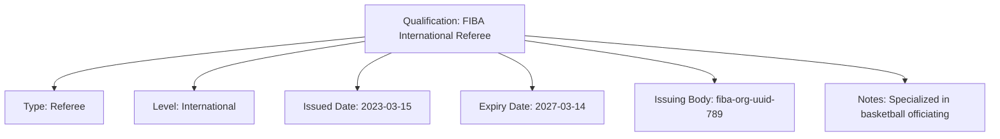

---
tags:
  - qualification
  - value-object
  - certification
  - professional-credentials
---

# Qualification (Value Object)

## Overview

A Qualification Value Object represents a certification or qualification held by an official. It is embedded within  
an Official entity and does not have its own identity or lifecycle.

## Purpose

This value object enables comprehensive credential management by:

- Documenting professional certifications and competency credentials for tournament officials
- Supporting qualification validation and assignment eligibility verification
- Facilitating credential tracking, renewal management, and compliance monitoring
- Enabling specialized expertise documentation for specific competitive requirements
- Providing audit trails for professional development and certification maintenance

## Structure

| Attribute | Description | Type | Required | Notes / Example |
|-----------|-------------|------|----------|-----------------|
| **Type** | The category of qualification | String | Yes | E.g., `Referee`, `Umpire`, `Judge`, `Scorekeeper` |
| **Level** | The level or grade of the qualification | String | Yes | E.g., `National`, `Regional`, `Local`, `International` |
| **Issued Date** | The date when the qualification was issued | Date | Yes | `2020-05-15` |
| **Expiry Date** | The date when the qualification expires | Date | Yes | `2025-12-31` |
| **Issuing Body** | The organization or authority that issued the qualification | UUID | Yes | Reference to an Organization entity |
| **Notes** | Additional information about the qualification | Text | No | E.g., `"Specialized in youth competitions"`, `"Advanced certification"` |

## Considerations

- **Validation:** Ensure expiry dates are in the future when creating new qualifications
- **Renewal:** Track qualification status and handle renewal processes
- **Compliance:** Ensure qualifications meet tournament or event requirements

## Example

### FIBA International Referee Certification

This example demonstrates an international referee qualification showing all credential attributes: certification type  
and competency level, issuance and expiration dates for renewal tracking, issuing organization reference, and  
specialized notes documenting expertise areas. This structure enables tournament organizers to verify official  
credentials, validate assignment eligibility, and ensure appropriate certification levels for competitive requirements.

## See Also

- [Official](./official.md) - Tournament officials holding qualifications
- [Organization](../../organization/organization.md) - Bodies that issue qualifications
- [Tournament](../../tournament/tournament.md) - Competitions requiring qualified officials
- [Base Value Object](../../foundation/base_value_object.md) - Common value object principles
