---
tags:
  - schedule
  - entity
  - tournament-scheduling
  - event-coordination
  - fixture-management
  - tournament-management
---

# Schedule (Entity)

## Overview

A Schedule represents a comprehensive tournament scheduling instance that organizes and coordinates all tournament  
events, fixtures, and activities within a specific timeframe. As an entity with independent identity and lifecycle,  
it provides the structural foundation for tournament timing, resource allocation, and event coordination.

## Purpose

This entity enables comprehensive tournament scheduling by:

- Managing tournament-wide event coordination and timing structure
- Organizing fixtures, matches, and activities within defined timeframes
- Supporting complex tournament formats from simple single-elimination to multi-stage championships
- Enabling resource allocation coordination including venues, officials, and participants
- Facilitating schedule optimization, conflict resolution, and real-time adjustments

## Structure

This entity includes standard attributes from the [Base Entity](../foundation/base_entity.md)  
and adds the following schedule-specific attributes:

| Attribute | Description | Type | Required | Notes / Example |
|-----------|-------------|------|----------|-----------------|
| **Tournament** | Reference to the tournament this schedule coordinates | UUID | Yes | Links to Tournament entity |
| **Schedule Name** | Descriptive name for the scheduling instance | String | Yes | `"Championship Main Schedule"`, `"Qualifying Round Schedule"`, `"Finals Day Schedule"` |
| **Start Date** | Tournament schedule start date | Date | Yes | `"2024-11-15"`, `"2024-12-01"` |
| **End Date** | Tournament schedule end date | Date | Yes | `"2024-11-17"`, `"2024-12-03"` |
| **Schedule Type** | Classification of scheduling approach | Enum | Yes | `MAIN_TOURNAMENT`, `QUALIFYING`, `FINALS`, `PRACTICE`, `MIXED` |
| **Fixtures** | List of scheduled tournament fixtures | List[UUID] | Yes | References to [Fixture](fixture.md) entities |
| **Total Events** | Total number of scheduled events | Integer | Yes | `24`, `156`, `8` |
| **Venues Used** | Venues allocated for this schedule | List[UUID] | Yes | References to Venue entities |
| **Officials Assigned** | Officials assigned to this schedule | List[UUID] | Optional | References to [Official](official/official.md) entities |
| **Schedule Coordinator** | Person responsible for schedule management | UUID | Optional | Links to Identity entity |
| **Timing Framework** | Overall timing structure and constraints | String | Optional | `"30-minute matches with 15-minute breaks"`, `"Continuous scheduling"` |
| **Conflict Resolution** | Approach for handling scheduling conflicts | String | Optional | `"Automatic rescheduling"`, `"Manual coordinator approval"` |
| **Publication Status** | Current publication state of the schedule | Enum | Optional | `DRAFT`, `PUBLISHED`, `ACTIVE`, `COMPLETED`, `CANCELLED` |
| **Last Modified** | When the schedule was last updated | DateTime | Optional | `"2024-11-10T14:30:00Z"` |
| **Notes** | Additional scheduling notes and information | Text | Optional | `"Schedule subject to weather conditions"`, `"Final schedule pending venue confirmation"` |

## Examples

### Example: Championship Main Tournament Schedule

```mermaid
graph TD
  S[Schedule: Championship Main Tournament]
  S --> T[Tournament: National Championship 2024]
  S --> SN[Schedule Name: Championship Main Schedule]
  S --> SD[Start Date: 2024-11-15]
  S --> ED[End Date: 2024-11-17]
  S --> ST[Schedule Type: MAIN_TOURNAMENT]
  S --> F[Fixtures: 48 championship matches across 3 days]
  S --> TE[Total Events: 48]
  S --> VU[Venues Used: Main Arena, Practice Courts 1-4]
  S --> OA[Officials Assigned: 12 certified referees, 6 judges]
  S --> SC[Schedule Coordinator: Tournament Director Sarah Johnson]
  S --> TF[Timing Framework: 45-min matches, 15-min breaks, 60-min finals]
  S --> CR[Conflict Resolution: Automatic rescheduling with coordinator approval]
  S --> PS[Publication Status: PUBLISHED]
  S --> LM[Last Modified: 2024-11-10 14:30 UTC]
  S --> N[Notes: Weather contingency plan activated if needed]
```

This example demonstrates a comprehensive championship tournament schedule with full resource allocation  
and coordination. The schedule includes detailed timing frameworks, automatic conflict resolution, and  
weather contingency planning for outdoor events.

### Example: Qualifying Round Schedule

```mermaid
graph TD
  S[Schedule: Qualifying Tournament Schedule]
  S --> T[Tournament: Regional Qualifiers 2024]
  S --> SN[Schedule Name: Qualifying Round Schedule]
  S --> SD[Start Date: 2024-10-28]
  S --> ED[End Date: 2024-10-29]
  S --> ST[Schedule Type: QUALIFYING]
  S --> F[Fixtures: 32 qualifying matches over 2 days]
  S --> TE[Total Events: 32]
  S --> VU[Venues Used: Regional Sports Complex Courts 1-8]
  S --> OA[Officials Assigned: 8 certified officials rotating assignments]
  S --> SC[Schedule Coordinator: Regional Tournament Manager Mike Chen]
  S --> TF[Timing Framework: 30-min matches, 10-min transitions]
  S --> CR[Conflict Resolution: Manual coordinator review and approval]
  S --> PS[Publication Status: ACTIVE]
  S --> LM[Last Modified: 2024-10-25 09:15 UTC]
  S --> N[Notes: Top 16 teams advance to championship tournament]
```

This second example shows a qualifying tournament schedule with streamlined timing and focused advancement  
criteria. The schedule emphasizes efficient qualifying processes with clear advancement rules and  
simplified coordination for regional tournament management.

## See Also

- [Fixture](./fixture.md) - Individual scheduled competition instances
- [Match](./match.md) - Competitive encounters between teams
- [Event](./event.md) - Specific occurrences during scheduled activities
- [Timeslot](./timeslot.md) - Specific time intervals for scheduling
- [Official](./official/official.md) - Tournament officials and their assignments
- [Tournament](../tournament/tournament.md) - Tournament context for scheduling
