---
tags:
  - score
  - value-object
  - team-performance
  - competition-tracking
  - match-results
  - scoring-system
---

# Score (Value Object)

## Overview

A Score represents the quantified performance achievement of a team or participant within a specific competitive  
context. As a value object without independent identity, it provides immutable measurement data that captures  
performance metrics, temporal progression, and contextual details for tournament analysis and record-keeping.

## Purpose

This value object enables comprehensive performance tracking by:

- Recording quantified team or participant performance within competitive contexts
- Supporting diverse scoring systems from simple numeric to complex structured formats
- Facilitating temporal score progression tracking and match chronology
- Enabling detailed performance analysis and statistical reporting
- Providing immutable performance records for tournament integrity and verification

## Structure

This value object contains the following score-specific attributes:

| Attribute | Description | Type | Required | Notes / Example |
|-----------|-------------|------|----------|-----------------|
| **Team** | Reference to the team achieving this score | UUID | Yes | Links to Team entity |
| **Score Value** | Quantified performance measurement | Text | Yes | `"15"`, `"3"`, `"{\"sets\": 2, \"games\": 6, \"points\": \"40\"}"` |
| **Score Unit** | Measurement type for performance quantification | String | Yes | `"Points"`, `"Goals"`, `"Sets"`, `"Games"`, `"Rounds"` |
| **Score Timestamp** | Precise time when score was recorded | DateTime | Yes | `"2024-11-15T14:32:45Z"` |
| **Match Clock** | Competition time when score was achieved | String | Optional | `"23:45"`, `"Set 2 Game 5"`, `"Period 3 - 08:15"` |
| **Score Type** | Classification of score recording | Enum | Yes | `FINAL`, `INTERMEDIATE`, `PERIOD_END`, `TIMEOUT`, `REAL_TIME` |
| **Score Context** | Specific competitive context for this score | String | Optional | `"First Set"`, `"Overtime Period"`, `"Championship Point"` |
| **Scoring Method** | How the score was achieved or recorded | String | Optional | `"Goal scored"`, `"Service ace"`, `"Penalty conversion"` |
| **Score Progression** | Sequence position within match scoring | Integer | Optional | `1`, `15`, `47` |
| **Previous Score** | Score state before this recording | Text | Optional | `"14"`, `"2"`, `"{\"sets\": 1, \"games\": 5}"` |
| **Score Differential** | Change from previous score state | Text | Optional | `"+1"`, `"+3"`, `"+1 set"` |
| **Official Verification** | Whether score was officially verified | Boolean | Yes | `true`, `false` |
| **Recording Official** | Official who recorded or verified the score | UUID | Optional | Links to Official entity |
| **Score Validity** | Validity status of the recorded score | Enum | Yes | `VALID`, `DISPUTED`, `UNDER_REVIEW`, `CORRECTED` |
| **Correction Reason** | Explanation if score was corrected | String | Optional | `"Timing error corrected"`, `"Official review adjustment"` |
| **Performance Notes** | Additional context about score achievement | Text | Optional | `"Decisive point"`, `"Come-from-behind score"` |

## Examples

### Example: Tennis Match Score Progression

```mermaid
graph TD
  S[Score: Tennis Championship Final]
  S --> T[Team: Eagles - Player Sarah Johnson]
  S --> SV[Score Value: {"sets": 2, "games": 6, "points": "40"}]
  S --> SU[Score Unit: Tennis Format]
  S --> ST[Timestamp: 2024-11-15T16:45:30Z]
  S --> MC[Match Clock: Set 3 Game 7]
  S --> STY[Type: REAL_TIME]
  S --> SC[Context: Championship Point Opportunity]
  S --> SM[Method: Service ace]
  S --> SP[Progression: 47th score update]
  S --> PS[Previous: {"sets": 2, "games": 6, "points": "30"}]
  S --> SD[Differential: +1 point]
  S --> OV[Verified: true]
  S --> RO[Official: Chair Umpire Lisa Chen]
  S --> SVL[Validity: VALID]
  S --> PN[Notes: Match point - championship victory]
```

This example demonstrates complex structured scoring typical of tennis with detailed progression tracking,  
official verification, and championship context for high-stakes competitive environments.

### Example: Basketball Game Score

```mermaid
graph TD
  S[Score: Basketball Tournament Final]
  S --> T[Team: Thunder - Basketball Team]
  S --> SV[Score Value: 89]
  S --> SU[Score Unit: Points]
  S --> ST[Timestamp: 2024-10-28T20:15:22Z]
  S --> MC[Match Clock: 4th Quarter - 02:33]
  S --> STY[Type: REAL_TIME]
  S --> SC[Context: Fourth Quarter Comeback]
  S --> SM[Method: Three-point shot]
  S --> SP[Progression: 127th score update]
  S --> PS[Previous: 86]
  S --> SD[Differential: +3 points]
  S --> OV[Verified: true]
  S --> RO[Official: Head Referee Mike Johnson]
  S --> SVL[Validity: VALID]
  S --> PN[Notes: Clutch three-pointer with 2:33 remaining]
```



This second example shows simplified numeric scoring with real-time tracking and competitive context  
documentation typical of basketball with emphasis on critical scoring moments and official verification.

## Value Object Characteristics

### Immutability

- Score values cannot be modified once recorded; corrections require new score records
- All score attributes remain constant throughout the value object lifecycle
- Score progression maintains chronological integrity through sequence numbering
- Official verification status becomes permanent once authenticated

### Equality and Comparison

- Scores are equal when all attributes match exactly including timestamps
- Score comparison enables progression analysis and performance evaluation
- Temporal ordering supported through timestamp and progression sequence
- Score validity affects equality determination and official record status

### Composition Guidelines

- Scores embed within fixture and match contexts without independent lifecycle
- Multiple scores track progression within single competitive instances
- Score collections maintain chronological ordering for analysis purposes
- Value object composition supports diverse scoring system requirements

## Scoring System Support

### Simple Numeric Scoring

```text
Score Value: "24"
Score Unit: "Points"
Score Type: REAL_TIME
```

### Complex Structured Scoring

```json
{
  "sets": 2,
  "games": 6,
  "points": "40",
  "tiebreak_points": null
}
```

### Multi-Period Scoring

```text
Score Context: "Period 3"
Score Value: "15"
Previous Score: "12" 
Score Differential: "+3"
```

## See Also

- [Fixture](./fixture.md) - Scheduled competition instances containing score records
- [Match](./match.md) - Competitive encounters generating score progressions
- [Event](./event.md) - Specific occurrences that may trigger score changes
- [Team](../team/team.md) - Teams achieving scores within competitive contexts
- [Official](./official/official.md) - Officials responsible for score verification
- [Base Value Object](../foundation/base_value_object.md) - Common value object principles
