---
tags:
  - timeslot
  - value-object
  - time-management
  - scheduling
  - temporal-coordination
  - tournament-timing
---

# Timeslot (Value Object)

## Overview

A Timeslot represents a specific temporal interval with defined start and end boundaries, providing precise time  
allocation for tournament activities. As a value object without independent identity, it offers immutable temporal  
data that enables comprehensive scheduling coordination, conflict detection, and resource optimization.

## Purpose

This value object enables comprehensive temporal management by:

- Defining precise time boundaries for tournament activities and competitive events
- Supporting complex scheduling coordination with conflict detection and resolution
- Facilitating resource allocation optimization across temporal constraints
- Enabling timezone-aware scheduling for international and multi-regional tournaments
- Providing immutable temporal records for audit trails and schedule verification

## Structure

This value object contains the following timeslot-specific attributes:

| Attribute | Description | Type | Required | Notes / Example |
|-----------|-------------|------|----------|-----------------|
| **Start Time** | Beginning timestamp of the temporal interval | DateTime | Yes | `"2024-11-15T14:00:00Z"` |
| **End Time** | Concluding timestamp of the temporal interval | DateTime | Yes | `"2024-11-15T15:30:00Z"` |
| **Duration** | Length of time interval in minutes | Integer | Yes | `90`, `120`, `45` |
| **Time Zone** | Timezone context for the temporal interval | String | Yes | `"UTC"`, `"America/New_York"`, `"Europe/London"` |
| **Time Zone Offset** | UTC offset for the specified timezone | String | Yes | `"+00:00"`, `"-05:00"`, `"+01:00"` |
| **Local Start Time** | Start time in local timezone context | DateTime | Optional | `"2024-11-15T09:00:00-05:00"` |
| **Local End Time** | End time in local timezone context | DateTime | Optional | `"2024-11-15T10:30:00-05:00"` |
| **Daylight Saving** | Whether daylight saving time is active | Boolean | Optional | `true`, `false` |
| **Buffer Before** | Additional time allocated before start | Integer | Optional | `15`, `30` (minutes) |
| **Buffer After** | Additional time allocated after end | Integer | Optional | `15`, `30` (minutes) |
| **Effective Start** | Actual start including buffer time | DateTime | Optional | `"2024-11-15T13:45:00Z"` |
| **Effective End** | Actual end including buffer time | DateTime | Optional | `"2024-11-15T16:00:00Z"` |
| **Priority Level** | Scheduling priority for resource conflicts | Enum | Optional | `LOW`, `MEDIUM`, `HIGH`, `CRITICAL` |
| **Flexibility** | Allowable adjustment window in minutes | Integer | Optional | `0`, `15`, `30` |
| **Recurrence Pattern** | Pattern for recurring timeslots | String | Optional | `"Daily"`, `"Weekly"`, `"None"` |
| **Blackout Periods** | Times when this slot cannot be scheduled | List[Object] | Optional | Conflicting time ranges |
| **Venue Constraints** | Venue-specific timing limitations | Object | Optional | Opening hours, cleanup time |
| **Equipment Setup** | Time required for equipment preparation | Integer | Optional | `30`, `60` (minutes) |
| **Equipment Breakdown** | Time required for equipment removal | Integer | Optional | `15`, `30` (minutes) |
| **Validation Status** | Temporal validation and conflict status | Enum | Yes | `VALID`, `CONFLICT`, `WARNING`, `INVALID` |
| **Conflict Details** | Specific conflict information if applicable | List[String] | Optional | `"Venue double-booked"`, `"Team unavailable"` |

## Examples

### Example: Championship Final Timeslot

```mermaid
graph TD
  T[Timeslot: Championship Final]
  T --> ST[Start: 2024-11-17T19:00:00Z]
  T --> ET[End: 2024-11-17T21:30:00Z]
  T --> D[Duration: 150 minutes]
  T --> TZ[Timezone: America/New_York]
  T --> TZO[Offset: -05:00]
  T --> LST[Local Start: 14:00 EST]
  T --> LET[Local End: 16:30 EST]
  T --> DS[Daylight Saving: false]
  T --> BB[Buffer Before: 60 minutes]
  T --> BA[Buffer After: 45 minutes]
  T --> ES[Effective Start: 18:00:00Z]
  T --> EE[Effective End: 22:15:00Z]
  T --> PL[Priority: CRITICAL]
  T --> F[Flexibility: 0 minutes]
  T --> RP[Recurrence: None]
  T --> VC[Venue: Main arena operating hours]
  T --> EQS[Setup: 45 minutes for broadcast]
  T --> EQB[Breakdown: 30 minutes]
  T --> VS[Status: VALID]
```



This example demonstrates a high-priority championship timeslot with comprehensive temporal coordination  
including broadcast setup, venue constraints, and zero flexibility typical of major tournament finals.

### Example: Qualifying Round Timeslot

```mermaid
graph TD
  T[Timeslot: Qualifying Match Q024]
  T --> ST[Start: 2024-10-28T15:30:00Z]
  T --> ET[End: 2024-10-28T16:30:00Z]
  T --> D[Duration: 60 minutes]
  T --> TZ[Timezone: UTC]
  T --> TZO[Offset: +00:00]
  T --> LST[Local Start: 15:30 UTC]
  T --> LET[Local End: 16:30 UTC]
  T --> DS[Daylight Saving: N/A]
  T --> BB[Buffer Before: 10 minutes]
  T --> BA[Buffer After: 10 minutes]
  T --> ES[Effective Start: 15:20:00Z]
  T --> EE[Effective End: 16:40:00Z]
  T --> PL[Priority: MEDIUM]
  T --> F[Flexibility: 15 minutes]
  T --> RP[Recurrence: None]
  T --> VC[Venue: Standard court hours]
  T --> EQS[Setup: 5 minutes]
  T --> EQB[Breakdown: 5 minutes]
  T --> VS[Status: VALID]
```



This second example shows a flexible qualifying timeslot with standard buffer periods and moderate  
priority suitable for preliminary tournament rounds with scheduling adaptability.

## Value Object Characteristics

### Immutability

- Timeslot boundaries cannot be modified once established; changes require new timeslot creation
- All temporal attributes remain constant throughout the value object lifecycle
- Timezone information maintains consistency to prevent temporal calculation errors
- Buffer and setup times become fixed once allocated to prevent scheduling conflicts

### Temporal Validation

- End time must be chronologically after start time
- Duration must match the calculated difference between start and end times
- Timezone offsets must be valid and consistent with specified timezone
- Buffer periods cannot exceed reasonable limits or create negative effective durations

### Scheduling Constraints

- Overlapping timeslots require explicit conflict resolution procedures
- Resource availability must be verified within effective time boundaries
- Priority levels determine conflict resolution precedence
- Flexibility windows enable dynamic scheduling adjustments

## Temporal Operations

### Duration Calculations

```text
Duration = End Time - Start Time
Effective Duration = Effective End - Effective Start
Total Allocation = Duration + Buffer Before + Buffer After + Setup + Breakdown
```

### Timezone Conversions

```text
UTC Time = Local Time + Timezone Offset
Local Time = UTC Time - Timezone Offset
```

### Conflict Detection

```text
Overlap = (Start1 < End2) AND (Start2 < End1)
Resource Conflict = Same Resource AND Overlap
Schedule Conflict = Same Entity AND Overlap
```

## Business Rules

### Temporal Constraints

- Timeslots cannot have negative durations or invalid temporal boundaries
- Resource allocation must respect venue operating hours and availability
- Equipment setup and breakdown time must be included in effective timeslot boundaries
- Buffer periods provide transition time between consecutive activities

### Conflict Resolution

- Higher priority timeslots take precedence in resource allocation conflicts
- Flexibility windows enable automatic rescheduling within acceptable parameters
- Critical priority timeslots cannot be moved or modified without explicit authorization
- Conflict resolution must maintain tournament integrity and fairness

### Timezone Management

- All timeslots stored in UTC for consistency and calculation accuracy
- Local timezone display provided for user convenience and regional coordination
- Daylight saving transitions handled automatically with appropriate offset adjustments
- International tournaments require careful timezone coordination across regions

## See Also

- [Fixture](./fixture.md) - Scheduled competition instances using timeslot allocation
- [Schedule](./schedule.md) - Tournament scheduling framework containing timeslots
- [Event](./event.md) - Specific occurrences within timeslot boundaries
- [Venue](../venue/venue.md) - Physical locations with operating hour constraints
- [Base Value Object](../foundation/base_value_object.md) - Common value object principles
