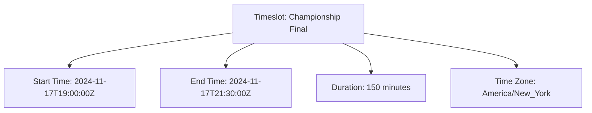

---
tags:
  - timeslot
  - value-object
  - time-management
  - scheduling
---

# Timeslot (Value Object)

## Overview

A Timeslot Value Object represents a specific interval of time, defined by a start and end time.

It describes characteristics of a time period and is typically embedded within other entities (like Fixture or Event)  
to specify when activities occur.

## Purpose

This value object enables precise temporal coordination by:

- Defining exact time boundaries for tournament activities and competitive events
- Supporting timezone-aware scheduling for international and multi-regional tournaments
- Enabling conflict detection and resource optimization across overlapping time requirements
- Providing immutable temporal records for schedule integrity and audit purposes
- Facilitating automated scheduling validation and timeline management

## Structure

| Attribute | Description | Type | Required | Notes / Example |
|-----------|-------------|------|----------|-----------------|
| **Start Time** | The beginning of the time interval | DateTime | Yes | `2024-11-02T14:00:00Z` |
| **End Time** | The end of the time interval | DateTime | Yes | `2024-11-02T15:30:00Z` |
| **Duration** | The length of the time interval in minutes | Integer | Yes | `90` (minutes) |
| **Time Zone** | The time zone for the start and end times | String | Yes | `"UTC"`, `"America/New_York"`, `"Europe/London"` |

## Considerations

- **Time Zone Handling:** All times should be stored in a consistent time zone (typically UTC) and converted for display
- **Duration Calculation:** Duration is calculated as the difference between start and end times
- **Validation:** End time must be after start time
- **Overlap Detection:** Timeslots should not overlap within the same context (e.g., same venue, same team)

## Example

### Championship Final Timeslot

This example demonstrates a championship final timeslot showing all temporal attributes: precise start and end times  
in UTC format, calculated duration in minutes, and timezone specification for local coordination. This structure  
enables tournament organizers to coordinate venue booking, official assignments, and participant scheduling while  
maintaining timezone accuracy for international tournaments and preventing scheduling conflicts across resources.

## See Also

- [Fixture](./fixture.md) - Scheduled competition instances using timeslots
- [Schedule](./schedule.md) - Tournament scheduling framework containing timeslots
- [Event](./event.md) - Specific occurrences within timeslot boundaries
- [Venue](../venue/venue.md) - Physical locations with timing constraints
