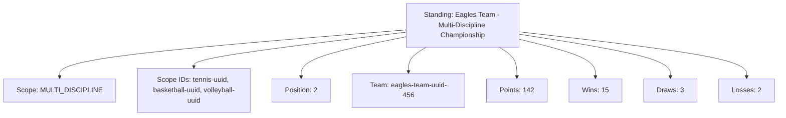

---
tags:
  - standing
  - entity
  - tournament-performance
  - team-positioning
---

# Standing (Entity)

## Overview

A Standing Entity represents a team's position and performance within a specific scope of a tournament. Teams can
have multiple standing instances as they progress through different stages and disciplines, tracking their current
position and performance statistics within each context.

As an Entity, it maintains its own identity and lifecycle, managed according to the [Base Entity](../foundation/base_entity.md).

## Purpose

This entity enables comprehensive tournament standing management by:

- Tracking team performance and position within specific tournament scopes (stages, disciplines, or combinations)
- Supporting multiple concurrent standings per team as they progress through different tournament contexts
- Calculating and maintaining real-time position updates based on match results and performance statistics
- Providing foundation data for tournament progression decisions, seeding calculations, and qualification determinations
- Enabling scope-specific validation rules and performance tracking across stage, discipline, and multi-discipline contexts

## Structure

This entity includes standard attributes from the [Base Entity](../foundation/base_entity.md)
and adds the following standing-specific attributes:

| Attribute | Description | Type | Required | Notes / Example |
|-----------|-------------|------|----------|-----------------|
| **Scope** | The type of standing context | String | Yes | `"STAGE"`, `"DISCIPLINE"`, `"MULTI_DISCIPLINE"` |
| **Scope IDs** | References to the specific scopes | List[UUID] | Yes | For multi-discipline, contains all relevant discipline IDs |
| **Position** | The current ranking position in this scope | Integer | Yes | `1`, `2`, `3` |
| **Team** | Reference to the Team this standing represents | UUID | Yes | `team-uuid-123` |
| **Points** | Total points accumulated according to scoring rules | Integer | Yes | `25`, `18`, `12` |
| **Wins** | Number of matches won by the team | Integer | Yes | `8`, `5`, `3` |
| **Draws** | Number of matches drawn by the team | Integer | Yes | `2`, `1`, `0` |
| **Losses** | Number of matches lost by the team | Integer | Yes | `1`, `3`, `5` |

## Example

### Multi-Sport Tournament Standing

This example demonstrates a multi-discipline standing for the Eagles team participating in tennis, basketball, and
volleyball competitions. The standing shows their overall position (2nd place) across all three disciplines with
comprehensive performance statistics including total points (142), wins (15), draws (3), and losses (2). This
structure enables tournament organizers to track team performance across multiple disciplines while maintaining
separate discipline-specific standings for detailed analysis and progression decisions.

## Considerations

- **Scope Management:** Teams can have multiple standings for different scopes (stage, discipline, multi-discipline)
- **Real-time Updates:** Position recalculated whenever performance statistics change
- **Validation Rules:** Scope and Scope IDs must be consistent; teams must be eligible for all referenced contexts
- **Performance Tracking:** Statistics update independently based on scope-specific match results

## See Also

- [Team](../team/team.md) - Team entities tracked in standings
- [Discipline](../discipline/discipline.md) - Discipline-specific standing contexts
- [Tournament](../tournament/tournament.md) - Tournament context for standings
- [Ranking](../ranking/ranking.md) - Long-term ranking systems based on standings
- [Base Entity](../foundation/base_entity.md) - Common entity structure and lifecycle
