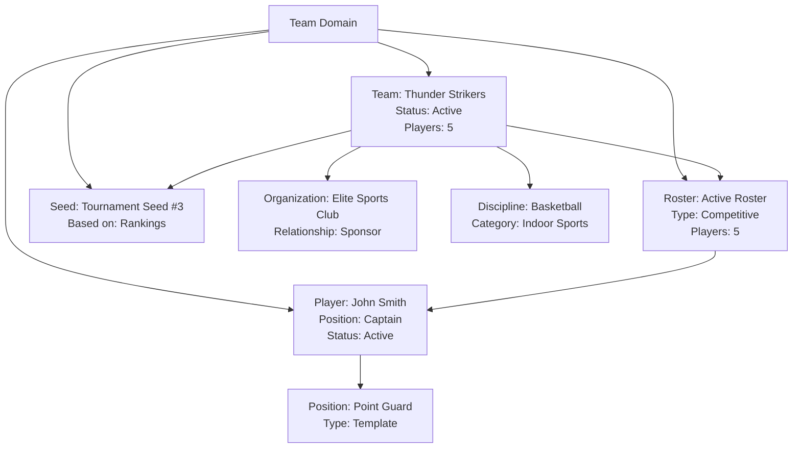

---
tags:
- team
- domain
- competition
- roster
- tournament
- player
---

# Team Domain

## Overview

The Team domain defines the structure, management, and lifecycle of teams as the fundamental units of competition in the
Tournament Organizer system. It covers all aspects of team composition, roster management, player roles, and team
participation in tournaments and matches. This domain supports both individual and group competition formats, ensuring
flexibility and consistency across all sports and activities.

## Purpose

The Team domain enables tournament organizers to:

- Manage competitive units of any size (individual or group)
- Track team composition, player assignments, and roster changes
- Handle organizational affiliations and sponsorship relationships
- Support tournament seeding and placement management
- Maintain staff assignments and role management
- Ensure consistent competition rules across different sports

## Structure

### Core Models

- **[Team](team.md)**: Central entity representing a competition unit (single or multiple participants)
- **[Roster](roster.md)**: Official list of players (starters, substitutes, reserves) for a team
- **[Player](roster/player/player.md)**: Instance of a registrant as a player in a specific context
- **[Seed](seed.md)**: Team seeding for tournament placement

### Supporting Templates

- **[Position](roster/player/position.md)**: Template for field positions (e.g., Goalkeeper, Point Guard)

### Status Lifecycles

**Team Statuses:**

- Draft → Active → Locked/Suspended → Archived

**Roster Statuses:**

- Active → Locked → Archived

**Player Statuses:**

- Active ↔ Benched/Injured/Suspended

## Example

This example illustrates the Team domain's core structure with the Thunder Strikers basketball team. The team entity
maintains an active competitive roster with assigned players, organizational sponsorship, and tournament seeding.
Players have specific positions and statuses, while the roster manages overall team composition. This structure
enables tournament organizers to track team eligibility, manage competition participation, handle roster changes,
and maintain accurate records throughout the tournament lifecycle.

## See Also

- [Team](team.md) - Core team entity documentation
- [Roster](roster.md) - Team roster management
- [Player](roster/player/player.md) - Player entity details
- [Seed](seed.md) - Tournament seeding values
- [Position](roster/player/position.md) - Player position templates
- [Tournament](../tournament/README.md) - Tournament structure and management
- [Schedule](../schedule/README.md) - Match and event scheduling
- [Registration](../registration/README.md) - Registrant and participant management
- [Organization](../organization/README.md) - Team affiliations and sponsorships
