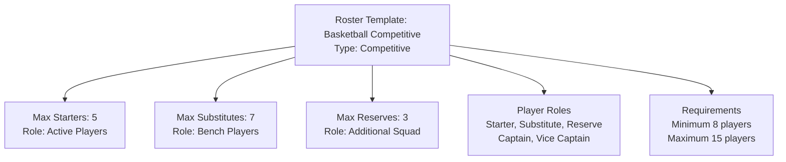

---
tags:
- roster
- template-entity
- team
- player
- competition
---

# Roster (Template Entity)

## Overview

A Roster Template Entity defines a reusable blueprint for roster structures and configurations that can be used to
create specific roster instances. It provides a standardized framework for roster types, player roles, and team
composition patterns that can be applied across different contexts and tournaments.

## Purpose

The Roster Template Entity enables tournament organizers to:

- Standardize team composition rules across competitions
- Define player role categories and limitations
- Establish consistent roster requirements for different sports
- Create reusable roster configurations for tournaments
- Ensure compliance with discipline-specific rules
- Streamline team registration and validation processes

## Structure

This Template Entity includes the standard attributes defined in the [Base Entity](../../foundation/base_entity.md).

| Attribute       | Description                                                                 | Type   | Required | Notes / Example                                |
| --------------- | --------------------------------------------------------------------------- | ------ | -------- | ---------------------------------------------- |
| **Name**        | The name of the roster template                                            | String | Yes      | `"Standard Roster"`, `"Tournament Roster"`     |
| **Type**        | The type of roster template                                                | String | Yes      | `"Competitive"`, `"Recreational"`, `"Tournament"` |
| **Description** | Description of the roster template and its characteristics                 | Text   | Optional | `"Standard competitive roster structure"`      |
| **Max Starters** | Maximum number of starters for this roster template                       | Integer| Yes      | `5`, `11`, `15`                                |
| **Max Substitutes** | Maximum number of substitutes for this roster template                   | Integer| Yes      | `3`, `5`, `7`                                  |
| **Max Reserves** | Maximum number of reserves for this roster template                       | Integer| Optional | `2`, `3`, `5`                                  |
| **Player Roles** | Standard player roles for this roster template                            | List[String] | Yes | `["Starter", "Substitute", "Reserve"]`         |
| **Requirements** | Standard requirements for this roster template                            | List[String] | Optional | `["Minimum 8 players", "Maximum 15 players"]`  |

## Example

This example shows a Basketball Competitive roster template that defines the structure for basketball teams. The
template specifies 5 starting players, 7 substitutes, and 3 reserves for a maximum squad of 15 players. Player
roles include standard categories (Starter, Substitute, Reserve) plus leadership roles (Captain, Vice Captain).
Requirements ensure minimum viable team size and maximum roster limits. Tournament organizers use this template
to validate team registrations, ensuring all basketball teams meet consistent composition standards while providing
flexibility for different tournament formats and competition levels.

## See Also

- [Team](../team.md) - Core team entity that uses roster templates
- [Player](player/player.md) - Individual player entities within rosters
- [Position](player/position.md) - Player position templates for field assignments
- [Base Entity](../../foundation/base_entity.md) - Standard template entity attributes
