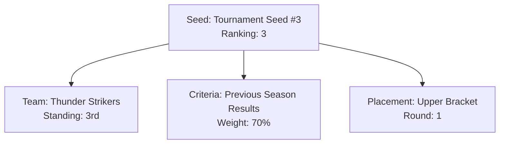

---
tags:
- seed
- value-object
- tournament
- ranking
- seeding
---

# Seed (Value Object)

## Overview

A Seed Value Object represents a ranked position assigned to a team within a specific tournament context.
This assignment is typically based on performance, rankings, or other criteria defined by tournament organizers,
aiming to create balanced and fair tournament structures like brackets or groups.

## Purpose

The Seed Value Object enables tournament organizers to:

- Assign ranked positions to teams for tournament placement
- Create balanced competition brackets and groups
- Maintain fairness through systematic seeding processes
- Track seeding criteria and rationale
- Support various seeding methodologies
- Enable proper tournament draw procedures

## Structure

| Attribute       | Description                                                                    | Type    | Required | Notes / Example                                    |
| --------------- | ------------------------------------------------------------------------------ | ------- | -------- | -------------------------------------------------- |
| **Ranking**     | The numerical rank associated with this seed (e.g., 1st, 2nd, 3rd)            | Integer | Yes      | `1`, `8`                                           |
| **Name**        | Optional display name for the seed, often combining discipline/group and rank | String  | Optional | `"Group A Seed 1"`, `"Main Bracket Seed #4"`       |
| **Description** | Optional text providing additional context about the seed assignment          | String  | Optional | `"Top seed based on international ranking points"` |

## Example

This example shows Tournament Seed #3 assigned to the Thunder Strikers basketball team. The seed ranking of 3
is based on their previous semi-final performance and current 3rd place league standing. The seeding criteria
uses 70% weighting from previous season results, placing them in the upper bracket with a favorable tournament
path. This systematic approach ensures fair competition distribution while providing transparency in seeding
decisions for teams, organizers, and spectators.

## See Also

- [Team](team.md) - Teams that receive seed assignments
- [Tournament](../tournament/tournament.md) - Tournament structure using seeds
- [Standing](../standing/standing.md) - Performance data used for seeding
- [Ranking](../ranking/ranking.md) - Ranking systems that inform seeding
