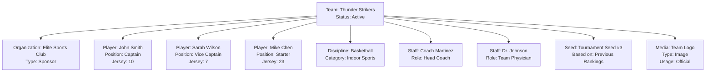

---
tags:
- team
- entity
- competition
- roster
- tournament
---

# Team (Entity)

## Overview

A Team Entity represents the fundamental unit of competition in tournaments, regardless of size. Whether consisting
of a single player or multiple participants, all competitive entities are treated as teams within the system.
This unified approach simplifies tournament management, match scheduling, and result tracking while maintaining
consistency across different competition formats.

## Purpose

The Team Entity serves as the primary competitive unit that:

- Represents all forms of competitive participation (individual or group)
- Maintains roster composition and player assignments
- Tracks organizational affiliations and sponsorships
- Enables seeding and tournament placement
- Supports media and documentation management
- Provides a consistent interface for match scheduling and standings

## Structure

This Entity includes the standard attributes defined in the [Base Entity](../foundation/base_entity.md).

| Attribute        | Description                                                                         | Type       | Required | Notes / Example                                                                          |
| ---------------- | ----------------------------------------------------------------------------------- | ---------- | -------- | ---------------------------------------------------------------------------------------- |
| **Name**         | Official title or designation of the team                                          | String     | Yes      | `"Alpha Eagles"`, `"Thunder Strikers"`                                                   |
| **Organization** | Reference to the [Organization](../organization/organization.md) this team belongs to or is sponsored by | UUID | No | `org-uuid-123` (Company) or `org-uuid-456` (Sponsor) |
| **Roster**       | List of [Players](roster/player/player.md) that make up the team                   | List[UUID] | Yes      | References to Player entities. `[player-uuid-abc, player-uuid-def]`                      |
| **Disciplines**  | [Activity disciplines](../discipline/discipline.md) this team participates in      | List[UUID] | Yes      | References to Activity Discipline entities. `[discipline-uuid-123, discipline-uuid-456]` |
| **Staff**        | Coaches, managers, and supporting personnel                                         | List[UUID] | No       | References to User entities with staff roles. `[user-uuid-789, user-uuid-012]`           |
| **Seed**         | [Team's initial placement](seed.md) for tournament seeding                         | UUID       | No       | Reference to Seed entity. `seed-uuid-abc`                                                |
| **Media**        | Optional list of [Media](../media/media.md) entities associated with this team     | List[UUID] | Optional | Example: `[media-a1b2c3d4-e5f6-4890-1234-567890abc099]`                                  |

## Example

This example shows the Thunder Strikers basketball team with all key attributes represented. The team has a
sponsorship relationship with Elite Sports Club, maintains a roster of three active players with assigned
positions and jersey numbers, participates in basketball discipline, employs coaching and medical staff,
holds a #3 seed position for tournament placement, and has official media assets. This comprehensive
structure enables tournament organizers to manage team composition, track performance, coordinate schedules,
and maintain official records throughout the competition lifecycle.

## See Also

- [Roster](roster.md) - Team roster management and player assignments
- [Player](roster/player/player.md) - Individual player entities within teams
- [Seed](seed.md) - Tournament seeding and placement values
- [Organization](../organization/organization.md) - Team affiliations and sponsorships
- [Tournament](../tournament/tournament.md) - Tournament structure and team participation
- [Standing](../standing/standing.md) - Team performance tracking and rankings
