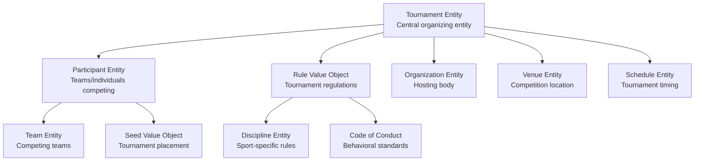

---
tags:
- tournament
- domain
- competition-management
- tournament-organization
---

# Tournament Domain

## Overview

The Tournament domain defines the structure, management, and lifecycle of competitive events and series of
competitions within the Tournament Organizer system. It serves as the central organizing domain that coordinates
all aspects of tournament operations, from planning and registration through execution and completion.

## Purpose

The Tournament domain enables comprehensive tournament management by:

- Organizing competitive events with structured formats, rules, and participant coordination across diverse sports
- Supporting various tournament formats from single elimination to round robin and league-style competitions
- Managing the complete tournament lifecycle from planning through completion and archival
- Coordinating with venues, schedules, and organizational resources for successful tournament execution
- Ensuring proper tournament oversight, governance, and compliance with established standards and regulations
- Facilitating participant registration, communication, and engagement throughout the tournament process

## Structure

### Core Models

| Model | Type | Description |
|-------|------|-------------|
| **[Tournament](./tournament.md)** | Entity | Competitive events organizing participants according to rules and formats |
| **[Participant](./participant.md)** | Entity | Teams or individuals registered to compete in tournaments |
| **[Rule](./rule.md)** | Value Object | Specific regulations governing tournament conduct and competition |

### Domain Relationships

## Example

### Regional Basketball Championship

This example demonstrates a complete tournament domain structure for a regional basketball championship:

- **Tournament**: Regional Basketball Championship (March 15-17, 2024)
- **Participants**: 16 registered teams with seeding positions
- **Rules**: Game duration (4x12min), overtime format (5min), roster limits (15 players)
- **Organization**: Regional Basketball Association
- **Venue**: Central Sports Complex with multiple courts
- **Schedule**: Three-day single elimination format

The tournament coordinates all domain elements to ensure successful competition execution while maintaining
proper governance, participant management, and rule enforcement throughout the event lifecycle.

## See Also

- [Schedule Domain](../schedule/README.md) - Tournament timing and event coordination
- [Team Domain](../team/README.md) - Team structure and tournament participation
- [Venue Domain](../venue/README.md) - Tournament facilities and locations
- [Organization Domain](../organization/README.md) - Tournament organizing entities
- [Registration Domain](../registration/README.md) - Participant registration process
