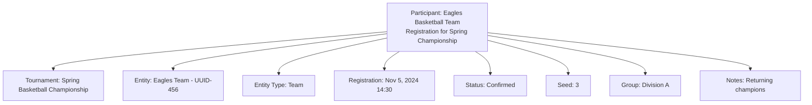

---
tags:
- participant
- entity
- tournament-registration
- competition-participation
---

# Participant (Entity)

## Overview

A Participant Entity represents a team or individual that is registered to compete in a tournament. It serves as
the connection between the tournament and the competing entities, tracking registration status, eligibility,
and participation details throughout the tournament lifecycle.

## Purpose

The Participant Entity enables comprehensive participation management by:

- Registering teams and individuals for tournament competition with complete eligibility tracking
- Managing participation status from registration through tournament completion
- Tracking participant-specific information, requirements, and compliance within tournament context
- Supporting diverse participation models from individual competitors to team-based entries
- Facilitating communication and coordination between tournament organizers and participants
- Maintaining accurate records of tournament participation for historical and administrative purposes

## Structure

This Entity includes the standard attributes defined in the [Base Entity](../foundation/base_entity.md).

| Attribute | Description | Type | Required | Notes / Example |
|-----------|-------------|------|----------|-----------------|
| **Tournament** | Reference to the tournament this participant is registered for | UUID | Yes | `tournament-uuid-123` |
| **Entity** | Reference to the competing entity (team or individual) | UUID | Yes | `team-uuid-456` or `individual-uuid-789` |
| **Entity Type** | Type of the participating entity | String | Yes | `"Team"`, `"Individual"` |
| **Registration Date** | When the participant registered for the tournament | DateTime | Yes | `2024-11-05T14:30:00Z` |
| **Status** | Current participation status | String | Yes | `"Registered"`, `"Confirmed"`, `"Withdrawn"`, `"Disqualified"` |
| **Seed** | Tournament seeding position (if applicable) | Integer | Optional | `1`, `8`, `16` |
| **Group** | Tournament group assignment (if applicable) | String | Optional | `"Group A"`, `"Pool 1"`, `"Division B"` |
| **Notes** | Additional participation notes | Text | Optional | `"Late registration fee applied"`, `"Special accommodation required"` |

## Example

### Basketball Championship Participant

This example demonstrates a basketball team's participation in a championship tournament showing all key attributes:
tournament reference linking to the specific competition, entity reference to the competing team, registration
timestamp for administrative tracking, confirmed status indicating readiness to compete, seeding position for
bracket placement, group assignment for tournament organization, and administrative notes providing context.
This structure enables tournament organizers to manage all aspects of participant involvement from registration
through competition completion.

## See Also

- [Tournament](./tournament.md) - Competitive events where participants compete
- [Team](../team/team.md) - Team entities participating in tournaments
- [Registration](../registration/registration.md) - Registration process and requirements
- [Seed](../team/seed.md) - Tournament seeding and placement logic
- [Base Entity](../foundation/base_entity.md) - Standard entity attributes and lifecycle
