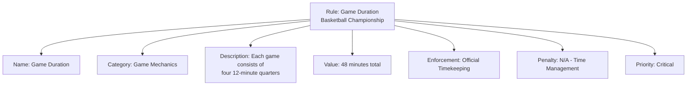

---
tags:
- rule
- value-object
- tournament-rules
- competition-regulations
---

# Rule (Value Object)

## Overview

A Rule Value Object represents a specific regulation or guideline that governs tournament conduct, competition
format, or participant behavior. Rules are embedded within tournaments and do not have independent identity,
serving to define the parameters and constraints under which the tournament operates.

## Purpose

This value object enables comprehensive rule management by:

- Defining specific regulations and guidelines that govern tournament conduct and competition format
- Supporting diverse rule types from game mechanics to participant behavior and administrative procedures
- Ensuring consistent rule application and enforcement throughout tournament execution
- Providing clear documentation of tournament parameters for participants and officials
- Enabling flexible rule customization while maintaining tournament integrity and fairness
- Facilitating dispute resolution through precise rule definition and reference

## Structure

| Attribute | Description | Type | Required | Notes / Example |
|-----------|-------------|------|----------|-----------------|
| **Name** | The name or title of the rule | String | Yes | `"Game Duration"`, `"Overtime Format"`, `"Roster Limits"` |
| **Category** | The category or type of rule | String | Yes | `"Game Mechanics"`, `"Participant Behavior"`, `"Equipment"` |
| **Description** | Detailed description of the rule | Text | Yes | `"Each game consists of four 12-minute quarters"` |
| **Value** | Specific value or parameter (if applicable) | String | Optional | `"48 minutes"`, `"15 players maximum"`, `"5 fouls"` |
| **Enforcement** | How the rule is enforced or monitored | String | Optional | `"Automatic"`, `"Official Decision"`, `"Self-Reported"` |
| **Penalty** | Consequence for rule violation (if applicable) | String | Optional | `"Technical foul"`, `"Disqualification"`, `"Point deduction"` |
| **Priority** | Rule priority level for conflict resolution | String | Optional | `"Critical"`, `"Important"`, `"Standard"` |

## Example

### Basketball Tournament Game Duration Rule

This example demonstrates a basketball game duration rule showing all rule attributes: clear identification name,
game mechanics category for organization, detailed description of the regulation, specific time value for
implementation, enforcement method through official timekeeping, no penalty as it's a structural rule, and
critical priority for tournament operations. This structure enables tournament organizers to maintain
comprehensive rule documentation while providing clear guidance for participants and officials.

## See Also

- [Tournament](./tournament.md) - Competitive events governed by rules
- [Discipline](../discipline/discipline.md) - Sports and activities with specific rule sets
- [Code of Conduct](../code_of_conduct/code_of_conduct.md) - Behavioral expectations and standards
- [Official](../schedule/official/official.md) - Tournament officials responsible for rule enforcement
