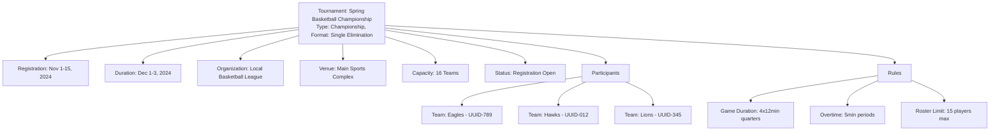

---
tags:
- tournament
- entity
- competition-events
- tournament-management
---

# Tournament (Entity)

## Overview

A Tournament Entity represents a competitive event or series of competitions that brings together participants
(teams or individuals) to compete according to established rules and formats. It serves as the central organizing
entity that coordinates all aspects of tournament operations, from planning and registration through execution
and completion.

## Purpose

The Tournament Entity enables comprehensive tournament management by:

- Organizing competitive events with structured formats, rules, and participant coordination
- Supporting diverse tournament formats from single elimination to round robin and league-style competitions
- Managing the complete tournament lifecycle from planning through completion and archival
- Coordinating with venues, schedules, and organizational resources for successful tournament execution
- Ensuring proper tournament oversight, governance, and compliance with established standards
- Facilitating participant registration, communication, and engagement throughout the tournament process

## Structure

This Entity includes the standard attributes defined in the [Base Entity](../foundation/base_entity.md).

| Attribute | Description | Type | Required | Notes / Example |
|-----------|-------------|------|----------|-----------------|
| **Name** | The name of the tournament | String | Yes | `"Spring Basketball Championship"`, `"Summer Soccer League"` |
| **Type** | The type of tournament | String | Optional | `"Championship"`, `"League"`, `"Exhibition"`, `"Qualifier"` |
| **Description** | Description of the tournament | Text | Optional | `"Annual basketball championship for local teams"` |
| **Format** | The format structure of the tournament | String | Optional | `"Single Elimination"`, `"Round Robin"`, `"League"` |
| **Capacity** | Maximum number of participants for this tournament | Integer | Optional | `16`, `32`, `64` |
| **Registration Start** | When registration opens for the tournament | DateTime | Yes | `2024-11-01T00:00:00Z` |
| **Registration End** | When registration closes for the tournament | DateTime | Yes | `2024-11-15T23:59:59Z` |
| **Start Date** | When the tournament begins | Date | Yes | `2024-12-01` |
| **End Date** | When the tournament ends | Date | Yes | `2024-12-03` |
| **Status** | Current tournament status | String | Yes | `"Draft"`, `"Registration Open"`, `"In Progress"`, `"Completed"` |
| **Organization** | Reference to the organizing entity | UUID | Yes | `organization-uuid-123` |
| **Venue** | Reference to the primary tournament venue | UUID | Yes | `venue-uuid-456` |
| **Participants** | List of teams or individuals participating | List[UUID] | Optional | `[team-uuid-789, team-uuid-012]` |
| **Rules** | List of tournament-specific rules | List[UUID] | Optional | `[rule-uuid-345, rule-uuid-678]` |

## Example

### Spring Basketball Championship

This example shows a Spring Basketball Championship tournament with single elimination format accommodating 16 teams.
The tournament spans three days in December with a two-week registration period in November. It demonstrates the
complete tournament structure including organization reference, venue allocation, participant tracking, and specific
basketball rules. The tournament status shows it's currently accepting registrations, and the participant list
tracks registered teams by UUID reference for proper entity relationships.

## See Also

- [Participant](./participant.md) - Teams and individuals participating in tournaments
- [Rule](./rule.md) - Tournament-specific rules and regulations
- [Schedule](../schedule/schedule.md) - Tournament timing and event coordination
- [Team](../team/team.md) - Team structure and tournament participation
- [Organization](../organization/organization.md) - Tournament organizing entities
- [Venue](../venue/venue.md) - Tournament facilities and locations
- [Base Entity](../foundation/base_entity.md) - Standard entity attributes and lifecycle
