---
tags:
- tournament
- entity
- competition-events
- tournament-management
---

# Tournament (Entity)

## Overview

A Tournament Entity represents a competitive event or series of competitions that brings together participants
(teams or individuals) to compete according to established rules and formats. It serves as the central organizing
entity that coordinates all aspects of tournament operations, from planning and registration through execution
and completion.

## Purpose

The Tournament Entity enables comprehensive tournament management by:

- Organizing competitive events with structured formats, rules, and participant coordination
- Supporting diverse tournament formats from single elimination to round robin and league-style competitions
- Managing the complete tournament lifecycle from planning through completion and archival
- Coordinating with venues, schedules, and organizational resources for successful tournament execution
- Ensuring proper tournament oversight, governance, and compliance with established standards
- Facilitating participant registration, communication, and engagement throughout the tournament process

## Structure

This Entity includes the standard attributes defined in the [Base Entity](../foundation/base_entity.md).

| Attribute | Description | Type | Required | Notes / Example |
|-----------|-------------|------|----------|-----------------|
| **Name** | The name of the tournament | String | Yes | `"Spring Basketball Championship"`, `"Summer Soccer League"` |
| **Type** | The type of tournament | String | Optional | `"Championship"`, `"League"`, `"Exhibition"`, `"Qualifier"` |
| **Description** | Description of the tournament | Text | Optional | `"Annual basketball championship for local teams"` |
| **Format** | The competitive format structure of the tournament | String | Optional | `"Single Elimination"`, `"Double Elimination"`, `"Round Robin"`, `"League"` |
| **Category** | Tournament category level | String | Optional | `"Regional"`, `"National"`, `"International"`, `"Championship"` |
| **Capacity** | Maximum number of participants for this tournament | Integer | Optional | `16`, `32`, `64` |
| **Duration** | Expected duration of the tournament | String | Optional | `"Weekend"`, `"Multi-day"`, `"Single-day"`, `"Week-long"` |
| **Registration Start** | When registration opens for the tournament | DateTime | Yes | `2024-11-01T00:00:00Z` |
| **Registration End** | When registration closes for the tournament | DateTime | Yes | `2024-11-15T23:59:59Z` |
| **Registration Period** | Number of days registration is open | Integer | Optional | `30`, `14`, `7` (calculated from start/end dates) |
| **Start Date** | When the tournament begins | Date | Yes | `2024-12-01` |
| **End Date** | When the tournament ends | Date | Yes | `2024-12-03` |
| **Status** | Current tournament status | String | Yes | `"Draft"`, `"Registration Open"`, `"In Progress"`, `"Completed"`, `"Cancelled"` |
| **Fee Structure** | Tournament fee configuration | List[String] | Optional | `["Early Bird: $50", "Regular: $75", "Late: $100"]` |
| **Prize Structure** | Prize and award configuration | List[String] | Optional | `["1st Place: $500", "2nd Place: $300", "3rd Place: $100"]` |
| **Organization** | Reference to the organizing entity | UUID | Yes | `organization-uuid-123` |
| **Primary Venue** | Reference to the primary tournament venue | UUID | Yes | `venue-uuid-456` |
| **Additional Venues** | References to additional venues if multi-venue | List[UUID] | Optional | `[venue-uuid-789, venue-uuid-012]` |
| **Activity** | Reference to the sport/activity type | UUID | Yes | `activity-basketball-uuid` |
| **Discipline** | Reference to the specific competition discipline | UUID | Yes | `discipline-5v5-basketball-uuid` |
| **Participants** | List of teams or individuals participating | List[UUID] | Optional | `[team-uuid-789, team-uuid-012]` |
| **Rules** | List of tournament-specific rules | List[UUID] | Optional | `[rule-uuid-345, rule-uuid-678]` |
| **Schedule** | Reference to the tournament schedule | UUID | Optional | `schedule-uuid-901` |
| **Officials** | List of assigned tournament officials | List[UUID] | Optional | `[official-uuid-234, official-uuid-567]` |
| **Safety Protocols** | List of safety protocols and procedures | List[UUID] | Optional | `[safety-protocol-uuid-345]` |
| **Medical Support** | List of medical support arrangements | List[UUID] | Optional | `[medical-support-uuid-678]` |
| **Requirements** | Participant requirements and qualifications | List[String] | Optional | `["Age 18+", "Team registration", "Equipment provided", "Insurance required"]` |
| **Contact Information** | Tournament organizer contact details | Text | Optional | `"tournament@example.com", "+1-555-0123"` |
| **Website** | Official tournament website URL | String | Optional | `"https://tournament.example.com"` |
| **Social Media** | Social media handles and links | List[String] | Optional | `["@TournamentName", "facebook.com/tournament"]` |
| **Sponsors** | List of tournament sponsors | List[String] | Optional | `["Local Sports Store", "Community Bank", "Equipment Manufacturer"]` |
| **Broadcasting** | Broadcasting and streaming information | Text | Optional | `"Live stream on tournament website"`, `"Local TV coverage"` |
| **Awards Ceremony** | Awards ceremony details | Text | Optional | `"Sunday 5:00 PM at Main Venue"` |

## Example

### Spring Basketball Championship

```mermaid
graph TD
    T[Tournament: Spring Basketball Championship<br/>Type: Championship, Format: Single Elimination<br/>Category: Regional]
    
    T --> BASIC[Basic Information]
    BASIC --> N[Name: Spring Basketball Championship]
    BASIC --> TY[Type: Championship]
    BASIC --> F[Format: Single Elimination]
    BASIC --> C[Category: Regional]
    BASIC --> CAP[Capacity: 32 Teams]
    BASIC --> DUR[Duration: Weekend]
    
    T --> TIMING[Registration & Timing]
    TIMING --> RS[Registration: Nov 1-15, 2024]
    TIMING --> SD[Start: Dec 1, 2024]
    TIMING --> ED[End: Dec 3, 2024]
    TIMING --> ST[Status: Registration Open]
    
    T --> FINANCIAL[Financial Structure]
    FINANCIAL --> FS[Fees: Early $50, Regular $75, Late $100]
    FINANCIAL --> PS[Prizes: 1st $500, 2nd $300, 3rd $100]
    FINANCIAL --> SP[Sponsors: Local Sports Store, Community Bank]
    
    T --> ORGANIZATION[Organization & Venues]
    ORGANIZATION --> O[Organization: Regional Basketball League]
    ORGANIZATION --> PV[Primary Venue: Central Sports Complex]
    ORGANIZATION --> AV[Additional Venues: Community Center, High School Gym]
    
    T --> COMPETITION[Competition Details]
    COMPETITION --> A[Activity: Basketball]
    COMPETITION --> D[Discipline: 5v5 Basketball]
    COMPETITION --> P[Participants: 24 registered teams]
    COMPETITION --> R[Rules: FIBA regulations + tournament specifics]
    
    T --> SUPPORT[Support & Services]
    SUPPORT --> SCH[Schedule: 3-day elimination bracket]
    SUPPORT --> OF[Officials: 12 certified referees]
    SUPPORT --> SAF[Safety: Emergency protocols, First aid]
    SUPPORT --> MED[Medical: On-site paramedics]
    
    T --> COMMUNICATION[Communication & Media]
    COMMUNICATION --> CI[Contact: tournament@basketball.org]
    COMMUNICATION --> W[Website: www.springchampionship.com]
    COMMUNICATION --> SM[Social: @SpringBBall, Facebook page]
    COMMUNICATION --> BC[Broadcasting: Live stream, Local TV]
    
    T --> EVENTS[Special Events]
    EVENTS --> AC[Awards Ceremony: Sunday 5PM]
    EVENTS --> REQ[Requirements: Age 18+, Insurance, Equipment]
```

This comprehensive example demonstrates a fully-featured basketball championship tournament showing all essential
attributes for professional tournament organization. The tournament spans three days with 32-team capacity using
single elimination format. It includes complete financial structure with tiered fees and prize distribution,
multi-venue coordination, comprehensive support services including officials and medical staff, extensive
communication channels for participant engagement, and special event coordination. This structure enables
tournament organizers to manage every aspect of tournament execution from initial planning through final
awards ceremony while maintaining professional standards and participant satisfaction.

## See Also

- [Participant](./participant.md) - Teams and individuals participating in tournaments
- [Rule](./rule.md) - Tournament-specific rules and regulations
- [Schedule](../schedule/schedule.md) - Tournament timing and event coordination
- [Team](../team/team.md) - Team structure and tournament participation
- [Organization](../organization/organization.md) - Tournament organizing entities
- [Venue](../venue/venue.md) - Tournament facilities and locations
- [Activity](../activity/activity.md) - Sports and competitive activities
- [Discipline](../discipline/discipline.md) - Specific competition formats and rules
- [Official](../schedule/official/official.md) - Tournament officials and their roles
- [Safety](../safety/safety.md) - Safety protocols and emergency procedures
- [Finance](../finance/finance.md) - Tournament financial management
- [Base Entity](../foundation/base_entity.md) - Standard entity attributes and lifecycle
