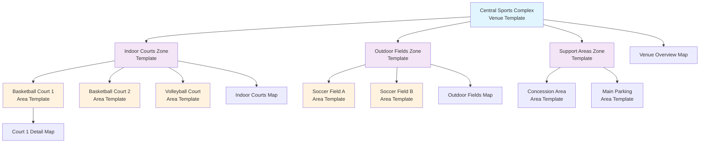

# **Venue Domain**

## **Overview**

The Venue domain manages the physical facilities, spaces, and locations where tournament activities take place. It
provides a hierarchical structure for organizing venues, zones, and areas, along with visual mapping capabilities to
support event planning and participant navigation.

This domain uses a template-based approach where venue configurations are copied into tournaments, allowing for
tournament-specific modifications while maintaining standardized venue structures.

## **Purpose**

The Venue domain enables tournament organizers to:

- **Define** reusable venue templates for consistent facility management
- **Organize** complex facilities through hierarchical zone and area structures  
- **Navigate** venues effectively through integrated mapping systems
- **Scale** from simple single-area venues to complex multi-zone facilities
- **Customize** venue instances while preserving original templates

## **Structure**

### **Core Models**

| **Model** | **Type** | **Purpose** | **Description** |
|-----------|----------|-------------|-----------------|
| **[Venue](venue.md)** | Template Entity | Facility Container | Overall physical facilities and complexes |
| **[Zone](zone.md)** | Template Entity | Area Organization | Logical groupings within larger venues |
| **[Area](area.md)** | Template Entity | Playable Space | Single, specific competition spaces |
| **[Map](map.md)** | Template Entity | Visual Layout | Visual representations of physical spaces |

### **Template Entity Analysis**

**Current Template Entities:**

- **Venue**: Used as a template for standard venue configurations, copied into tournaments
- **Zone**: Template for organizing areas within venues, copied with venue templates
- **Area**: Template for specific playable spaces, copied with venue/zone templates
- **Map**: Template for visual layouts, can be associated with venues, zones, or areas

**Potential Template Entities:**

- **Amenity Templates**: Standard amenities available at different venue types
- **Surface Templates**: Standard surface types for different sports/activities
- **Dimension Templates**: Standard dimensions for different competition areas

### **Status Lifecycle**

**Venue Statuses:**

- **Active**: Template is available for use
- **Deprecated**: Template is no longer recommended

**Zone Statuses:**

- **Active**: Template is available for use
- **Deprecated**: Template is no longer recommended

**Area Statuses:**

- **Active**: Template is available for use
- **Deprecated**: Template is no longer recommended
- **Under Maintenance**: Area is temporarily unavailable

**Map Statuses:**

- **Active**: Map is current and available
- **Deprecated**: Map is outdated and no longer recommended

**Lifecycle Transitions:**

- Venue/Zone/Area/Map: Active → Deprecated
- Area: Active → Under Maintenance → Active

### **Relationships & Cross-References**

- **Venue ↔ Zone**: Organizes zones within venue
- **Venue ↔ Area**: Direct area references or via zones
- **Venue ↔ Map**: Overall venue layouts
- **Zone ↔ Area**: Areas within zones
- **Zone ↔ Map**: Zone-specific layouts
- **Area ↔ Map**: Area-specific layouts
- **Area ↔ Fixture**: Areas used for fixtures
- **Venue ↔ Tournament**: Venue templates copied into tournaments

## **Example**

### **Venue Hierarchy Example**

## **Quality Standards**

- All models include comprehensive attribute documentation
- Cross-references are accurate and up to date
- Status lifecycles are clearly defined
- Template entity usage is documented
- Practical examples are provided where relevant
- Consistent formatting and terminology throughout

## **Implementation Guidelines**

- Use template entities for standardization and efficiency
- Enforce status transitions and lifecycle rules
- Validate venue configurations against tournament requirements
- Maintain accurate cross-references between all related models
- Regularly review and update documentation for clarity and completeness

## **Related Domains**

- [Tournament Domain](../tournament/README.md): Tournament structure and management
- [Schedule Domain](../schedule/README.md): Match and event scheduling
- [Inventory Domain](../inventory/README.md): Equipment and resource management
- [Safety Domain](../safety/README.md): Safety protocols and procedures

---

**Last Updated**: September 16, 2025 **Version**: 2.0 **Status**: Active **Next Review**: October 16, 2025

## **See Also**

- [Venue Template Entity](venue.md)
- [Zone Template Entity](zone.md)
- [Area Template Entity](area.md)
- [Map Template Entity](map.md)
- [Tournament Domain README](../tournament/README.md)
- [Schedule Domain README](../schedule/README.md)
- [Inventory Domain README](../inventory/README.md)
- [Safety Domain README](../safety/README.md)
- [Foundation Domain README](../foundation/README.md)
