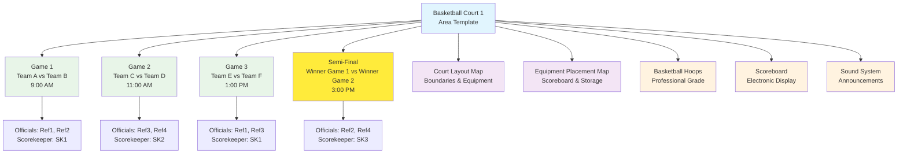

# **Area** (Template Entity)

## **Overview**

An **Area** Entity Template defines a blueprint for a *single, specific, playable space* within a larger venue context
(e.g., a Venue template or a [Zone](../venue/zone.md) template). It represents the fundamental unit where a
single competition event (like a Fixture) takes place at any given time.

## **Purpose**

This template entity provides the fundamental schedulable unit for tournament activities:

- **Defines** the specific physical space where competitions occur
- **Standardizes** area configurations for consistent tournament planning
- **Enables** precise fixture scheduling to avoid conflicts
- **Supports** venue management through detailed space specifications

Examples include templates for a *single* standard competition court (e.g., "Court 1"), a specific field ("Field A"), a
particular table ("Table 3"), or a designated rink ("Rink 2"). It does **not** represent a collection of courts or a
general spectator zone.

When a `Venue` or `Zone` template is used, the definitions of its associated `Area` templates are typically **copied**
into the specific instance (e.g., within a `Tournament`), allowing for modification (e.g., setting status to 'Under
Maintenance') without affecting the original template. This template serves as the fundamental unit for fixture
scheduling.

This template entity inherits properties from the [Base Entity](../foundation/base_entity.md).

---

## **Structure**

| **Attribute**    | **Type**   | **Required** | **Description**                                              |
|------------------|------------|--------------|--------------------------------------------------------------|
| **Name**         | String     | Yes          | Human-readable area template identifier                      |
| **Number**       | Integer    | Yes          | Numeric identifier for ordering within context              |
| **Type**         | String     | Yes          | Category of playable area (court, field, table, etc.)       |
| **Description**  | Text       | Optional     | Detailed description of area template and features          |
| **Surface**      | String     | Optional     | Ground or floor surface type for playable area              |
| **Dimensions**   | String     | Optional     | Playable size and dimensions description                     |
| **Maps**         | List[UUID] | Optional     | References to Map entities for area layouts                 |
| **Notes**        | Text       | Optional     | Configuration and access notes for area type                |

---

## **Attributes**

**Note:** This Entity Template includes the standard attributes (`ID`, `Status` [e.g., Active, Deprecated, Under
Maintenance], `CreatedAt`, `LastUpdatedAt`) defined in the [Base Entity](../foundation/base_entity.md).

| Attribute       | Description                                                                                                                                                                | Type       | Required | Notes / Example                                                                                                                  |
| --------------- | -------------------------------------------------------------------------------------------------------------------------------------------------------------------------- | ---------- | -------- | -------------------------------------------------------------------------------------------------------------------------------- |
| **Name**        | A human-readable name identifying the specific area template (e.g., a court number, field name). Should be unique within a relevant context.                               | String     | Yes      | E.g., "Court 1", "Field A", "Table 3", "Rink 2", "Lane 4"                                                                        |
| **Number**      | A numeric identifier used for ordering and sorting areas within their context (e.g., within a Zone or Venue).                                                              | Integer    | Yes      | E.g., `1`, `2`, `3` for sequential ordering, or `101`, `102`, `103` for hierarchical ordering                                    |
| **Type**        | Categorizes the primary purpose or type of the specific playable area template.                                                                                            | String     | Yes      | E.g., "CompetitionCourt", "PlayingField", "CompetitionTable", "SwimmingLane", "RunningTrackLane", "BowlingLane", "Rink", "Board" |
| **Description** | Optional detailed description of the specific area template, its standard features (relevant to play), or typical use.                                                     | Text       | Optional | "Standard competition court, suitable for basketball/volleyball."                                                                |
| **Surface**     | The standard type of ground or floor surface for this specific playable area, if applicable.                                                                               | String     | Optional | E.g., "Hardwood", "Artificial Turf", "Grass", "Clay", "Concrete", "Ice", "Synthetic"                                             |
| **Dimensions**  | Textual description or structured data representing the typical playable size/dimensions of this area type.                                                                | String     | Optional | E.g., "Regulation Basketball Court (94x50 ft)", "400m Lane", "10m x 5m"                                                          |
| **Maps**        | Optional list of references (by ID) to detailed **[Map](../venue/map.md)** entities specifically depicting this area template or its immediate surroundings. | List[UUID] | Optional | `["map-uuid-area-court1-layout", "map-uuid-area-court1-detail"]`                                                                 |
| **Notes**       | General notes about the configuration, access, or specific characteristics of this type of playable area.                                                                  | Text       | Optional | "North end goal needs pre-game check.", "Requires key card access via West door."                                                |

---

## **Example**

### **Basketball Court Area Template**

```json
{
  "id": "area-tmpl-basketball-court-1",
  "name": "Basketball Court 1",
  "number": 1,
  "type": "CompetitionCourt",
  "description": "Standard regulation basketball court with professional hardwood surface",
  "surface": "Hardwood",
  "dimensions": "Regulation Basketball Court (94x50 ft)",
  "maps": [
    "map-court1-layout",
    "map-court1-equipment-placement"
  ],
  "notes": "High-quality sound system installed. Equipment storage in adjacent room A-1.",
  "status": "Active",
  "createdAt": "2024-01-15T09:00:00Z",
  "lastUpdatedAt": "2024-06-01T14:30:00Z"
}
```

### **Area Usage Diagram**



---

## **Relationships**

- An `Area` Entity Template is typically referenced by a Venue template (directly) or a
  **[Zone](../venue/zone.md)** template to define the specific playable spaces within them.
- It may reference a Unit entity if dimensions are provided with units.
- It optionally references a list of specific **[Map](../venue/map.md)** entities.
- When the parent `Venue`/`Zone` template is copied into a `Tournament`, this `Area` template definition is also copied
  as part of that structure, becoming the specific instance used by Fixture entities.

---

## **Considerations**

- **Template Nature:** Defines a standard configuration for a *single* playable area. Instance-specific details (e.g.,
  current availability status during an event, temporary setup notes for a specific fixture) are handled on the copied
  instance within the `Tournament` data or potentially on the `Fixture` itself.
- **Copy Mechanism:** Part of the larger `Venue`/`Zone` template copy process.
- **Specificity:** Represents the most granular level of *schedulable, playable space* within the `Venue` hierarchy
  (Venue -> [Zone] -> Area). It is the target location for a `Fixture`.
- **No Capacity:** This model does **not** track spectator capacity or general occupancy; that would belong to a
  different model, perhaps related to the parent `Venue` or `Zone` if needed.
- **Dimensions:** Useful for planning layouts and confirming suitability for specific activities.
- **Map Reference:** Allows associating specific visual layouts (e.g., boundary lines, equipment placement) with this
  area template.

---

## **See Also**

- [Venue Domain README](README.md)
- [Venue Template Entity](venue.md)
- [Zone Template Entity](zone.md)
- [Map Template Entity](map.md)
- [Tournament Domain](../tournament/README.md)
- [Schedule Domain](../schedule/README.md)
- [Foundation Domain](../foundation/README.md)
