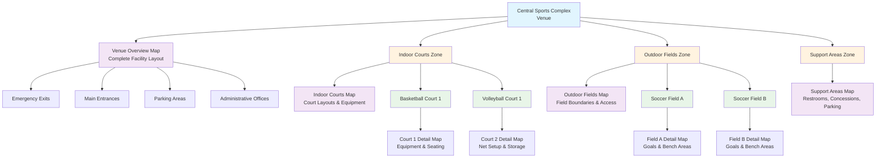

# **Map** (Template Entity)

## **Overview**

A **Map** Entity Template represents a visual representation or layout of physical spaces like Venues, Zones, or Areas.
It provides spatial context and navigation information for users, supporting event planning, participant navigation, and
facility management.

## **Purpose**

This template entity provides visual and spatial information that enables:

- **Navigation** through complex venue layouts for participants and staff
- **Planning** of event logistics and space utilization
- **Visualization** of facility boundaries, access points, and key features
- **Emergency Response** through clear layout understanding and exit identification

Maps can be associated with venues for overall layouts, zones for section-specific details, or areas for precise
location information.

This template entity inherits properties from the [Base Entity](../foundation/base_entity.md).

---

## **Structure**

| **Attribute**    | **Type**     | **Required** | **Description**                                              |
|------------------|--------------|--------------|--------------------------------------------------------------|
| **Name**         | String       | Yes          | Descriptive name for the map                                 |
| **Description**  | String       | Optional     | Detailed context and purpose of the map                     |
| **Floor Level**  | String/Int   | Optional     | Floor or level identifier for multi-level venues            |
| **Image**        | UUID         | Yes          | Reference to map image stored in database                   |
| **Version**      | String       | Optional     | Version identifier for map revisions                        |

---

## **Attributes**

**Note:** This Entity Template includes the standard attributes (`ID`, `Status`, `CreatedAt`, `LastUpdatedAt`) defined
in the [Base Entity](../foundation/base_entity.md).

| Attribute       | Description                                                       | Type         | Required | Notes / Example                                 |
| --------------- | ----------------------------------------------------------------- | ------------ | -------- | ----------------------------------------------- |
| **Name**        | A descriptive name for the map.                                   | String       | Yes      | `"Main Building - Floor 1"`, `"Field Layout A"` |
| **Description** | Optional longer description providing more context about the map. | String       | No       | `"Map showing vendor booths and restrooms"`     |
| **Floor Level** | Indicates the floor or level this map represents.                 | String / Int | No       | `"Ground"`, `"Level 2"`, `0`, `1`               |
| **Image**       | Reference to the map image stored in the database.                | UUID         | Yes      | `550e8400-e29b-41d4-a716-446655440000`          |
| **Version**     | A version identifier if the map layout changes over time.         | String       | No       | `"1.1"`, `"2024-Final"`                         |

---

## **Example**

### **Venue Overview Map Template**

```json
{
  "id": "map-venue-overview",
  "name": "Central Sports Complex - Main Floor",
  "description": "Complete facility layout showing all zones, entrances, amenities, and emergency exits",
  "floorLevel": "Ground",
  "image": "550e8400-e29b-41d4-a716-446655440000",
  "version": "2024.3",
  "status": "Active",
  "createdAt": "2024-01-15T09:00:00Z",
  "lastUpdatedAt": "2024-09-01T10:15:00Z"
}
```

### **Map Hierarchy Diagram**



---

## **Relationships**

- A `Map` Entity can be associated with:
  - One Venue entity for overall layouts
  - One **[Zone](../venue/zone.md)** entity for zone-specific layouts
  - One Area entity for area-specific layouts
- It may reference Image entities for the actual map images or files.
- When instantiated, a Map may be associated with:
  - Multiple Point of Interest entities for marked locations
  - Multiple Equipment entities for placed items

---

## **Considerations**

- **Template Usage:** Defines the standard structure for venue maps
- **Copy Mechanism:** When instantiated, creates a new map with its own identity
- **Instance Management:** Each map instance maintains its own lifecycle
- **Validation Rules:**
  - Name must be unique within its venue context
  - Image must be in a supported format
  - Version must follow a consistent format
  - Floor level must be valid for the venue
- **Usage Cases:**
  - Event layout planning
  - Participant navigation
  - Safety planning
  - Space optimization
  - Resource placement
  - Emergency response planning

---

## **See Also**

- [Venue Domain README](README.md)
- [Venue Template Entity](venue.md)
- [Zone Template Entity](zone.md)
- [Area Template Entity](area.md)
- [Tournament Domain](../tournament/README.md)
- [Schedule Domain](../schedule/README.md)
- [Foundation Domain](../foundation/README.md)
