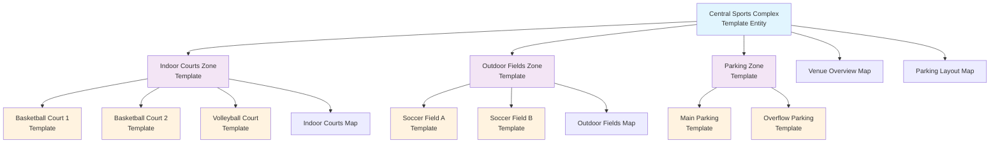

# **Venue** (Template Entity)

## **Overview**

A **Venue** Entity Template defines a blueprint for the overall physical facility, complex, or location where
tournament activities might take place. It serves as a reusable, top-level container for organizing standard
configurations of specific spaces, such as Zone and Area templates.

## **Purpose**

This template entity provides a standardized approach to defining venue configurations that can be:

- **Reused** across multiple tournaments with similar venue requirements
- **Copied** into tournament instances for customization without affecting the original template
- **Organized** hierarchically through zones and areas for complex facilities
- **Mapped** visually for navigation and planning purposes

Examples include templates for a standard sports complex, convention center, or school campus layout.

When a `Venue` template is used, the definitions of its associated `Zone` templates (and their referenced `Area`
templates) are typically **copied** into the specific instance (e.g., within a `Tournament`), allowing for
modification without affecting the original template.

This template entity inherits properties from the [Base Entity](../foundation/base_entity.md).

---

## **Structure**

| **Attribute**    | **Type**   | **Required** | **Description**                                              |
|------------------|------------|--------------|--------------------------------------------------------------|
| **Name**         | String     | Yes          | Human-readable venue template identifier                     |
| **Description**  | Text       | Optional     | Detailed description of venue template and features         |
| **Contact**      | Text       | Optional     | Contact information for venue management and coordination    |
| **Type**         | String     | Yes          | Primary venue category and purpose classification            |
| **Zones**        | List[UUID] | Yes          | References to Zone templates within venue                    |
| **Maps**         | List[UUID] | Optional     | References to Map entities for venue layouts                |
| **Notes**        | Text       | Optional     | Configuration and access notes for venue type               |

---

## **Attributes**

**Note:** This Entity Template includes the standard attributes (`ID`, `Status` [e.g., Active, Deprecated], `CreatedAt`,
`LastUpdatedAt`) defined in the [Base Entity](../foundation/base_entity.md).

| Attribute       | Description                                                                                                                                                        | Type       | Required | Notes / Example                                                                  |
| --------------- | ------------------------------------------------------------------------------------------------------------------------------------------------------------------ | ---------- | -------- | -------------------------------------------------------------------------------- |
| **Name**        | A human-readable name identifying the venue template (e.g., a facility name, complex designation).                                                                 | String     | Yes      | E.g., "Central Sports Complex", "Community Center", "University Campus"          |
| **Description** | Optional detailed description of the venue template, its purpose, or general features.                                                                             | Text       | Optional | "Multi-purpose sports facility with indoor and outdoor venues."                  |
| **Contact**     | Contact information for venue management, including phone numbers, email addresses, and key personnel for coordination.                                           | Text       | Optional | "Facility Manager: John Smith, Phone: (555) 123-4567, Email: john\@venue.com"   |
| **Type**        | Categorizes the primary purpose or type of the venue template.                                                                                                     | String     | Yes      | E.g., "Sports Complex", "Convention Center", "School Campus", "Community Center" |
| **Zones**       | List of references (by ID) to **[Zone](../venue/zone.md)** templates within this venue template.                                                     | List[UUID] | Yes      | References Zone template IDs. `["zone-tmpl-indoor", "zone-tmpl-outdoor"]`        |
| **Maps**        | Optional list of references (by ID) to **[Map](../venue/map.md)** entities specifically depicting this venue template or its immediate surroundings. | List[UUID] | Optional | `["map-uuid-venue-overview", "map-uuid-venue-parking"]`                          |
| **Notes**       | General notes about the configuration, access, or specific characteristics of this type of venue.                                                                  | Text       | Optional | "Main entrance on North side.", "Requires security clearance for access."        |

---

## **Example**

### **Central Sports Complex Venue Template**

```json
{
  "id": "venue-tmpl-central-sports",
  "name": "Central Sports Complex",
  "description": "Multi-purpose sports facility with indoor courts and outdoor fields",
  "contact": "Facility Manager: Sarah Johnson, Phone: (555) 987-6543, Email: sarah.johnson\@centralsports.org",
  "type": "Sports Complex",
  "zones": [
    "zone-tmpl-indoor-courts",
    "zone-tmpl-outdoor-fields",
    "zone-tmpl-parking"
  ],
  "maps": [
    "map-venue-overview",
    "map-venue-parking-layout"
  ],
  "notes": "Main entrance via North parking lot. Administrative office open 6 AM - 10 PM daily.",
  "status": "Active",
  "createdAt": "2024-01-15T09:00:00Z",
  "lastUpdatedAt": "2024-06-01T14:30:00Z"
}
```

### **Venue Structure Diagram**



---

## **Relationships**

- A `Venue` Entity Template is referenced by a Tournament to define its physical location.
- It references a list of one or more **[Zone](../venue/zone.md)** templates.
- It optionally references a list of specific **[Map](../venue/map.md)** entities.
- When the `Venue` template is copied into a `Tournament`, this template definition is also copied as part of that
  structure.

---

## **Considerations**

- **Template Nature:** Defines a standard venue configuration. Instance-specific details (status changes during an
  event, temporary notes) belong on the copied instance within the `Tournament`.
- **Copy Mechanism:** Part of the larger venue template copy process.
- **Zone Organization:** Zones are an optional organizational layer. Areas can belong directly to a Venue if zone
  organization is unnecessary.
- **Map Reference:** Allows associating specific visual layouts (e.g., venue boundaries, access points) with this venue
  template.

---

## **See Also**

- [Venue Domain README](README.md)
- [Zone Template Entity](zone.md)
- [Area Template Entity](area.md)
- [Map Template Entity](map.md)
- [Tournament Domain](../tournament/README.md)
- [Schedule Domain](../schedule/README.md)
- [Foundation Domain](../foundation/README.md)
