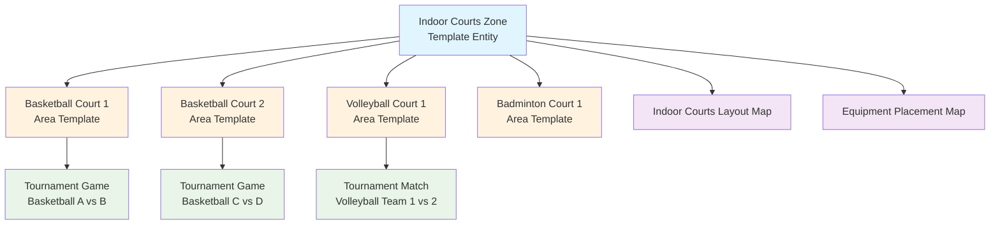

# **Zone** (Template Entity)

## **Overview**

A **Zone** Entity Template defines a blueprint for a logical grouping or section within a larger venue template. It
serves as an optional organizational layer to cluster references to related Area templates, making it easier to
manage and navigate complex venue layouts.

## **Purpose**

This template entity provides a standardized approach to organizing venue areas that can be:

- **Grouped** logically by function, location, or access requirements
- **Managed** as cohesive units within larger venue complexes
- **Navigated** efficiently through clear organizational structure
- **Mapped** with zone-specific visual layouts

Examples include templates for an "Indoor Courts Section", "Outdoor Fields Area", or "Main Competition Zone".

When a `Venue` template is used, the definitions of its associated `Zone` templates (and their referenced `Area`
templates) are typically **copied** into the specific instance (e.g., within a `Tournament`), allowing for
modification without affecting the original template.

This template entity inherits properties from the [Base Entity](../foundation/base_entity.md).

---

## **Structure**

| **Attribute**    | **Type**   | **Required** | **Description**                                              |
|------------------|------------|--------------|--------------------------------------------------------------|
| **Name**         | String     | Yes          | Human-readable zone template identifier                      |
| **Description**  | Text       | Optional     | Detailed description of zone template and features          |
| **Type**         | String     | Yes          | Primary zone category and purpose classification             |
| **Areas**        | List[UUID] | Yes          | References to Area templates within zone                     |
| **Maps**         | List[UUID] | Optional     | References to Map entities for zone layouts                 |
| **Notes**        | Text       | Optional     | Configuration and access notes for zone type                |

---

## **Attributes**

**Note:** This Entity Template includes the standard attributes (`ID`, `Status` [e.g., Active, Deprecated], `CreatedAt`,
`LastUpdatedAt`) defined in the [Base Entity](../foundation/base_entity.md).

| Attribute       | Description                                                                                                                                                       | Type       | Required | Notes / Example                                                                            |
| --------------- | ----------------------------------------------------------------------------------------------------------------------------------------------------------------- | ---------- | -------- | ------------------------------------------------------------------------------------------ |
| **Name**        | A human-readable name identifying the zone template (e.g., a section name, area designation).                                                                     | String     | Yes      | E.g., "Indoor Courts", "Outdoor Fields", "Main Competition Zone"                           |
| **Description** | Optional detailed description of the zone template, its purpose, or general features.                                                                             | Text       | Optional | "Collection of standard indoor competition courts suitable for basketball and volleyball." |
| **Type**        | Categorizes the primary purpose or type of the zone template.                                                                                                     | String     | Yes      | E.g., "Indoor", "Outdoor", "Mixed", "Competition", "Training", "Spectator", "Service"      |
| **Areas**       | List of references (by ID) to Area templates within this zone template.                                                                                       | List[UUID] | Yes      | References Area template IDs. `["area-tmpl-field1", "area-tmpl-field2"]`                   |
| **Maps**        | Optional list of references (by ID) to **[Map](../venue/map.md)** entities specifically depicting this zone template or its immediate surroundings. | List[UUID] | Optional | `["map-uuid-zone-indoor-layout", "map-uuid-zone-indoor-detail"]`                           |
| **Notes**       | General notes about the configuration, access, or specific characteristics of this type of zone.                                                                  | Text       | Optional | "Access via North entrance only.", "Requires special security clearance."                  |

---

## **Example**

### **Indoor Courts Zone Template**

```json
{
  "id": "zone-tmpl-indoor-courts",
  "name": "Indoor Courts Section",
  "description": "Climate-controlled indoor courts suitable for basketball, volleyball, and badminton",
  "type": "Indoor",
  "areas": [
    "area-tmpl-basketball-court-1",
    "area-tmpl-basketball-court-2",
    "area-tmpl-volleyball-court-1",
    "area-tmpl-badminton-court-1"
  ],
  "maps": [
    "map-indoor-courts-layout",
    "map-indoor-courts-equipment"
  ],
  "notes": "Access via main entrance. HVAC system maintains 68-72°F during events.",
  "status": "Active",
  "createdAt": "2024-01-15T09:00:00Z",
  "lastUpdatedAt": "2024-06-01T14:30:00Z"
}
```

### **Zone Structure Diagram**



---

## **Relationships**

- A `Zone` Entity Template is referenced by a Venue template to organize its areas.
- It references a list of one or more Area templates.
- It optionally references a list of specific **[Map](../venue/map.md)** entities.
- When the parent `Venue` template is copied into a `Tournament`, this `Zone` template definition is also copied as
  part of that structure.

---

## **Considerations**

- **Template Nature:** Defines a standard zone configuration. Instance-specific details (status changes during an
  event, temporary notes) belong on the copied instance within the `Tournament`.
- **Copy Mechanism:** Part of the larger `Venue` template copy process.
- **Optional Layer:** Zones are an optional organizational layer. Areas can belong directly to a Venue if zone
  organization is unnecessary.
- **Map Reference:** Allows associating specific visual layouts (e.g., zone boundaries, access points) with this zone
  template.

---

## **See Also**

- [Venue Domain README](README.md)
- [Venue Template Entity](venue.md)
- [Area Template Entity](area.md)
- [Map Template Entity](map.md)
- [Tournament Domain](../tournament/README.md)
- [Schedule Domain](../schedule/README.md)
- [Foundation Domain](../foundation/README.md)
